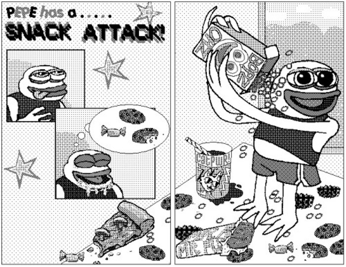
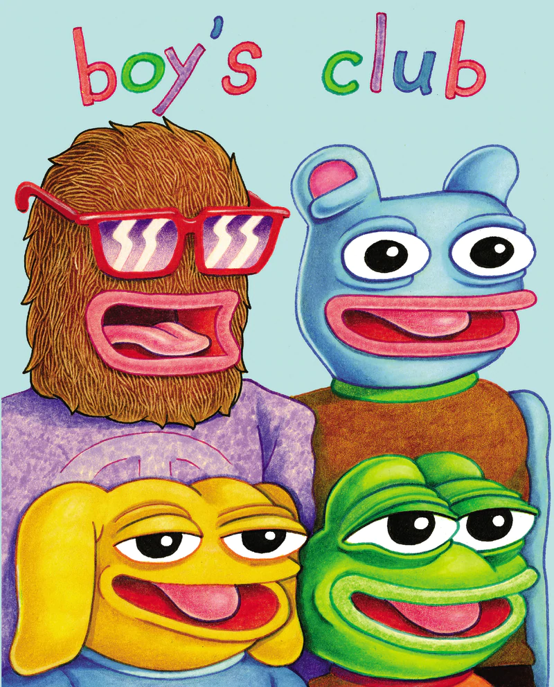

# Birth of Pepe the Frog

The journey begins in a San Francisco community thrift store where Matt worked in his 20s. He spent most of his days in his office in the toy department, where he would often lose himself in drawing.

> _“It was like my ideal job situation.”_ - Matt

Matt was always into drawing, especially drawing frogs.

One frog after another and **Pepe was born.**

> _“Matt was always drawing that frog. Forever, I swear.”_ - Aiyana, Matt’s partner

The first time Matt’s "frog character" was named Pepe was for a comic he created, called “Playtime”.

He created Pepe in Microsoft Paint, alongside his comic buddy - Brett.

Pepe the Frog (/ˈpɛpeɪ/) was a character consisting of a green frog with a humanoid body.\
Eventually, Matt added 2 more characters to the friend group.

> _“I just thought it would be fun to have 4 characters, kinda like ninja turtles.”_ - Matt

That’s how the comic “Boy’s Club” came to be.

The 4 comic book characters from Boy’s Club were all inspired by Matt's own personality and the personality of his real life friends:

* Landwolf - the party dog
* Andy - the jokester
* Brett - he liked to dance
* **Pepe** - the group's little brother

**Fun fact**: Around that time, a popular American cartoonist and creator of popular characters like [Tuca & Bertie](https://www.imdb.com/title/tt8036272/) and [BoJack Horseman](https://www.imdb.com/title/tt3398228/) - [Lisa Hanawalt](http://www.lisahanawalt.com/), met Matt at a comics convention and immediately fell in love with the "Boy's Club" comic and with Pepe.

> _“For me they felt very accessible. It’s this sort of masculinity where you can be in your underwear, singing to Shania Twain.”_ - Lisa Hanawalt
