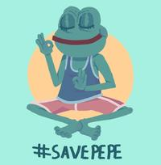
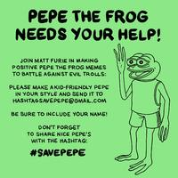

# Reclaiming Pepe

Matt teamed up with the ADL to try and reclaim Pepe.

They started the #SavePepe campaign, inviting everyone to draw their own version of Pepe and post it online.

   

Many other famous cartoonists joined the movement. Hampton Boyer, Lisa Hanawalt, Kevin Kuhko Lee all drew their own versions of Pepe and posted them online.

> _“Let’s try to take something that’s been recognized as a hate-symbol and turn it into a recognized love symbol.”_ - Matt, during his talk for the #SavePepe campaign

Matt’s goal with the campaign was to create the [Peace Pepe Database of Love](https://www.peacepepedatabaseoflove.com/) (the site is currently down). The campaign wasn’t as successful as Matt had hoped.

Next month, Donald Trump won his candidacy for president and the 4chan community felt like their goal was finally accomplished.

A [video ](https://youtu.be/aFh08JEKDYk)of [Richard Spencer](https://en.wikipedia.org/wiki/Richard\_B.\_Spencer) (an infamous self-proclaimed Nazi activist) getting punched in the face, right after talking to a reporter about his “pepe badge”, went viral soon after. This sparked a huge debate and controversy nation wide and unfortunately Pepe was attached to it, again.

The [“Save Pepe” Kickstarter Project](https://www.kickstarter.com/projects/615106574/save-pepe) had 367 backers who pledged $34,757 in total.

## RIP Pepe

Saturday, May 6th 2017 - Matt creates an emotional comic where he depicts all of the characters from "Boy’s Club" attending Pepe’s funeral.

For Matt, this was a way of trying to distance himself from all of the controversy... but a part of him also desperately wanted to put an end to it.

> _“The Pepe thing was so out of control at that point and whatever Pepe meant to all these other people didn't mean the same thing to me. So I had to kill him.”_ - Matt

RIP Pepe the Frog.

MSNBC, The New York Times, Vox, CNN and many other media outlets reported on the event.\
Unfortunately for Matt, everyone that used pepe memes in a bad manner just saw this as their win over him for Pepe.

## Racist Pepe Book

In August 2017, a book titled [“The Adventures of Pepe and Pede”](https://g.co/kgs/Tx6qzn) was created by Eric Hauser.

It sparked an outrage in the media as it was perceived to be racist and islamophobic.

In the book, the villain is an alligator named Alkah, which many took as a reference to Muslims.

> _“I’m using Pepe just as a light-hearted way of expressing some conservative values. If you love America, you’re gonna love this book for sure.”_ - Eric Hauser, author of the book

**This was the last straw for Matt.**

He threatened legal action, citing intellectual-property infringement.

A legal team representing Matt took the case and argued that the book “espoused racist, Islamophobic and hate-filled themes, included allusions to the alt-right movement.”

Never before did Matt went this route.

> _“It was like hell man. If you wanna escape hell, you can’t ignore it, you almost have to go to the center of it.”_ - Matt

## Suing Alex Jones

A right-wing political commentator and host of the show Infowars, Alex Jones, was selling a poster where Pepe was featured alongside president Donald Trump and other right-wing personnel.

> _“He was selling a poster with Pepe on it and a bunch of douchebags and I just didn't want him to sell the poster.”_ - Matt

However, things didn’t go so smoothly.

Alex Jones doubled down and jacked up the price of the poster and offered to personally sign every sold poster.

Matt was forced to sue again.

After a lengthy court battle and 4 months later, in June 2019 Infowars agreed to settle and pay $2,000,000 in damages.

After this successful case, Matt's legal representatives managed to enforce intellectual-property infringement against Baked Alaska, Richard Spencer and The Daily Stormer to name a few.

This series of actions finally managed to turn the narrative of Pepe back around.\
Matt even tried to convince the ADL to change their stance and remove Pepe from their hate symbol database, but was unsuccessful.

## Pepe the Hong Kong protest Frog

In the 2019-2020 Hong Kong protests, Pepe was used by the protesters as a symbol of freedom, democracy and youth.

A version of Pepe wearing the outfit of the protesters, with a yellow hat, began circulating online, particularly as a sticker pack for messaging apps.

This was the protesters' way of showcasing resistance towards authoritarianism online. For many, Pepe represented hope for a brighter future.

Matt welcomed this as it was not connected with the alt-right ideology and it was serving a good cause.
