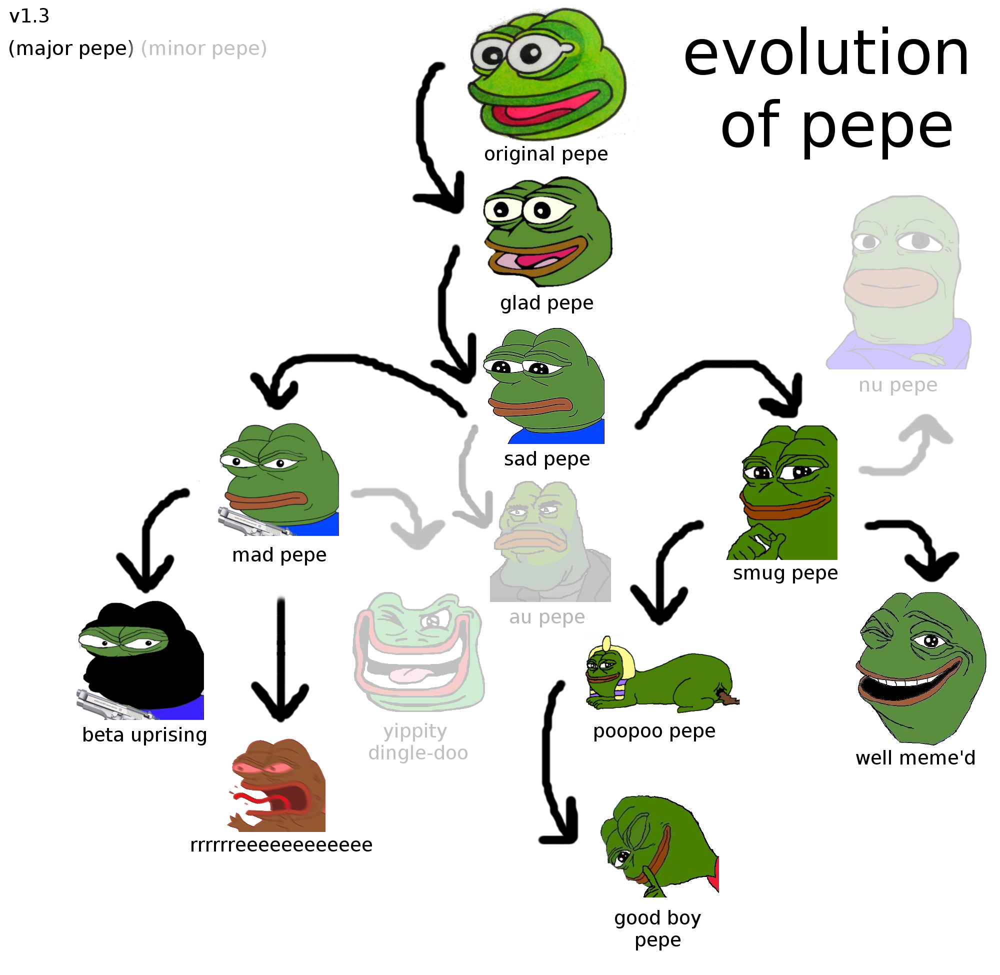

# Types of Pepes

### Happy Frog, the "Feels good, man" Pepe

Feels good man phrase is a reference to the emotions Pepe felt in “Boy’s Club” when he goes to the bathroom standing up, with his pants all the way down. The Feels Good Man Pepe is considered the OG Pepe meme.

### Sad Frog, the "Feels bad, man" Pepe

Sad Frog is an illustration of a depressed-looking Pepe, often accompanied by the text “Feels Bad Man." or “You will never X”. It is used to denote feelings of failure or disappointment, either by posting the image or using the phrase “feelsbadman.jpg.” Sad Frog may be seen as the antithesis of Feels Good Man.

### Smug Frog, the Smug pepe

Smug Frog, also known as Smug Pepe, is a reaction image of a smug-looking version of Pepe.

.png>)

### Angry Pepe

Angry Pepe, also known as Angry Frog, is a reaction image featuring a hostile-looking variation of Pepe. The image is often accompanied by expressions of rage and intense frustration.

.png>)

### Nu Pepe

Nu Pepe is an alternate depiction of Pepe in which the frog is drawn with crossed arms and wearing a blue long sleeve shirt.

On December 9th, 2014, an image of Pepe resembling the character Javert from Les Misérables was highlighted on the Finnish imageboard Ylilauta. On January 24th, 2015, an edited version in which Pepe is wearing a Bane mask was posted on the Russian imageboard Два.ч. On March 1st, an unedited version of the image was posted on 4chan's /qa/ (question and answer) board, referring to the reaction image as "nu pepe" and nominating it as "the official meme of /qa/".

The next day, the image was on the \[s4s] (shit 4chan says) board.

  

### "Well Meme'd"

“Well Meme’d” is an ironic expression typically accompanied by an exploitable image of a character laughing and saying “Hahaha, great post!” followed by “Well Meme’d, my friend!," based on an original comic featuring Pepe wearing a sweater and tie.

### Peep The Toad

On July 30th, 2016, Tumblr user @pornstarwars submitted an illustration of an anthropomorphic toad with the caption "when u cant afford quality name brand memes so u have to settle for Peep the Toad".

Over the next eight months, the post gained over 134,000 notes. On September 29th, Redditor @GT\_memes reposted the illustration to [/r/dankmemes](https://www.reddit.com/r/dankmemes/), where it accumulated more than 6,500 votes (91% upvoted) within five months. On October 14th, Redditor @c\_dunbar submitted a screenshot of @pornstarwars' post to [/r/me\_irl](https://www.reddit.com/r/me\_irl/), where it garnered upwards of 5,700 votes (94% upvoted) within four months. On October 23rd, 2016, the Peep the Toad Facebook page was launched, which highlights various examples of the toad character. On February 24th, 2017, Redditor @ReallyNotARabbit submitted a post proclaiming that "Peep the Toad memes" were "on the rise" to [/r/memeeconomy](https://www.reddit.com/r/MemeEconomy/). On March 8th, Redditor MarioMann211 reposted the image to [/r/memeeconomy](https://www.reddit.com/r/MemeEconomy/), asking for an "estimate" on its value.

### Pepe Punch

Pepe Punch, also known as Punching Pepe, is a depiction of Pepe the Frog winding up a punch aimed at the screen from the perspective of the person viewing the image.

The image used for Pepe Punch combines the Smug Frog version with an image of Vegeta from Dragon Ball rearing back a punch with his hand outstretched towards the perspective of the screen. The exact first instance of Pepe Punch is unknown, but it can be seen in use on 4chan as early as 2018.

### Clown Pepe

Clown Pepe, also known as Honk Honk or Honkler, original name Pepoclown, is a depiction of Pepe the Frog wearing a rainbow wig and red clown nose, which is often accompanied by jokes with corny or cringeworthy punchlines and the emojis 🤡🌎 meant to represent the phrase "Clown World."

The origin of "Pepoclown", comes from a Discord server for a 3v3 League of Legends community, The Shadow Isles. While the reason for creating this is unknown, the user is not. The creator of "Pepoclown" goes by the online alias as "Brizi".

On February 26th, 2019, YouTuber [ZimoZitrome](https://www.youtube.com/channel/UC99lkbVG8I5hRSZa4FD8zgw) posted a [video](https://www.youtube.com/watch?v=e-6eWEhjMa4) featuring Clown Pepe performing various antics like walking down 4chan threads, turning angry Wojaks into happy clowns and being shot into space (video has since been deleted). Over the next two months, the video accumulated upwards of 740,000 views and 3,300 comments.

In June 2019, Facebook also banned the word “Honk”, albeit temporarily.

### Groyper

Groyper refers to an exploitable illustration of Pepe the Frog resting his chin on interlocked hands. Additionally, Groypers (also known as Groyper Army) is the name of a group of far-right and alt-right nationalists and conservatives critical of the mainstream conservatism and led by political commentator Nicholas J. Fuentes.

### **Apu Apustaja (Help Helper)**

Apu Apustaja ("Help Helper" in English) is a poorly drawn variation of Pepe the Frog created in the style of [Spurdo Spärde](https://knowyourmeme.com/memes/spurdo-sparde). The character is rumored to have originated from the Finnish imageboard Ylilauta. On January 14th, 2016, the "Apu Apustaja'' Facebook page was launched. On March 25th, an anonymous 4chan user submitted the Apu Apustaja version of Pepe to the /b/ (random) board on 4chan. On April 19th, a thread featuring various illustrations of the character was submitted to the /int/ (international) board.

Over the years, Apu Apustaja has grown massively in popularity and became the "go to pepe meme" for many users on Discord and Telegram.

### Peepo

Peepo, also known as Pepo, is a series of emotes on Discord and Twitch depicting poorly drawn versions of Pepe the Frog, sharing similarities to Apu Apustaja.

The emotes are typically used in chats on both platforms to express a number of emotions depending on the type of Peepo used, ranging from happy to sad or more situational depending on the context. The first Peepo variations date back to at least 2017.

### Collectible Pepes

Starting in October 2014, /r9k/ users began submitting posts to share "rare" images of Pepe like they were trading cards.

On March 28th, 2015, a thread was submitted to /r9k/ about collecting Rare Pepes in order to "flood the market" and depreciate their value.

On March 31st, a /r9k/ user posted an Imgur gallery with over 1,200 pictures of Pepe. It received more than 260,000 views.

In early April, the collection of Pepe images were listed on eBay, which reached a price of $99,166 before being removed from the site.

On April 3rd, Smosh published an article about the rare Pepe images, which subsequently began to appear on other sites like Reddit and Tumblr.

By April 9th, there were over 230 "rare Pepe" listings on eBay. Additionally, ads for Rare Pepe collections were created on Craigslist. The same day, The Daily Dot published an article about the Craigslist listings.

### Evolution of Pepes (uncomplete)

### Pepe amphibia

