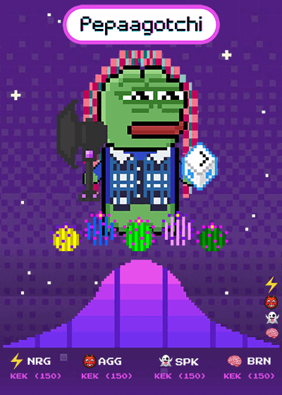
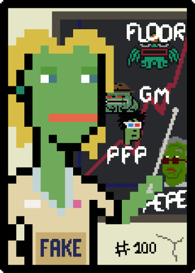
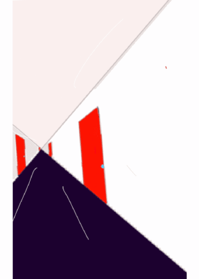
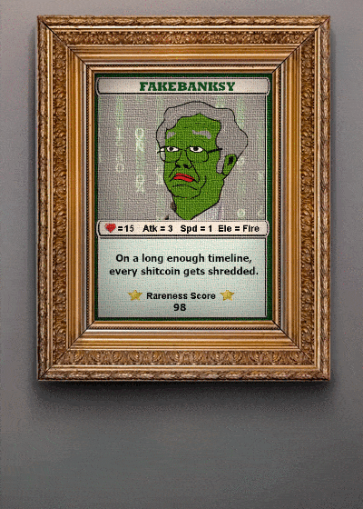
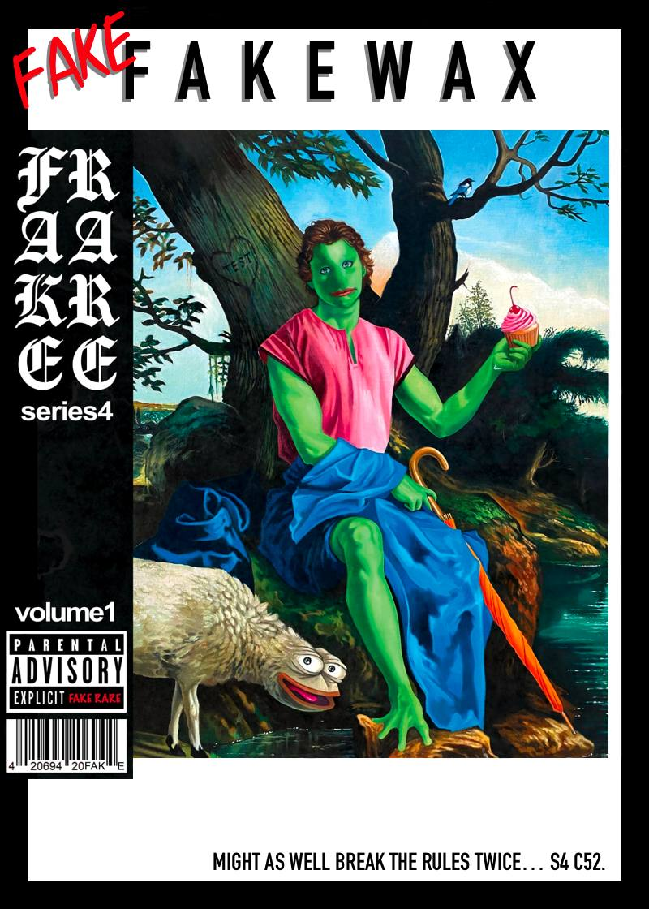

# Fake Rares Card Specific Lore


_**Work in progress**_ - if you would like to contribute your card-specific story, please follow the steps in [how-to-contribute-to-the-book-of-kek.md](../../how-to-contribute-to-the-book-of-kek.md "mention") or send us an email titled **"BoK Edit Request"** to [wiki@pepe.wtf.](mailto:wiki@pepe.wtf?subject=BoK%20Edit%20Request)&#x20;


> The legend has it that the cards in Series 0 of the Fake Rares were submitted for approval to be a part of the Rare Pepe collection but were not approved. While not all of them were scientifically denied - the rule was that each card had to be an older XCP asset and not part of any directory.

Below you can find some more card specific lore.

## [FREEDOMKEK](https://pepe.wtf/asset/FREEDOMKEK) - Series 0, Card 1, 1/300

On September 21 2021, [Rare Scrilla](https://pepe.wtf/artists/Rare-Scrilla) was banned from the Rare Pepe Trading Telegram group for violating the number one rule: you can only share Official Rare Pepes in the Rare Pepe Trading Group. Rare Scrilla shared a Fake Rare that was rejected from the directory in 2018. You see, Scrilla had just rediscovered the fake in his wallet, so he figured he’d share it in the chat and give a few away to people who shared their addresses. He was quickly banned from the chat, so he decided to spin up a new chat and subsequent directory called Fake Rares. The [new chat](https://t.me/OFFICIALFAKERARES) quickly filled up, and Scrilla offered the FREEDOMKEK card – the fake that got him fake banned in the first place – to anyone who shared the card in the Rare Pepe chat.&#x20;

It was a “Proof of Ban” card and thus became the first card in the Fake Rare directory. Series 0, Card 1. The Rare Pepe administrators eventually unbanned Scrilla and even participated in the new Fake Rares community, and the rest has been written on the blockchain. Read the rest of the story [here](https://fakeraredirectory.com/la-faka-has-been-defeated/).

## [FAKEASF](https://pepe.wtf/asset/FAKEASF) - Series 1, Card 1, 1/1,656

The set begins with the [FAKEASF](https://pepe.wtf/asset/FAKEASF) community-created card. This asset was airdropped to the first 100 people in the Fake community and serves as the access card for submissions to the directory.

 (1).gif>)

## [FAKETORCH](https://pepe.wtf/asset/FAKETORCH) - Series 1, Card 2, 1/1

The FAKETORCH, another community-created card… and the only 1 of 1 card in the collection. The torch was designed to bounce from faker to faker each week, granting the holder the privilege of adding a qualifying FAKE RARE into Series 0. This series is reserved for Rare Pepe-era fakes. Criteria outlined somewhere else.

## [PEPAAGOTCHI](https://pepe.wtf/asset/PEPAAGOTCHI) - Series 4, Card 46, 1/121

[@BabyPicasso](https://twitter.com/BabyPicassoo) and [@NftRooster](https://twitter.com/NftRooster) collaborated on [PEPAAGOTCHI](https://pepe.wtf/asset/PEPAAGOTCHI) as a tribute to [Aavegotchi's](https://www.aavegotchi.com/) by [Pixelcraft Studios](https://twitter.com/pixelcraftstuds) - a Play-2-Earn game on Polygon. Inspiration came from [SARUTOBIPEPE](https://pepe.wtf/asset/SARUTOBIPEPE) which unlocked a special skin in the [Sarutobi](http://www.mandelduck.com/sarutobi/) game - the first playable Rare Pepe!

## [MISSPEPEPUNK](https://pepe.wtf/asset/MISSPEPEPUNK) - Series 4, Card 43, 1/100

Fake version of [MISSPEPE](https://pepe.wtf/asset/MISSPEPE), a Rare Pepe submitted back in the day. Both cards were made and submitted by the same artist - [Ffmad](https://pepe.wtf/artists/Ffmad). This MISSPEPEPUNK is an NFT teacher, who is specialized in "green ones". For each of the 100 cards, a unique profile picture will be associated in the near future.

## [FAKEWAX](https://pepe.wtf/asset/FAKEWAX) - Series 4, Card 51, 1/150

[FAKEWAX](https://pepe.wtf/asset/FAKEWAX) was the only 51st card in a series (as every other series has 50 cards). The artwork for the card was made by [Viva La Vandal](https://pepe.wtf/artists/Viva-La-Vandal). As all of Series 4 was an audio collection, what made the FAKEWAX card so special is the fact that holders of it could redeem an actual vinyl with all of the special content from the audio series. Read more about FAKEWAX [here](https://fakeraredirectory.com/fakewax/).

## [PEPEFICATION](https://pepe.wtf/asset/PEPEFICATION) - Series 7, Card 22, 1/75

From the [artist](https://twitter.com/Crims0nRIdeR), [Crimson Rider](https://pepe.wtf/artists/Crimson-Rider): "He's running from the 'Pepe Hype'. With each door he opens, he becomes more _frog_, and with every Pepe art he sees, he becomes more addicted until finally, he becomes filthy rich and falls into the 'well of wealth', where money loses any meaning and it's hard to feel anything. He breaks that crystal and reality becomes pointless, trapping himself in a never-ending circle."

## [PEPONACID](https://pepe.wtf/asset/PEPONACID) - Series 4, Card 16, 1/30

The iconic frog has always been a symbol of love, positivity, and acceptance. What better way to showcase this acceptance than with a psychedelic twist. This Fake Rare represents the [artist's](https://pepe.wtf/artists/Prateek-Dhiman) love of psychedelics.

## [P](https://pepe.wtf/asset/PEPONACID)[FAKEBANKSY](https://pepe.wtf/asset/FAKEBANKSY) - Series 2, Card 1, 1/100

From [Wizard X](https://pepe.wtf/artists/Wizard-X), the creator of the card: "On a long enough timeline, every shitcoin gets shredded."

## [PEPEPOPO](https://pepe.wtf/artists/Wizard-X) - Series 3, Card 32, 1/21

[SeerLight](https://pepe.wtf/artists/SeerLight), the creator revealed how the idea of the card came to be: "I was showering and thought... What about a Pepe but make it Ghost in a Shell? Added a bit of vaporwave and tada!"

## [WAGMIWORLD](https://pepe.wtf/asset/WAGMIWORLD) - Series 8, Card 43, 1/100

[WAGMIWORLD](https://pepe.wtf/asset/WAGMIWORLD) is [SuperTrip64](https://twitter.com/SuperTrip64)'s contribution to the legendary [Series 8](https://fakeraredirectory.com/series-8/) of Fake Rares, [curated by Vincent Van Dough](https://twitter.com/Vince\_Van\_Dough/status/1541599342590537729) and marking 2022's "Summer of Pepe".&#x20;

.png>)

SuperTrip64 develops pure 64 Bit Visuals™ games, playable via his website [SuperTrip.Land](http://supertrip.land). Upon releasing his card WAGMIWORLD he also [released a multiplayer game](https://twitter.com/SuperTrip64/status/1552720983961862145), in which players could explore a Pepe-themed amusement park during a 24h event, uniting [770 unique players](https://twitter.com/SuperTrip64/status/1553153594752466947) in what is considered the first ever 64bit Pepe game.



## [BOOTLEGGED](https://pepe.wtf/asset/BOOTLEGGED) - Series 8, Card 17, 1/100

[BOOTLEGGED](https://pepe.wtf/asset/BOOTLEGGED) is [Seerlight](https://pepe.wtf/artists/SeerLight)'s first Fake Rare. Seerlight is an illustrator and animator based in LA, best known for his style involving intricate line art and flat colors with striking color palettes. His subjects are primarily architecture, sceneries and landscapes. Seerlight is inspired by anime, vaporwave aesthetics, cyberpunk themes and escapism.

<figure><figcaption></figcaption></figure>

 

<figure><figcaption>
<a href="https://pepe.wtf/asset/BOOTLEGGED">BOOTLEGGED</a>
</figcaption></figure>

 

<figure><figcaption></figcaption></figure>

There are a few frames in this animated card that show a timestamp in the bottom left corner, which based on blockchain data, coincides with the moment he had finalized the artwork and locked the token issuance. Dank Art Historians believe this to be the “finishing touch” on this work, the last stroke of Seerlight’s brush.

<figure><figcaption>
PM 6:44 JUL 6
</figcaption></figure>

## [PEPEMAGPIE](https://pepe.wtf/asset/PEPEMAGPIE) - Series 4, Card 25, 1/100

"[PEPEMAGPIE](https://pepe.wtf/asset/PEPEMAGPIE) depicts a young peper living as a hermit in the wilderness. His welcoming gaze, elegant posture, and the surrounding symbols refer to his role as a keeper of peace and a connoisseur of remarkable treasures. Set against a lush landscape composed of oak trees, one may take notice of the inscription carved within the tree’s trunk, “TEST”. He holds a blush frosted cupcake topped with a tart cherry in his left hand while his right arm is folded across his body, the fingers gracefully supporting a bright orange umbrella. Dank Art Historians have identified these symbols as references to origin assets on Counterparty. The presence of the sheep further upholds the notion of benevolence and peace which is a reference to the essence of the pepe community. And finally, the unassuming magpie bird is depicted as a gesture of wit. It is said that this type of bird is notorious for collecting shiny objects.” - [Pepenardo](https://pepe.wtf/artists/Pepenardo).

<figure><figcaption>
<a href="https://pepe.wtf/asset/PEPEMAGPIE">PEPEMAGPIE</a>
</figcaption></figure>

 

<figure><figcaption>
<a href="https://pepe.wtf/asset/FAKEFAKEWAX">FAKEFAKEWAX</a>
</figcaption></figure>

PEPEMAGPIE was also featured on the cover of [FAKEFAKEWAX](https://pepe.wtf/asset/FAKEFAKEWAX). As a tribute to FAKEWAX, Fake master [Pepenardo](https://twitter.com/PepenardoStudio) released FAKEFAKEWAX, a 35 numbered limited edition vinyl available only via 48h silent auction at the [pepepawnshop](../../chapter-4-latest-developments/pepepawnshop/ "mention").
