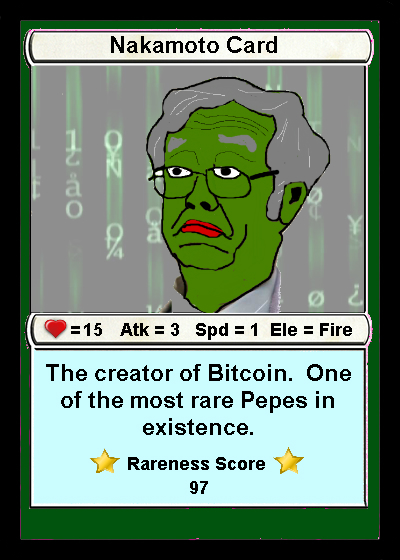

# Pepe's Blockchain Beginnings

At the same time as the Pepe controversy was happening, there was a growing community of Pepe fans trying to reclaim the meme in their own way, **using blockchain technology**.

On crypto forums like [Bitcointalk](https://bitcointalk.org/), people started creating pictures of Pepe, similar to collectible cards and tokenizing them on the blockchain. Some Pepes were memes from 4chan, some were superhero knockoffs, some were even political Pepes.

They were coined **Rare Pepes.**

These Rare Pepes would be traded amongst people, using cryptocurrency. Soon, a platform for trading these collectibles, the “[RarePepeWallet](https://rarepepewallet.com/)”, was developed by [Joe Looney](https://twitter.com/wasthatawolf).

One user even managed to make a profit to buy a yacht which he named “[The SS Rare Pepe](https://www.vice.com/en/article/yw5axg/pepecash-millionaire-yacht-cryptocurrency-rare-pepes)”.\
The individual has lived on the yacht ever since.

The Rare Pepe Movement gained significant popularity in the crypto community, with people buying, selling, and trading Rare Pepe tokens on various blockchain platforms. These tokens were designed to be unique and scarce, with each token representing a specific Rare Pepe artwork or character. Some Rare Pepe tokens were more valuable than others, depending on their rarity, popularity, and aesthetic appeal. The Rare Pepe Movement also spawned various offshoots and imitations, such as the "Ultra Rare Pepes" and the "Super Rare Pepes."


One user even managed to make a profit to buy a yacht which he named “[The SS Rare Pepe](https://www.vice.com/en/article/yw5axg/pepecash-millionaire-yacht-cryptocurrency-rare-pepes)”. The individual has lived on the yacht ever since. Fun fact: The yacht was bought with [PEPECASH](https://pepe.wtf/asset/PEPECASH), one of the tokenized Rare Pepe cards.


The Rare Pepe Movement eventually evolved into a more general trend of tokenizing digital assets and creating decentralized marketplaces for trading them. This trend gave rise to various blockchain-based platforms, such as OpenSea, Rarible, and NFT Gateway, that allow people to buy, sell, and trade non-fungible tokens (NFTs) representing various digital assets, such as art, music, and collectibles. The Rare Pepe Movement thus served as a precursor and inspiration for the NFT craze that exploded in 2021, with some people attributing the rise of NFTs to the Rare Pepe Movement's innovative use of blockchain technology to create and trade unique digital assets.

As the Rare Pepe Movement continued to grow, it also faced various challenges and controversies. Some people criticized it as a frivolous and speculative use of blockchain technology, while others saw it as a legitimate and creative way to express themselves and build community. The Rare Pepe Movement also faced legal and regulatory issues, with some countries and jurisdictions cracking down on the trading of tokenized digital assets due to concerns over money laundering, tax evasion, and fraud. Despite these challenges, the Rare Pepe Movement remains a fascinating and influential phenomenon in the world of blockchain and digital culture.
