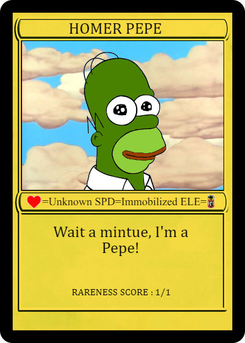
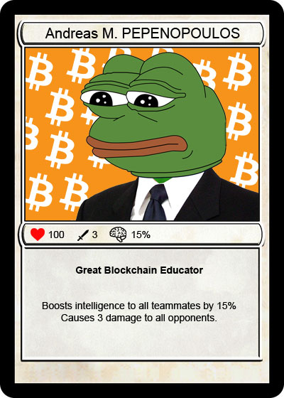
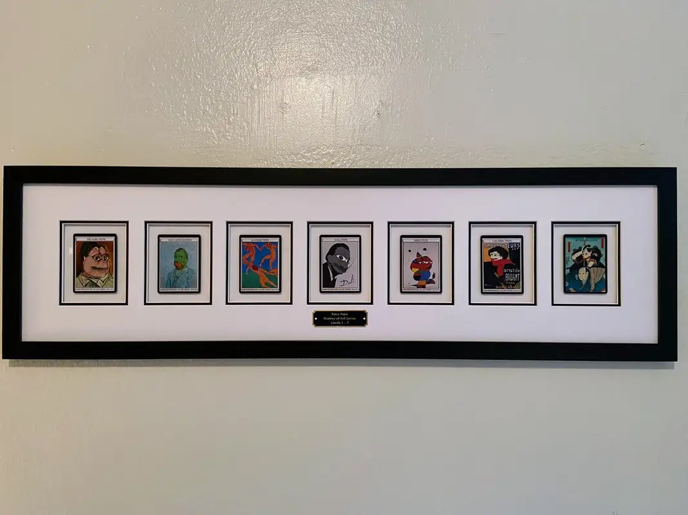
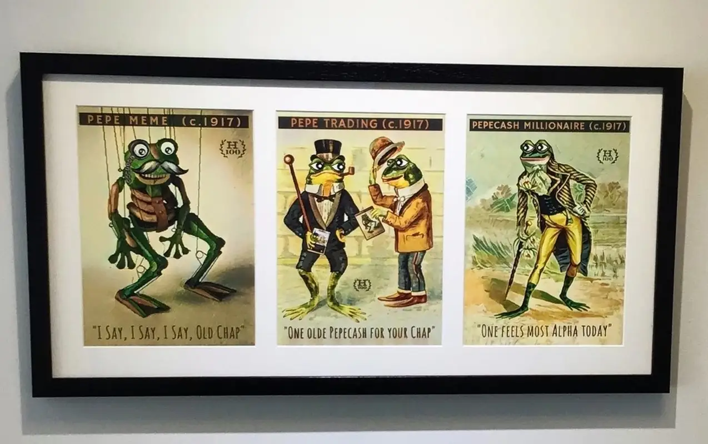
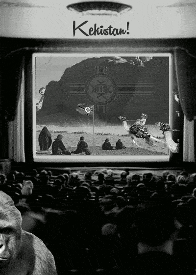
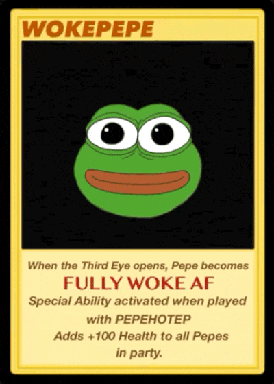

# Famous Rare Pepe auctions

## **The “RARE AF” auction**

The first ever Rare Pepe card auction was held at the first [Rare Digital Art Festival](https://raredigitalartfestival.splashthat.com/), aka “RARE AF”.

It was held on the 13th of January 2018, in the offices of Rise New York. The event was announced only a few weeks earlier, but an impressive amount of people had shown up. Crypto enthusiasts, meme aficionados, artists, gamers and collectors were all present. DJ Pepe and DJ Scrilla were there also.

The bidding was held in PEPECASH, and started off with a diptych of Salvador Dali-inspired Pepes. The bidding started at 5,000 PEPECASH and ended at 12,000 PEPECASH. Matt Hall, the creator of Crypto Punks, called it “an amazing deal.”

500 Kekistan passports were issued and went for 20,000 PEPECASH.

20 animated Japanese-watercolor Pepe by the celebrated artist [DaVinci9](https://twitter.com/DavinciNine) sold for 26,000 PEPECASH.

A [RAREPEPE](https://pepe.wtf/asset/RAREPEPE), 1 of 300 ever made, was scooped for a whooping 60,000 PEPECASH.

However, the star of the show was definitely [HOMERPEPE](https://pepe.wtf/asset/HOMERPEPE), a 1 of 1 Rare Pepe card.

 .jpg>)

The bidding started at 20,000 PEPECASH and quickly surpassed 100,000. The excitement rose and the bidding was down to two individuals.


Video of the moment HOMERPEPE was sold for 350,000 PEPECASH


Homer Pepe was sold for a mind-melting 350,000 PEPECASH ($39,200 at the time), making it the most expensive Pepe card sold by that time.

Due to the excitement in the room, both individuals actually stood up to claim their reward, thinking they won. The winner had to be determined by a coin flip.

In the end Peter Kell, an internet marketer and entrepreneur, became the proud owner of the HOMERPEPE card. People openly mocked Peter for this purchase but he knew what he had. Memes were art.

In March 2021, HOMERPEPE sold for 205ETH ($320,000 at the time). This event galvanized collectors, pushing Pepe into the NFT collective consciousness.

Another card from the Rare Pepe collection was sold for $500k (147 ETH) on 10th of September 2021, the collection’s (almost) fifth birthday, renewing interest in the 2016 NFT series. The card in question was a Series 1 RAREPEPE, the Nakamoto Card.

## **Sotheby's auction**

On 9th of September 2021 the Head of Contemporary Art Auction and Co-Head of NFTs at Sotheby’s, Max Moore, posted a cryptic [tweet](https://twitter.com/MaxMoore\_Art/status/1436003229498687489?s=20\&t=di2R15jDKEYwq6sVXg7wOw) on his profile mentioning the collection's fifth birthday and floating the idea of a potential Sotheby’s auction.

Later next month, on 7th of October, Sotheby’s official Twitter account [announced](https://twitter.com/Sothebys/status/1446199243820216322?s=20\&t=uzKsckt8zNBFtOSbIzrhbQ) their second dedicated NFT sale - “Natively Digital 1.2: The Collectors”. The sale showcased 53 NFTs from 19 different collectors that had been handpicked by Sotheby’s.

3 of the 53 showcased NFTs were Rare Pepes, auctioned by TokenAngles, an Italian collector active in the space since 2019 and the owner of the famous HOMERPEPE.

  

The 3 auctioned Pepes were: [RAREPEPE](https://pepe.wtf/asset/RAREPEPE) (the famous Nakamoto Card), [PEPENOPOLOUS](https://pepe.wtf/asset/PEPENOPOULOS) - a 1/1 Series 3 card and [PEPEAIR](https://pepe.wtf/asset/PEPEAIR) - a 1/100 Series 28 card. The auction lasted until the 26th of October.

The PEPEAIR card sold for $52,920, the RAREPEPE card sold for $239,400 and the 1/1 PEPENOPOLOUS card sold for an astonishing $3,650,000.

## **"Pepe is Art" by** [**Scarce.city**](https://scarce.city/)

[Scarce.city](https://scarce.city/) has been a proud supporter of the Rare Pepe movement and Joe Looney.

They’ve auctioned hundreds of Pepes over the years on their marketplace, both Rare Pepes and Fake Rares.

The main unique selling point of Scarce.city is that their platform allows for bidding over the Lightning Network, or as they call it "Lightning Auctions".

Scarce.city hosted a pop-up show called “[Pepe is Art](https://drive.google.com/file/d/1jd-b5sDpCkwAI2jYTBgYWs3BaXAK93Yy/view)” during the [NFT.NYC](https://www.nft.nyc/) conference, from Oct 29 to Nov 3rd in 2021.

A detailed article covering the event can be found on Scarce.city's blog [here](https://scarce.city/blog/pepe-is-art).

 

A dozen Rare and Fake Rare Pepes were featured, some even as their physical representations, plus a lot of other pepe art was on display. They were available either for auction or were accepting private offers.



Vignesh "[MetaKovan](https://twitter.com/MetaKovan)" Sundaresan, the individual who bought Beeple's ["Everyday's" collection](https://www.cnbc.com/2021/04/07/buyer-of-69-million-dollar-beeple-art-metakovan-on-nfts.html) in March 2021, scooped up a [RAREPEPE](https://pepe.wtf/asset/RAREPEPE) during the auction for $500,000.

All auctioned cards can be found on the Scarce.city website [here](https://scarce.city/collections/pepe-is-art).

## [RarePepes.com](https://rarepepes.com/) VR auction

[RarePepes.com](https://rarepepes.com/) teamed up with the [Alphaverse](https://alphaverse.com/), a browser-based metaverse project, on 22nd of November 2021 to bring the world the first ever [Rare Pepe VR auction](https://rarepepes.com/auction/rare-pepes-auction-in-virtual-reality-11-22-2021/).

Users were able to join in using their VR headsets for a full experience, but they could have also joined using a regular desktop browser, they just needed to register on the site beforehand to join the auction.

A hosted live stream of the event was also available for viewers.

Anyone was able to bid on Rare Pepes as long as they completed verification beforehand.



Registrations and verifications were free, however there was a 4% fee for the winning bids.

Only OTC payments in BTC were accepted.

    

A series of 5 animated Rare Pepes were featured in the auction:

* [KEKISTAN](https://pepe.wtf/asset/KEKISTAN) - 1/100,000 ; Series #20 ; Card #3
* [PEPEGLOBE](https://pepe.wtf/asset/PEPEGLOBE) - 1/550 ; Series #12 ; Card #14
* [PUFFPEPE](https://pepe.wtf/asset/PUFFPEPE) - 1/125 ; Series #33 ; Card #24
* [PUREPEPE](https://pepe.wtf/asset/PUREPEPE) - 1/100 ; Series #18 ; Card #28
* [WOKEPEPE](https://pepe.wtf/asset/WOKEPEPE) - 1/7,777 ; Series #20 ; Card #12

## Artnet's "ArtNFT: Feels Good Man" auction

From March 11th to 22nd, [Artnet](https://www.artnet.com/) held the "[ArtNFT: Feels Good Man](https://auctions-nft.artnet.com/sale/artnft-feels-rare-man)" auction.

> _"Artnet is one of the leading online resources for the international art market and the destination to buy, sell, and research art online. Founded in 1989 with the goal of bringing transparency to the art world, Artnet’s comprehensive suite of products offers a variety of art market resources to our audience of collectors, dealers, and art enthusiasts." - Artnet_

A plethora of both Rare Pepes and Fake Rares were being auctioned during the days of the event, including the notable [Pepenardo Grail Set](https://auctions-nft.artnet.com/artists/pepenardo/pepenardo-grail-set/125), [PEPEROSS](https://auctions-nft.artnet.com/artists/boost/pepeross/126) and the [Golden Grail Collection](https://auctions-nft.artnet.com/artists/various-artists/rare-pepe-series-1-golden-grail-collection/128) to name a few.

  

All auctioned items were successfully sold.
