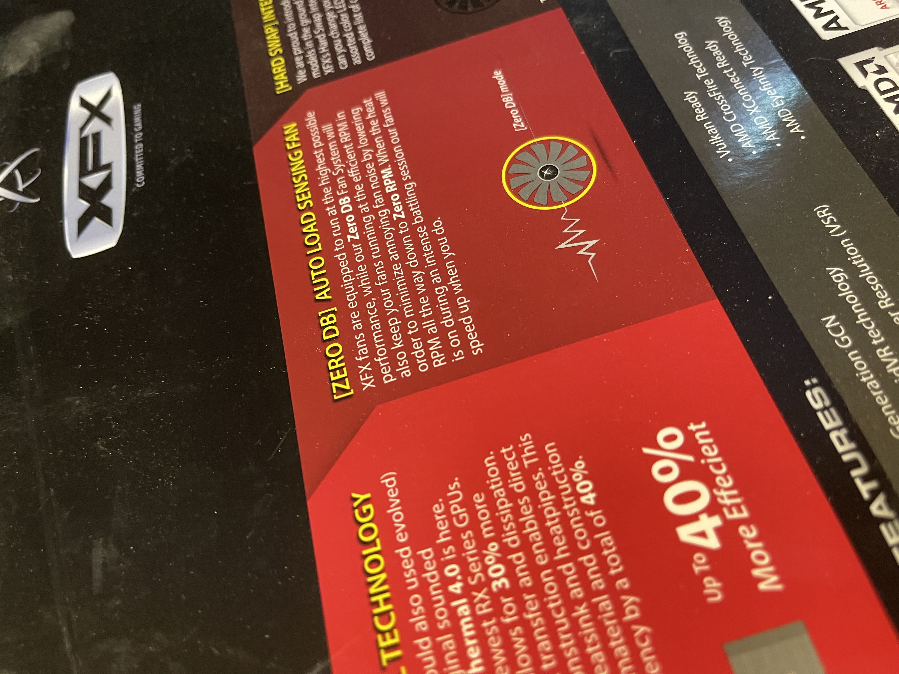

# Official Rare Pepe Sub Assets


_**Work in progress**_ - if you would like to contribute your sub asset-specific story, please follow the steps in [how-to-contribute-to-the-book-of-kek.md](../../how-to-contribute-to-the-book-of-kek.md "mention") or send us an email titled **"BoK Edit Request"** to [wiki@pepe.wtf.](mailto:wiki@pepe.wtf?subject=BoK%20Edit%20Request)&#x20;


## Series 11, Card 29 - CSAT

<figure><figcaption></figcaption></figure>

****[**Seris 11, Card 29 - CSAT**](https://pepe.wtf/asset/CSAT) **** was created by the artist known as [Boost](https://pepe.wtf/artists/Boost). In a [recent interview](https://www.youtube.com/watch?v=rRvC767N5oI), Boost stated that some of the text on the card was lifted from a graphics card box, and that he purposely misspelled a word just like the GPU box did. The word in question is "efficiency" which he spelled "effeciency."  To show the misspelling, Boost issued a sub-asset named [CSAT.cc0](https://xchain.io/asset/A18188137632490106252) and attached an image of the box. The sub-asset was distributed as a dividend for holders of the CSAT card. A total of 98,870 tokens were sent to 671 recipients on August 6, 2022. You can view the transaction [here](https://xchain.io/tx/2082427).&#x20;

<figure><figcaption></figcaption></figure>

## Series 20, Card 16 - VAPORMAGIC

<figure><figcaption></figcaption></figure>

**Series 20, Card 16 -** [**VAPORMAGIC**](https://pepe.wtf/asset/VAPORMAGIC) was created by the artist known as [Boost](https://pepe.wtf/artists/Boost). In a [recent interview](https://www.youtube.com/watch?v=rRvC767N5oI), Boost explained that VAPORMAGIC was a mashup of his own [CSAT](https://pepe.wtf/asset/CSAT) card and Series 1, Card 16 card [MAGICPEPEYE](https://pepe.wtf/asset/MAGICPEPEYE). Of the card, Boost said that CSAT visually displayed taking a trip (through space), so he wanted VAPORMAGIC to display taking a trip of a different type (LSD) by making the background look like a piece of [Blotting paper](https://en.wikipedia.org/wiki/Blotting\_paper).&#x20;

In May of 2022, BOST issued a whopping 33 different sub-assets for VAPORMAGIC with supplies ranging from 0 to 300. Of the 33 tokens, 30 of them had an image attached. Boost stated that these were just random images he made with no specific purpose or reason. The tokens were distributed as dividends to VAPORMAGIC token holders between May 2022 and August 2022. Below is a list of the sub-assets in the order in which they were distributed:

[VAPORMAGIC.NAKAMOTO](https://xchain.io/asset/VAPORMAGIC.NAKAMOTO), [VAPORMAGIC.EKO](https://xchain.io/asset/VAPORMAGIC.EKO), [VAPORMAGIC.FRACTURE](https://xchain.io/asset/VAPORMAGIC.FRACTURE), [VAPORMAGIC.KADINSKY](https://xchain.io/asset/VAPORMAGIC.KADINSKY), [VAPORMAGIC.KNIFE](https://xchain.io/asset/VAPORMAGIC.KNIFE), [VAPORMAGIC.METAL](https://xchain.io/asset/VAPORMAGIC.METAL), [VAPORMAGIC.POINTILLIST](https://xchain.io/asset/VAPORMAGIC.POINTILLIST), [VAPORMAGIC.SHADOW](https://xchain.io/asset/VAPORMAGIC.SHADOW), [VAPORMAGIC.SYNESTHESIA](https://xchain.io/asset/VAPORMAGIC.SYNESTHESIA), [VAPORMAGIC.TROPIC](https://xchain.io/asset/VAPORMAGIC.TROPIC), [VAPORMAGIC.WAVE](https://xchain.io/asset/VAPORMAGIC.WAVE), [VAPORMAGIC.print.1](https://xchain.io/asset/VAPORMAGIC.print.1) (token without image), [VAPORMAGIC.print.2](https://xchain.io/asset/VAPORMAGIC.print.2) (token without image), [VAPORMAGIC.print.3](https://xchain.io/asset/VAPORMAGIC.print.3), [VAPORMAGIC.print.4](https://xchain.io/asset/VAPORMAGIC.print.4), [VAPORMAGIC.print.5](https://xchain.io/asset/VAPORMAGIC.print.5), [VAPORMAGIC.print.6](https://xchain.io/asset/VAPORMAGIC.print.6), [VAPORMAGIC.print.7](https://xchain.io/asset/VAPORMAGIC.print.7), [VAPORMAGIC.print.8](https://xchain.io/asset/VAPORMAGIC.print.8), [VAPORMAGIC.print.9](https://xchain.io/asset/VAPORMAGIC.print.9), [VAPORMAGIC.print.10](https://xchain.io/asset/VAPORMAGIC.print.10), [VAPORMAGIC.print.11](https://xchain.io/asset/VAPORMAGIC.print.11), [VAPORMAGIC.print.12](https://xchain.io/asset/VAPORMAGIC.print.12), [VAPORMAGIC.print.13](https://xchain.io/asset/VAPORMAGIC.print.13), [VAPORMAGIC.print.14](https://xchain.io/asset/VAPORMAGIC.print.14), [VAPORMAGIC.print.15](https://xchain.io/asset/VAPORMAGIC.print.15), [VAPORMAGIC.print.16](https://xchain.io/asset/VAPORMAGIC.print.16), [VAPORMAGIC.print.9.1st](https://xchain.io/asset/VAPORMAGIC.print.9.1st), [VAPORMAGIC.print.14.scaler.1](https://xchain.io/asset/VAPORMAGIC.print.14.scaler.1), [VAPORMAGIC.print.14.scaler,2](https://xchain.io/asset/VAPORMAGIC.print.14.scaler.2), [VAPORMAGIC.print.9.preface](https://xchain.io/asset/VAPORMAGIC.print.9.preface), [VAPORMAGIC.print.6.cloud](https://xchain.io/asset/VAPORMAGIC.print.6.cloud).

[VAPORMAGIC.DETAILS](https://xchain.io/asset/VAPORMAGIC.DETAILS) has a current supply of 0 but is not locked, so it is possible that Boost may do something with it at a later date.&#x20;

<figure><figcaption>
All 30 sub-asset images
</figcaption></figure>

To view a full size version of the above image, click [here](https://i.imgur.com/x8pVBZe.jpg). &#x20;

