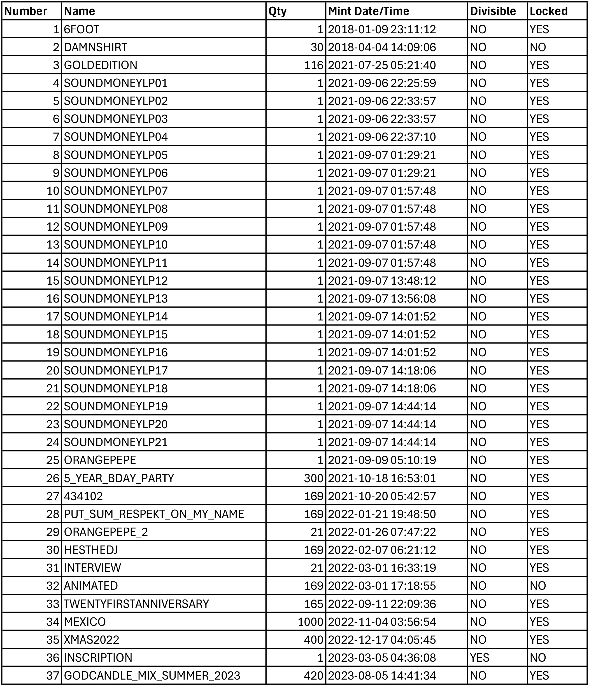
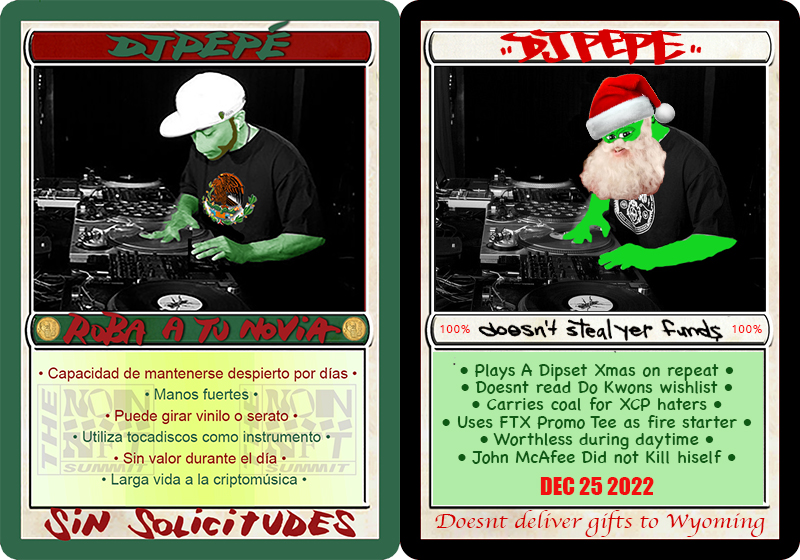

# Official Rare Pepe Sub Assets


_**Work in progress**_ - if you would like to contribute your sub asset-specific story, please follow the steps in [how-to-contribute-to-the-book-of-kek.md](../../how-to-contribute-to-the-book-of-kek.md "mention") or send us an email titled **"BoK Edit Request"** to [wiki@pepe.wtf.](mailto:wiki@pepe.wtf?subject=BoK%20Edit%20Request)&#x20;


## Series 2, Card 32 - HOMERPEPE

<figure><figcaption></figcaption></figure>

**Series 2, Card 32** - [HOMERPEPE](https://pepe.wtf/asset/HOMERPEPE) was created by the artist known as "[Boost](https://pepe.wtf/artists/Boost)" who created a total of 25 cards for the Rare Pepe Project. HOMERPEPE is a 1 of 1 token which was famously sold [at auction](https://www.youtube.com/watch?v=-JyR8AEqpYY) for 350,000 PEPECASH (approximately $39,000 USD) during the 2017 Rare Digital Art Festival in New York City. It was then [sold again](https://cointelegraph.com/news/rarest-pepe-most-important-nft-in-art-history-sells-for-205-eth) in early 2021 for 205 ETH (approximately $320,000 USD). It should be pointed out that these sales were for the 1 of 1 token called HOMERPEPE. The token registration was not included. The registration has changed hands several times over the past 6 years and in May 2019 the holder created a sub-asset called [HOMERPEPE.Sock](https://xchain.io/asset/HOMERPEPE.Sock) locked the issuance at 12. They auctioned a pair of physical socks to go along with the token at the Rare Digital Art Festival 2 which was again held in New York City. As of April 23, 2023 there are 5 holders of this sub-asset. One of them is Rare Pepe scientist [Bench](https://twitter.com/benchbtc).

<figure><figcaption></figcaption></figure>

## Series 4, Card 29 - DJPEPE

<figure><figcaption></figcaption></figure>

**Series 4, card 29 -** [**DJPEPE**](https://pepe.wtf/asset/DJPEPE) was created by [**Rare Scrilla**](https://pepe.wtf/artists/Rare-Scrilla). The token ownership is still held by Scrilla and has been steadily issuing sub assets since January 2018. To date, he has issued 37 unique sub assets. Some are to celebrate special occasions such as "[**5\_YEAR\_BDAY\_PARTY**](https://tokenscan.io/asset/DJPEPE.5_YEAR_BDAY_PARTY)" issued to celebrate the 5 year anniversary of the DJPEPE card and announced a party at the [**Rare Villa**](https://www.voxels.com/parcels/4681) inside the virtual world known as [**Cryptovoxels**](https://www.voxels.com/), "[**434102**](https://tokenscan.io/asset/DJPEPE.434102)" which is the Bitcoin block that included the DJPEPE token issuance transaction,  "[**TWENTYFIRSTANNIVERSARY**](https://tokenscan.io/asset/DJPEPE.TWENTYFIRSTANNIVERSARY)", which commemorated the [**September 11th attacks**](https://en.wikipedia.org/wiki/September_11_attacks) with a series of 35mm film images of [**The Pentagon**](https://en.wikipedia.org/wiki/The_Pentagon) taken on that day, [**MEXICO**](https://tokenscan.io/asset/DJPEPE.mexico) which was a special drop for the Non-NFT Summit in Mexico City Nov 7, 2022 and "[**XMAS2022**](https://tokenscan.io/asset/DJPEPE.XMAS2022)" for Christmas 2022.

Others were proof-of-ownership tokens such as the 21 SOUNDMONEYLP tokens, [**6FOOT**](https://tokenscan.io/asset/DJPEPE.6foot) for the 1 of 1 cardboard DJPEPE standup displayed at the [**2018 RARE AF Festival in New York City**](https://www.theparisreview.org/blog/2018/01/23/much-pepe-scenes-first-rare-digital-art-auction/). And some were simply art pieces or parodies of the original DJPEPE.

<figure><figcaption>
An up-to-date list of official DJPEPE sub assets
</figcaption></figure>

<figure><figcaption>
The twenty one 1 of 1 "receipts" for buyers of the Sound Money vinyl record
</figcaption></figure>

<figure><figcaption>
DJ Pepe's 5th birthday anouncement flyer
</figcaption></figure>

<figure><figcaption>
The GOLDEDITION
</figcaption></figure>

<figure><figcaption>
MEXICO and XMAS2022
</figcaption></figure>

## Series 11, Card 29 - CSAT

<figure><figcaption></figcaption></figure>

[**Seris 11, Card 29 - CSAT**](https://pepe.wtf/asset/CSAT) was created by the artist known as [Boost](https://pepe.wtf/artists/Boost). In a [recent interview](https://www.youtube.com/watch?v=rRvC767N5oI), Boost stated that some of the text on the card was lifted from a graphics card box, and that he purposely misspelled a word just like the GPU box did. The word in question is "efficiency" which he spelled "effeciency."  To show the misspelling, Boost issued a sub-asset named [CSAT.cc0](https://xchain.io/asset/A18188137632490106252) and attached an image of the box. The sub-asset was distributed as a dividend for holders of the CSAT card. A total of 98,870 tokens were sent to 671 recipients on August 6, 2022. You can view the transaction [here](https://xchain.io/tx/2082427).&#x20;

<figure><figcaption></figcaption></figure>

## Series 20, Card 16 - VAPORMAGIC

<figure><figcaption></figcaption></figure>

**Series 20, Card 16 -** [**VAPORMAGIC**](https://pepe.wtf/asset/VAPORMAGIC) was created by the artist known as [Boost](https://pepe.wtf/artists/Boost). In a [recent interview](https://www.youtube.com/watch?v=rRvC767N5oI), Boost explained that VAPORMAGIC was a mashup of his own [CSAT](https://pepe.wtf/asset/CSAT) card and Series 1, Card 16 card [MAGICPEPEYE](https://pepe.wtf/asset/MAGICPEPEYE). Of the card, Boost said that CSAT visually displayed taking a trip (through space), so he wanted VAPORMAGIC to display taking a trip of a different type (LSD) by making the background look like a piece of [Blotting paper](https://en.wikipedia.org/wiki/Blotting_paper).&#x20;

In May of 2022, BOST issued a whopping 33 different sub-assets for VAPORMAGIC with supplies ranging from 0 to 300. Of the 33 tokens, 30 of them had an image attached. Boost stated that these were just random images he made with no specific purpose or reason. The tokens were distributed as dividends to VAPORMAGIC token holders between May 2022 and August 2022. Below is a list of the sub-assets in the order in which they were distributed:

[VAPORMAGIC.NAKAMOTO](https://xchain.io/asset/VAPORMAGIC.NAKAMOTO), [VAPORMAGIC.EKO](https://xchain.io/asset/VAPORMAGIC.EKO), [VAPORMAGIC.FRACTURE](https://xchain.io/asset/VAPORMAGIC.FRACTURE), [VAPORMAGIC.KADINSKY](https://xchain.io/asset/VAPORMAGIC.KADINSKY), [VAPORMAGIC.KNIFE](https://xchain.io/asset/VAPORMAGIC.KNIFE), [VAPORMAGIC.METAL](https://xchain.io/asset/VAPORMAGIC.METAL), [VAPORMAGIC.POINTILLIST](https://xchain.io/asset/VAPORMAGIC.POINTILLIST), [VAPORMAGIC.SHADOW](https://xchain.io/asset/VAPORMAGIC.SHADOW), [VAPORMAGIC.SYNESTHESIA](https://xchain.io/asset/VAPORMAGIC.SYNESTHESIA), [VAPORMAGIC.TROPIC](https://xchain.io/asset/VAPORMAGIC.TROPIC), [VAPORMAGIC.WAVE](https://xchain.io/asset/VAPORMAGIC.WAVE), [VAPORMAGIC.print.1](https://xchain.io/asset/VAPORMAGIC.print.1) (token without image), [VAPORMAGIC.print.2](https://xchain.io/asset/VAPORMAGIC.print.2) (token without image), [VAPORMAGIC.print.3](https://xchain.io/asset/VAPORMAGIC.print.3), [VAPORMAGIC.print.4](https://xchain.io/asset/VAPORMAGIC.print.4), [VAPORMAGIC.print.5](https://xchain.io/asset/VAPORMAGIC.print.5), [VAPORMAGIC.print.6](https://xchain.io/asset/VAPORMAGIC.print.6), [VAPORMAGIC.print.7](https://xchain.io/asset/VAPORMAGIC.print.7), [VAPORMAGIC.print.8](https://xchain.io/asset/VAPORMAGIC.print.8), [VAPORMAGIC.print.9](https://xchain.io/asset/VAPORMAGIC.print.9), [VAPORMAGIC.print.10](https://xchain.io/asset/VAPORMAGIC.print.10), [VAPORMAGIC.print.11](https://xchain.io/asset/VAPORMAGIC.print.11), [VAPORMAGIC.print.12](https://xchain.io/asset/VAPORMAGIC.print.12), [VAPORMAGIC.print.13](https://xchain.io/asset/VAPORMAGIC.print.13), [VAPORMAGIC.print.14](https://xchain.io/asset/VAPORMAGIC.print.14), [VAPORMAGIC.print.15](https://xchain.io/asset/VAPORMAGIC.print.15), [VAPORMAGIC.print.16](https://xchain.io/asset/VAPORMAGIC.print.16), [VAPORMAGIC.print.9.1st](https://xchain.io/asset/VAPORMAGIC.print.9.1st), [VAPORMAGIC.print.14.scaler.1](https://xchain.io/asset/VAPORMAGIC.print.14.scaler.1), [VAPORMAGIC.print.14.scaler,2](https://xchain.io/asset/VAPORMAGIC.print.14.scaler.2), [VAPORMAGIC.print.9.preface](https://xchain.io/asset/VAPORMAGIC.print.9.preface), [VAPORMAGIC.print.6.cloud](https://xchain.io/asset/VAPORMAGIC.print.6.cloud).

[VAPORMAGIC.DETAILS](https://xchain.io/asset/VAPORMAGIC.DETAILS) has a current supply of 0 but is not locked, so it is possible that Boost may do something with it at a later date.&#x20;

<figure><figcaption>
All 30 sub-asset images
</figcaption></figure>

To view a full size version of the above image, click [here](https://i.imgur.com/x8pVBZe.jpg). &#x20;

## Series 25, Card 10 - RARECHERRY

<figure><figcaption></figcaption></figure>

**Series 25, Card 10** - [RARECHERRY](https://pepe.wtf/asset/RARECHERRY) was created by the artist that goes by [Nathan Sonic](https://pepe.wtf/artists/nathan-sonic). It is one of 14 cards created by Sonic for the Rare Pepe project. RARECHERRY was coded to parody the victory animation from [Microsoft Solitaire](https://en.wikipedia.org/wiki/Microsoft_Solitaire) which has been part of the Windows operating system since Windows 3.0 which was released in 1990. The asset name pays homage to the original author of the game - [Wes Cherry](https://www.youtube.com/watch?v=3x5VAg1HJIg). &#x20;

RARECHERRY is a .gif file that runs through 35 different Rare Pepe cards. In October 2022, Sonic released the subasset [RARECHERRY.FULLCHERRY](https://xchain.io/asset/RARECHERRY.FULLCHERRY) which when loaded, a bit of code starts to run that displays all 1,774 Rare Pepe cards in order. If you were to view every card, it would take you approximately 45 minutes. You can view the animation by clicking the link below. &#x20;



## Series 25, Card 38 - CHAMPAGNETNT

<figure><figcaption></figcaption></figure>

**Series 25, Card 38** - [CHAMPAGNETNT](https://pepe.wtf/asset/CHAMPAGNETNT) was created by [Mike in Space](https://pepe.wtf/artists/Mike-in-space) it is his only card in the Rare Pepe project. The card portrays a pepefied version of [Wayne Vaughan](https://www.linkedin.com/in/wayne/), the CEO of Texas-based blockchain company [Tierion, Inc.](https://tierion.com/) Vaugn and his company was found to be guilty of conducting an unregistered security offering when it sold the TNT token and was ordered by the [SEC](https://en.wikipedia.org/wiki/U.S._Securities_and_Exchange_Commission) to [return the $25 million they raised from investors](https://news.bitcoin.com/sec-lawsuit-tierion-refund-investors-25-million/).&#x20;

Since minting the card in 2017, Mike has released 3 sub-assets.&#x20;

<figure><figcaption></figcaption></figure>

The first - [CHAMPAGNETNT.SIGNED](https://xchain.io/asset/CHAMPAGNETNT.SIGNED) was released in late 2021. What made this card so unique is that it includes the actual signature of the person being parodied on it (Wayne Vaughan).&#x20;

<figure><figcaption></figcaption></figure>

Then in June of 2022, Mike released a very creative version of his card entitled [CHAMPAGNETNT.KANDINSKY](https://xchain.io/asset/CHAMPAGNETNT.KANDINSKY) which he made to look like artwork from the artist [Wassily Kandinsky](https://en.wikipedia.org/wiki/Wassily_Kandinsky).&#x20;

<figure><figcaption></figcaption></figure>

And in February of 2023, at the height of Ordinal mania, Mike released [CHAMPAGNETNT.INSCRIPTION](https://xchain.io/asset/CHAMPAGNETNT.INSCRIPTION) which points to Ordinal Inscription #[47,947](https://ordinals.com/inscription/d69652c38d46523d2fad5436771f9d9a94e39e2b80cf9e144ed951c7d9997120i0). This was done by using a [tool](https://inscribe.art/) created by [Joe Looney](https://twitter.com/wasthatawolf) - the creator of [rarepepewallet.com](https://rarepepewallet.com/). The inscription is a still image taken from the original .gif file used for the Rare Pepe card.&#x20;

## Series 29, Card 7 - RARETEMPLATE

<figure><figcaption></figcaption></figure>

**Series 29, Card 7** - [RARETEMPLATE](https://pepe.wtf/asset/RARETEMPLATE) was created by the artist [Nathan Sonic](https://pepe.wtf/artists/nathan-sonic). The card is a looping gif of a smiling pepe vortex. In October 2022 Sonic released a subasset titled [RARETEMPLATE.FULLRARETEMPLATE](https://xchain.io/asset/RARETEMPLATE.FULLRARETEMPLATE). When loaded, a bit of code starts which is an interactive vortex of smiling pepes in every color of the rainbow. By moving your mouse around the screen, you can move the center of the vortex and the pattern that is displayed. Below is a sample from the program and a link to the site where you can interact with it. &#x20;

<figure><figcaption></figcaption></figure>



