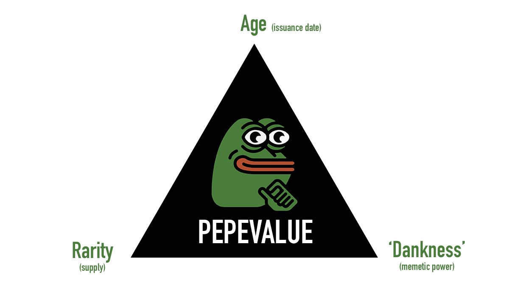

# Rare Pepe Valuation

Rare Pepes are the first art project in the history of NFTs. In a sense, they were to Bitcoin what [Cryptopunks](https://www.larvalabs.com/cryptopunks) are to Ethereum.

Part of the reason why Rare Pepes are so valuable is because they are **more difficult to get compared to most ERC-721 NFTs.**

Pepe valuation is based on 3 factors:

* Age (issuance date)
* Rarity (supply)
* Dankness (memetic power)

All Rare Pepes are old, but the oldest are the most valuable.

In 2018, a digital arts conference [Rare AF](https://raredigitalartfestival.splashthat.com/) was hosted in NYC. It was the first conference of its kind as it was hosting the world’s first Rare Pepes auction.

The last art piece to be auctioned was a Rare Pepe card called “Homer Pepe”. It started a bid war between two individuals. The crowd was so loud that the two bidders didn’t hear who won the bid and ended up tossing a coin flip to decide who gets to buy the Homer Pepe card.

The card was sold for 350,000 PEPECASH ($39,000) to Peter Kell.

.png>)

> _“What makes this Pepe worth so much? It’s the only one with a misprint. That’s value.”_ - Peter

Later in March 2021, Peter sold Homer Pepe for 205 ETH ($320,000).

