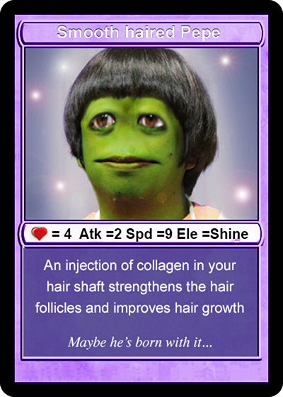
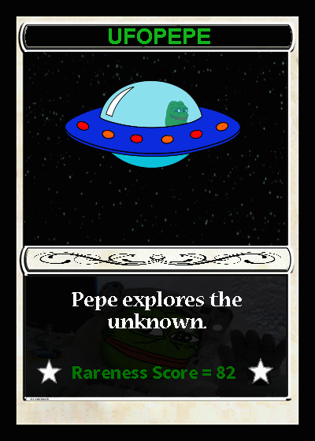
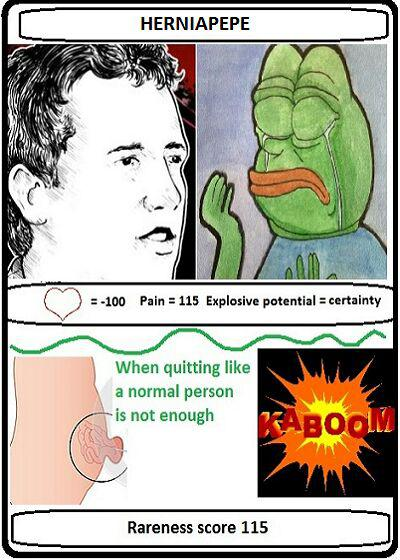
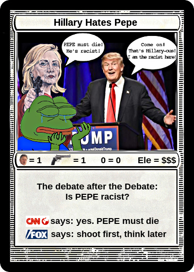
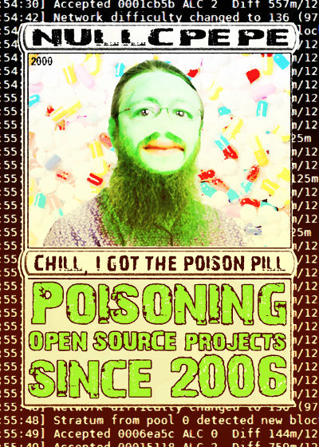
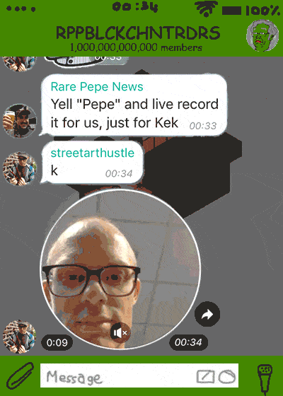

# Series & Card Specific Lore

There are 1774 different Rare Pepe Cards broken up into 36 series, each with (mostly) 50 unique cards.

Cards in series 1-9 were created in 2016.\
Cards in series 11-30 were created in 2017.\
Cards in series 31-36 were created in 2018.

Not all Rare Pepes are equally rare, some cards were issued 1000 times, some 100 times, some just once. Some, like PEPECASH, are issued 1 billion times.

However, the center of the bell curve sits around the 100–300 issuance levels, and some cards have also been subject to significant burn reductions. Each Rare Pepe has unique qualities.

Some of most valuable cards include the [Nakamoto RAREPEPE](http://rarepepedirectory.com/?p=10) (300 issued, Series 1, Card 1), the revered [LORDKEK](http://rarepepedirectory.com/?p=181) (10 issued, Series 1, Card 34), [DJPEPE](http://rarepepedirectory.com/?p=814) the first audio-visual tokenized asset (169 Issued, Series 4, Card 29), [UFOPEPE](http://rarepepedirectory.com/?p=193) the first tokenized gif (800 issued, Series 1, Card 37), and of course the [HOMERPEPE](http://rarepepedirectory.com/?p=392) (1 Issued, Series 2, Card 32) which is considered by many to be [‘the most important NFT in crypto art history’](https://cointelegraph.com/news/rarest-pepe-most-important-nft-in-art-history-sells-for-205-eth). There are various other 1/1s and other Rare Pepe cards.

## Famous Rare Pepe collections:

* **History of Art collection**\
  ****The Rare Pepe History of Art Series is a collection of Rare Pepe, all in series 8, by the anonymous twitter personality [Dan Dark Pill](https://twitter.com/DanDarkPill), designed in the style of famous artists such as Pablo Picasso, Vincent Van Gogh, and Salvador Dali. The collection was intended to be 24 cards, but only seven were completed (#1-6 and #8). Although 100 supply of each pepe were minted, 86 or more of each card is believed to be in a counterparty wallet for whom the private keys are permanently lost, making these cards extraordinarily rare and valuable. Less than 5 complete sets are known to exist, and [one is available at auction house Scarce City](https://scarce.city/auctions/rarepepe-history-of-art) for prospective buyers.
* **Hip Hop Elements collection**\
  This series 4 collection was created by long-time Rare Pepe and Fake Rare contributor Rare Scrilla to celebrate the elements of hip-hop music: DJs, MCs, break dance and graffiti. DJPEPE is an iconic Rare Pepe, as it is one of the few that offers bonus content (a link to soundcloud playlist of Rare Scrilla), and the first known music NFT ever.
* **Putin Pepe collection**\
  This series 3 collection, also by Dan Dark Pill, features 6 depictions of Russian President Vladmir Putin. The first [six cards](https://pepe.wtf/sets/Putin-Set) are only 9 issuance each, and the last one is a unique 1/1.
* **Mr. Hansel Triptych collection**\
  Mr. Hansel, one of the most prolific artists in the Rare Pepe Directory, made this [3-part series](https://pepe.wtf/sets/Mr-Hansel-Triptych) of pepe the frog depictions set in 1910.

## Famous Rare Pepe cards:

* ****[**RAREPEPE**](https://pepe.wtf/asset/RAREPEPE) **** (Series 1, Card 1, 1/300)\
  ****The first Rare Pepe ever attached to the Bitcoin blockchain. The Rare Pepe that started it all and the most iconic in the collection. The creator, known only as Mike, planted the seed for all of tokenized cryptoart and subsequently NFTs, with this card. There was no marketplace, there was no community of crypto artists and collectors, there was no plan to make an 18 month run of cards. He simply posted the image in a telegram chat and named it using the XCP protocol. It is based upon Dorian Satoshi Nakamoto, an elderly man [misidentified by Newsweek magazine](https://www.newsweek.com/2014/03/14/face-behind-bitcoin-247957.html) in 2014 as Satoshi Nakamoto, the anonymous creator of Bitcoin. Ownership of the Nakamoto Card gains you access to the very exclusive 300 Club.

* ****[**GOXPEPE**](https://pepe.wtf/asset/GOXPEPE) **** (Series 1, Card 2, 1/1,500)

* ****[**SHITCOINCARD**](https://pepe.wtf/asset/SHITCOINCARD) **** (Series 1, Card 3, 1/3,000)

* ****[**PEPECASH**](https://pepe.wtf/asset/PEPECASH) (Series 1, Card 11)\
  Alongside XCP, PEPECASH was the built-in currency of Rare Pepe Wallet. Many songs and memes were produced about the benefits of holding PEPECASH, including making you “alpha”. PEPECASH is a card just like the other cards on this directory, except it is a lot more liquid. Less than 700 million PEPECASH are in circulation at the moment. PEPECASH is meant to be the currency of the Pepesphere. It was initially needed to pay submission fees to get Rare Pepes into the Rare Pepe Directory, and into the wallets. Some people were also working on games that use PEPECASH. Each week half of the earnings from submissions were sacrificed to Kek for good luck. (This made PEPECASH deflationary.)

* ****[**HAIRPEPE**](https://pepe.wtf/asset/HAIRPEPE) (Series 1, Card 18, 1/1,000)\
  HAIRPEPE is a cult classic amongst the early Rare Pepe collectors for its dankness. Ownership of HAIRPEPE gains you access to a private chat room known as The Salon. HAIRPEPE trading caused the mempool to clog up on Dec 2nd, 2016.

* ****[**LORDKEK**](https://pepe.wtf/asset/LORDKEK) **** (Series 1, Card 34, 1/10, **divisible**)\
  The LORDKEK card has legendary status amongst the Rare Pepe community. It’s a deity of the Rare Pepes. When creating (minting) the card, its creator [@Robness](https://twitter.com/robnessofficial) mistakenly made the card infinitely divisible, causing the card to break not long after its mint. Particles (commonly referred to as “dust”) of the card started trading. Apart from the 7 addresses that hold one full card (and are most likely not keen on selling them), it’s practically impossible for a single individual nowadays to collect a full LORDKEK card. The only dispensers which are selling parts of the card, are offering fractions of it (.00001). [@Robness](https://twitter.com/robnessofficial) was the one who minted the asset onto the blockchain, but the artwork for the card was made by another artist, [@NeedMoney90](https://pepe.wtf/artists/NeedMoney90). Albeit, when asked, both of the creators agreed that there were such strong memetic forces at play when the card was being created, concluding that it must have been [Kek](https://pepe.wtf/artists/Kek) himself responsible for the creation of the LORDKEK card.\
  It’s often spoken that the card possesses mystical properties and is therefore considered magical.

* ****[**UFOPEPE** ](https://pepe.wtf/asset/UFOPEPE)(Series 1, Card 37, 1/800)\
  Also created by Mike, UFOPEPE is the first known GIF NFT.

* ****[**HERNIAPEPE**](https://pepe.wtf/asset/HERNIAPEPE) (Series 1, Card 45, 1/115)\
  Mike Hearn was a longtime Bitcoin developer dating back to its earliest days. During the infamous Blocksize Wars, Hearn was a strong proponent of raising the block size, and even created an alternative client to Bitcoin Core known as Bitcoin XT. When his proposal failed to gain adoption, Hearn declared Bitcoin a failed project in January 2016, and publicly declared he was selling all of his bitcoin (at the then-price of around $400) and leaving the community entirely. His declaration, which was plastered on [his personal blog](https://blog.plan99.net/the-resolution-of-the-bitcoin-experiment-dabb30201f7) and an extensive [interview in The New York times](https://www.nytimes.com/2016/01/17/business/dealbook/the-bitcoin-believer-who-gave-up.html), was described by many bitcoiners such as bittorrent founder Bram Cohen as a “[whiny ragequit](https://bramcohen.medium.com/whiny-ragequitting-cab164b1e88)”.

* ****[**PEPEROSS**](https://pepe.wtf/asset/PEPEROSS) (Series 2, Card 11, 1/50)\
  PEPEROSS is the first pepe to directly reference a previous entry in the directory, in this case the Nakamoto card (RAREPEPE). The idea of referencing prior cards (especially the Nakamoto card) would go on to become a recurring theme.

* ****[**HILLARYPEPE**](https://pepe.wtf/asset/HILLARYPEPE) (Series 2, Card 21, 1/400)\
  In September 2016, in the heat of the 2016 Presidential election, and less than a month after the Rare Pepe project had launched and the directory opened for submissions, pepe the frog was branded as a hate symbol of the alt-right by Democratic candidate Hillary Clinton. Suddenly, the project came under increased scrutiny. To make light of the situation, HILLARYPEPE was created and added to the directory.

* ****[**HOMERPEPE**](https://pepe.wtf/asset/HOMERPEPE) (Series 2, Card 32, 1/1)\
  The rarest card, HOMERPEPE is a unique 1/1 Rare Pepe that rose to prominence in January 2018 at the Rare Digital Art Festival in NYC, when it was auctioned for 350,000 PEPECASH ($39,000 at the time). This sale was the first major NFT sale, demonstrating that this form of artwork could fetch significant value and become a source of income for artists. In March 2021, HOMERPEPE was resold for $320,000.

* ****[**DJPEPE**](https://pepe.wtf/asset/DJPEPE) **** (Series 4, Card 29, 1/169)\
  Created on October 13th, 2016, DJPEPE is the first audio NFT, where tokenized crypto art meets music. An artist known as RareScrilla created this first music-linked Rare Pepe card. DJPEPE had an issuance of 169 cards and allowed users access to bonus content, a private Soundcloud link with exclusive music. Owners of this token, when using Rare Pepe Wallet, can access a link to a private SoundCloud managed by creator Rare Scrilla. DJPEPE is part of a four card “Hip-Hop” Series, which includes [**MCPEPE**](https://pepe.wtf/asset/MCPEPE), [**BBOYPEPE**](https://pepe.wtf/asset/BBOYPEPE), and [**PEPEONE**](https://pepe.wtf/asset/PEPEONE). DJPEPE cards were mostly given away at blockchain conferences and events from 2017-19 making them highly sought-after and one of the original crypto art pieces with unlockable bonus content.


Interview with RareScrilla, the creator of DJPEPE


* ****[**PEPETHUGLIFE**](https://pepe.wtf/asset/PEPETHUGLIFE) (Series 7, Card 17, 1/163)\
  On September 2, 2021, Bitcoin and Rare Pepe enthusiast Juan Galt sent PEPETHUGLIFE to the Liquid network [via a one-way transaction](https://www.juangalt.com/the-first-liquid-pepe/), making it the first pepe to make this journey.

* ****[**SEGWITPEPE**](https://pepe.wtf/asset/SEGWITPEPE) (Series 17, Card 27, 1/160)\
  One of the most contentious battles in Bitcoin history was the approval of Segregated Witness, also known as SegWit, a proposal to change bitcoin’s transaction format. This addition to the protocol was ultimately deployed on August 1, 2017, after considerable resistance from the “big block” contingent of the blocksize war. The author of SegWit was Bitcoin Core developer [Pieter Wuille](https://twitter.com/pwuille), co-founder of Blockstream who currently works at Chaincode Labs.

* ****[**PIMENTOLOAF**](https://pepe.wtf/asset/PIMENTOLOAF) (Series 19, Card 41, 1/500)\
  On February 27, 2019, the series 19 card PIMENTOLOAF was sent in a transaction over the Blockstream satellite, making it the first NFT to be sent via space. Created by the late Rare Pepe Scientist John Villar, it depicts a [scene from the parody show Bitcoin Car Talk](https://www.youtube.com/watch?v=lm5jj-L6lgA\&t=49s), featuring Mikeinspace and Jason Seibert.

* ****[**NULLCPEPE**](https://pepe.wtf/asset/NULLCPEPE) (Series 20, Card 19, 1/2,000)\
  Gregory Maxwell is a Bitcoin developer and former co-founder of bitcoin infrastructure company Blockstream, who posts on reddit under the handle [nullc](https://www.reddit.com/user/-nullc/). During the Blocksize War, he became a controversial figure and was accused by big blockers for poisoning the environment around open source projects, including previously at Wikipedia. He was one of the 5 individuals holding commit access to the Bitcoin Core repository, until he voluntarily surrendered his keys in 2015.

* ****[**FEELSGOODMAN**](https://pepe.wtf/asset/FEELSGOODMAN) (Series 20, Card 50, 1/500)\
  While the Rare Pepe Directory was closed in March 2018, one notable exception was made for the 1000th card, which had been set aside for Matt Furie, Pepe's creator. On October 5, 2021, Furie finally submitted the artwork for FEELSGOODMAN, making the Rare Pepe Directory officially complete. Learn more about the card in [this](https://open.spotify.com/episode/7LLY16oChVmy64hCnXZhYr?si=7476abeb2cb94ba5) podcast from Deeze Spaces with Matt Furie and Joe Looney.

* [**LUKEJRPEPE**](https://pepe.wtf/asset/LUKEJRPEPE) (Series 21, Card 7, 1/500)\
  [Luke-Jr](https://twitter.com/LukeDashjr) is also a longtime Bitcoin Core contributor. He is known to be a very devout Catholic.

.jpeg>)

* ****[**YELLPEPE**](https://pepe.wtf/asset/YELLPEPE) (Series 30, Card 3, 1/2,600)\
  On June 21, 2017 the late Rare Pepe artist Nathan Carson, also known as [@streetarthustle](https://twitter.com/streetarthustle), was in a crowded classroom when he was dared by members of the Rare Pepe Blockchain Trading Group to scream “PEPE!!” loudly. [He recorded this](https://youtu.be/UH7x6CUa2XQ), and it was immortalized into the series 30 card YELLPEPE.

* [**INVISIBLPEPE**](https://pepe.wtf/asset/INVISIBLPEPE) (Series 30, Card 50, 1/1,500)\
  The first imageless pepe. INVISIBLPEPE was also notable for having the private key to a [STILLPEPE](https://pepe.wtf/asset/STILLPEPE) (Series 1, Card 10) secretly embedded within metadata of the image.

#### Also relevant:

* ****[**PEPALISA**](https://pepe.wtf/asset/PEPALISA) **** (iconic dank portrait)
* ****[**PEPEBASQUIAT** ](https://pepe.wtf/asset/PEPEBASQUIAT)(iconic fine art Pepe)
* ****[**RAREPEPESS** ](https://pepe.wtf/asset/RAREPEPESS)(1st Rare Pepe sports card)
* ****[**DAOPEPEHACK** ](https://pepe.wtf/asset/DAOPEPEHACK)(the Ethereum DAO hack)
* ****[**HARDPEPEFORK**](https://pepe.wtf/asset/HARDPEPEFORK) (the hard fork)
* ****[**GODEMPEPE** ](https://pepe.wtf/asset/GODEMPEPE)(Link Marine omen)
* ****[**PEPETHUGLIFE**](https://pepe.wtf/asset/PEPETHUGLIFE) (most used GIF)
* [**CUBEPEPE**](https://pepe.wtf/asset/CUBEPEPE) (Chainlink omen)
