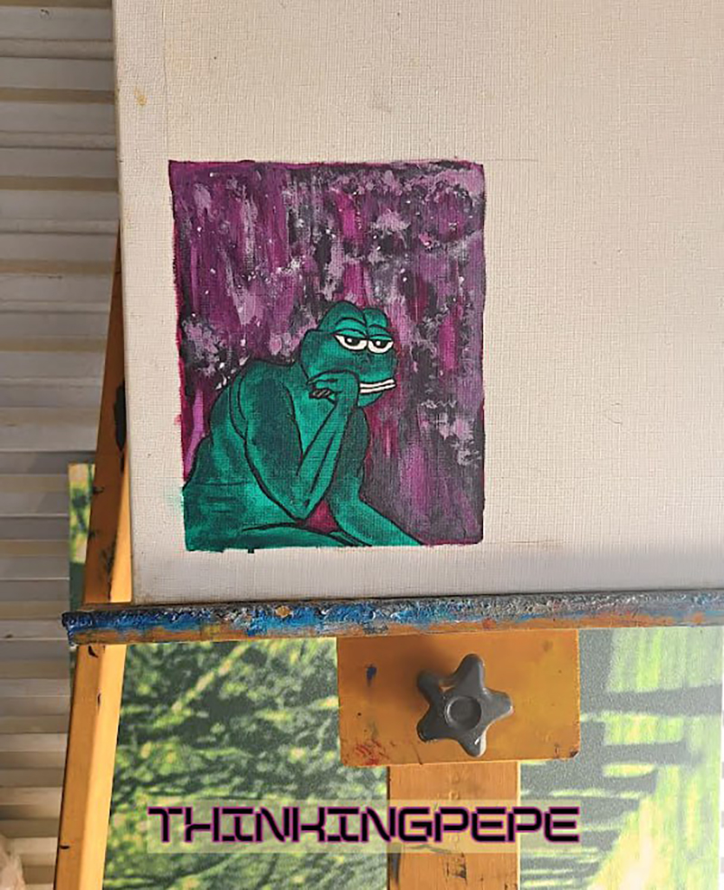

# Series 16

## Series 16, Card 17  - PEPEAXEGANG

<figure><figcaption></figcaption></figure>

**Series 16, Card 17** - [PEPEAXEGANG](https://pepe.wtf/asset/PEPEAXEGANG) was created by an [unknown artist](https://pepe.wtf/artists/1HG3SoUvnpp9jkNunYqbzfYRYBMqXfQD3t). They only created two cards for the Rare Pepe project, the other one being [LIZZZFACEPEPE](https://pepe.wtf/asset/LIZZFACEPEPE).&#x20;

Based on the axe logo at the top of this otherwise hand-drawn card my best guess is that the artist was making reference to the Chinese [gang](https://en.wikipedia.org/wiki/The\_Axe\_Gang) founded in 1921 of the same name that was popularized by the 2004 action-comedy film [_**Kung Fu Hustle**_](https://en.wikipedia.org/wiki/Kung\_Fu\_Hustle).&#x20;

## Series 16, Card 29 - THINKINGPEPE

<figure><figcaption></figcaption></figure>

**Series 16, Card 29** - [THINKINGPEPE](https://pepe.wtf/asset/THINKINGPEPE) was created by the artist known as [Pepe\_1337](https://pepe.wtf/artists/Pepe\_1337) who created a total of 21 Rare Pepe cards. It is an original piece based on the famous bronze sculpture by [Auguste Rodin](https://en.wikipedia.org/wiki/Auguste\_Rodin) called ["The Thinker"](https://en.wikipedia.org/wiki/The\_Thinker)  (_Le Penseur in French_). On May 19, 2024 Pepe\_1337 posted the following in the Official Rare Pepe Telegram chat room, "for those who were wondering, THINKINGPEPE started off as a sketch, then acrylic painting, then transferred and digitally enhanced." And he shared the image below of the original acrylic painting.

<figure><figcaption></figcaption></figure>

