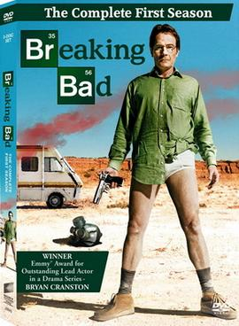

# Series 2

## Series 2, Card 5 - HEISENPEPE

<figure><figcaption></figcaption></figure>

**Series 2, Card 5** - [HEISENPEPE](https://pepe.wtf/asset/HEISENPEPE) was created by the artist known as [Django Bits](https://pepe.wtf/artists/Django-Bits). He created a total of 13 cards for the Rare Pepe series. This card pays homage to the American crime drama television series [Breaking Bad](https://en.wikipedia.org/wiki/Breaking\_Bad). Django used several iconic items from the show including the [RV](https://en.wikipedia.org/wiki/Recreational\_vehicle) used by the main character [Walter White](https://en.wikipedia.org/wiki/Walter\_White\_\(Breaking\_Bad\)) for cooking [methamphetamine](https://en.wikipedia.org/wiki/Methamphetamine). The Mexican cartel's [sketch](https://www.looper.com/322733/the-breaking-bad-prop-that-still-has-fans-scratching-their-heads/) of White, AKA "Heisenberg." A parody of White's famous saying, "[I am the one who knocks](https://knowyourmeme.com/memes/i-am-the-one-who-knocks)" from a monologue in which he insists he is a dangerous man to be feared. And finally, the use of the [periodic table](https://en.wikipedia.org/wiki/Periodic\_table) for the element Pepegen (Pe).&#x20;

<figure><figcaption></figcaption></figure>

## Series 2, Card 6 - RAREMRROBOT

<figure><figcaption></figcaption></figure>

**Series 2, Card 6** - [RAREMRROBOT](https://pepe.wtf/asset/RAREMRROBOT) was created by an [unknown artist](https://pepe.wtf/artists/15ko5dF1zjEvVg9KLiMvyeVZAcX6edymy7). They created a total of 2 cards for the Rare Pepe series. This card is of a pepefied [Rami Malek](https://en.wikipedia.org/wiki/Rami\_Malek) from the American drama thriller television series [Mr. Robot](https://en.wikipedia.org/wiki/Mr.\_Robot). In the show, Malek plays a computer hacker. Thus the made-up computer code on the card.&#x20;

## Series 2, Card 11 - PEPEROSS

<figure><figcaption></figcaption></figure>

**Series 2, Card 11** - [PEPEROSS](https://pepe.wtf/asset/PEPEROSS) was created by the artist known as [Boost](https://pepe.wtf/artists/Boost). He created a total of 25 cards for the Rare Pepe series. This card pays tribute to the American painer, art instructor, and television host [Bob Ross](https://en.wikipedia.org/wiki/Bob\_Ross). He was the creator and host of the instructional television show ["The Joy of Painting"](https://en.wikipedia.org/wiki/The\_Joy\_of\_Painting) which aired from 1983 until 1994. The image used for the card was taken from Ross' One Hour Special - [The Grandeur of Summer](https://youtu.be/mT0RNrTDHkI) which never aired on television. Boost replaced the lovely landscape that Ross created on the show with an even lovelier [RAREPEPE](https://pepe.wtf/asset/RAREPEPE) card.&#x20;

## Series 2, Card 23 - LIAMPEPE

<figure><figcaption></figcaption></figure>

Series 2, Card 23 - [LIAMPEPE](https://pepe.wtf/asset/LIAMPEPE) was created by an [unknown artist](https://pepe.wtf/artists/1FPHSQjNtUmbEE1tGhMbUE3nzozaZ2vpwf). This was their only submission to the Rare Pepe project. The image used for the card is of Irish actor [Liam Neeson](https://en.wikipedia.org/wiki/Liam\_Neeson) from the movie [Taken](https://en.wikipedia.org/wiki/Taken\_\(film\)). In the movie, Neeson plays Bryan Mills, an ex-[CIA](https://en.wikipedia.org/wiki/CIA) officer who sets about tracking down his teenage daughter Kim (Grace) and her best friend Amanda (Cassidy) after the two girls are kidnapped by Albanian human traffickers while traveling in France during a vacation. The card also includes references to several lines from the movie including Neeson's ["I will find you, and I will kill you."](https://www.esquire.com/entertainment/movies/a31775/taken-speech/) and one of the kidnapper's taunts, "Good Luck."

## Series 2, Card 32 - HOMERPEPE

<figure><figcaption></figcaption></figure>

**Series 2, Card 32** - [HOMERPEPE](https://pepe.wtf/asset/HOMERPEPE) was created by the artist known as [Boost](https://pepe.wtf/artists/Boost) and is arguably the most famous card in the entire set. The card is a simple parody of the cartoon character Homer Simpson from the American animated sitcom ["The Simpsons,"](https://en.wikipedia.org/wiki/The\_Simpsons) and includes a typo (mintue, instead of minute). The Simpsons is the longest-running American animated series, longest-running American sitcom, and the longest-running American scripted primetime television series, both in terms of seasons and number of episodes. But that's not what makes this card so special.

First of all, it is a 1 of 1. Second, it was sold at an auction held at the first digital art auction in history which was at the 2018 Rare Digital Art Festival in New York City for 350,000 PEPECASH (approximately $39,000 USD at the time of the sale) by [Peter Kell](https://knowyourmeme.com/editorials/interviews/peter-kell-recounts-the-story-of-buying-homer-pepe-the-most-valuable-rare-pepe-ever-and-how-he-sold-it-for-over-300000-three-years-later) - The self proclaimed PEPECASH Millionaire. Kell and the card were both featured in the [Feels Good Man](https://youtu.be/XVWQmQHVw48?t=3829) documentary and then sold the card three years later for [$312,000](https://knowyourmeme.com/news/homer-simpson-rare-pepe-nft-crypto-art-sells-for-over-312000).


The 2018 HOMERPEPE Auction


## Series 2, Card 34 - WINKELPEPE

<figure><figcaption></figcaption></figure>

**Series 2, Card 34** - [WINKELPEPE](https://pepe.wtf/asset/WINKELPEPE) was created by the artist known as [DanDarkPill](https://pepe.wtf/artists/DanDarkPill). Mr. Pill created a total of 26 cards for the Rare Pepe project including the History of Art series and the Putin set. Originally minted as 2 assets, one was sent to a burn address just 5 days after it was issued making the card a 1 of 1. At the time of writing, the card is in a dispenser and can be yours for the low low price of 89.9 BTC.

The card image is taken from the 1980 psychological horror film [The Shining](https://en.wikipedia.org/wiki/The\_Shining\_\(film\)). The film is based on [Stephen King](https://en.wikipedia.org/wiki/Stephen\_King)'s 1977 novel of the same name. At one point in the film, the child actor [Danny Lloyd](https://en.wikipedia.org/wiki/Danny\_Lloyd) is riding his [big wheel](https://en.wikipedia.org/wiki/Big\_wheel\_\(tricycle\)) through the kitchen and down the staff quarters hallway of the Overlook Hotel. As he turns a corner he encounters [twin girls](https://twitter.com/Shining\_twins) wearing identical outfits and holding hands. Their only lines of dialog being "Hello Danny. Come and play with us. Come and play with us, Danny. For ever and ever and ever." &#x20;

On the heads of the twins, Mr. Pill pasted green versions of the twins [Cameron](https://en.wikipedia.org/wiki/Cameron\_Winklevoss) and [Tyler](https://en.wikipedia.org/wiki/Tyler\_Winklevoss) Winklevoss who claim to have had their idea for [Facebook](https://en.wikipedia.org/wiki/Facebook) stolen by [Mark Zuckerberg](https://en.wikipedia.org/wiki/Mark\_Zuckerberg) while attending [Harvard University](https://en.wikipedia.org/wiki/Harvard\_University). The twins went on to found [Gemini](https://www.gemini.com/) where they became the first Bitcoin Billionaires.&#x20;

<figure><figcaption>
The original image used for the WINKLEPEPE Card. 
</figcaption></figure>
