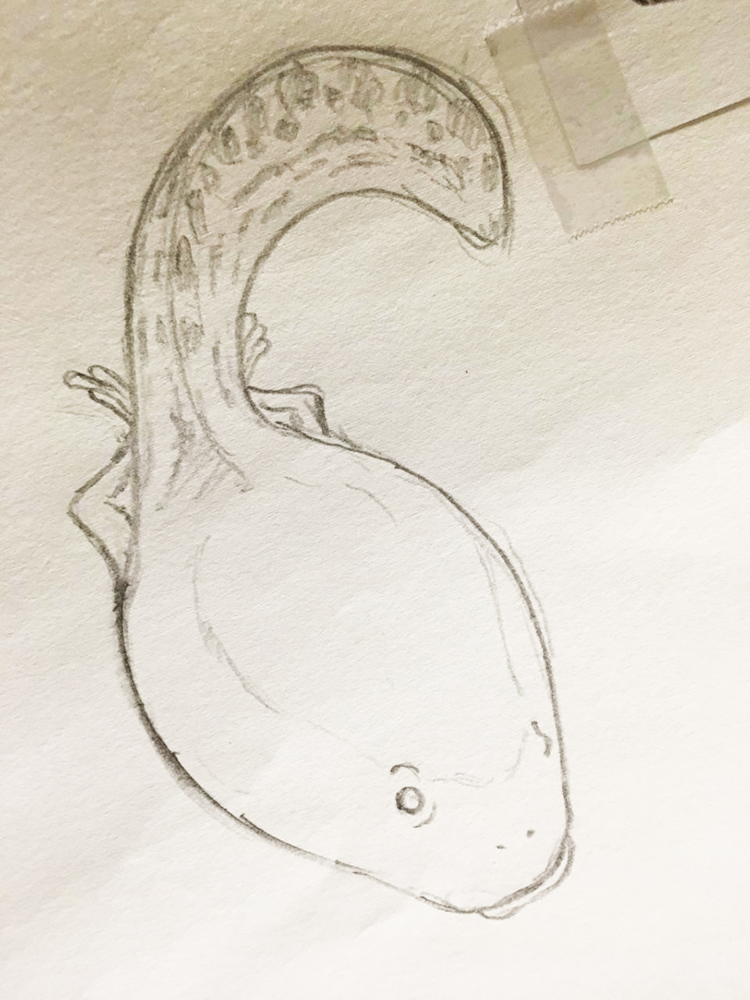

# Series 21

## Series 21, Card 6 - PEPETOPKEK

<figure><figcaption></figcaption></figure>

**Series 21, Card 6** - [PEPETOPKEK](https://pepe.wtf/asset/PEPETOPKEK) was created by [Nathan Sonic](https://pepe.wtf/artists/nathan-sonic). He created a total of 14 cards for the Rare Pepe project. In Turkish, kek means cake, and Topkek, a brand of cupcakes, was first produced in 1990 by [ETi](https://www.etiinternational.com/eti-topkek-cake-with-strawberry), a Turkish confectionery company. This card is a green version of the topkek strawberry cupcake packaging. The term Topkek became a [meme](https://knowyourmeme.com/memes/topkek.) on [4chan](https://www.4chan.org/) in 2013.

## Series 21, Card 18 - PEPEBALL

<figure><figcaption></figcaption></figure>

**Series 21, Card 18** - [PEPEBALL](https://pepe.wtf/asset/PEPEBALL) was created by the Japanese artist known as [Oni Giri](https://pepe.wtf/artists/Oni-Giri). She created a total of 9 cards for the Rare Pepe project; 8 of which are original artworks! Oni said of PEPEBALL, "I made this one because I love [Dragon Ball](https://en.wikipedia.org/wiki/Dragon_Ball_Z) so much." The pepe in the [gi](https://en.wikipedia.org/wiki/Karate_gi) was modeled after the main protagonist of the series - [Goku](https://dragonball.fandom.com/wiki/Goku).&#x20;

## Series 21, Card 23 - MAUIPEPE

<figure><figcaption></figcaption></figure>

**Series 21, Card 18 -** [**MAUIPEPE**](https://pepe.wtf/asset/MAUIPEPE) was created by the artist [**Luis Rivera**](https://x.com/impossibleartif)**.** It is one of 14 cards he made for the Rare Pepe directory. The ownership of all 14 have since been sold to former Rare Pepe Scientist, and creator of Freewallet and the tokenscan block explorer, Jdog. The card concept was done by Luis and then commissioned to the artist [**Julia Jenkins**](https://linktr.ee/juliajenkinsart) for final design and coloring. The original of each is below.&#x20;

<figure><figcaption></figcaption></figure>

## Series 21, Card 25 - PEPEANDY

<figure><figcaption></figcaption></figure>

**Series 21, Card 25** - [PEPEANDY](https://pepe.wtf/asset/PEPEANDY) was created by an [unknown artist](https://pepe.wtf/artists/1LHPw5hFTr8NYkE86b3F11y7vnBhmpJrts). They created the five card "Pepe the Forbidden One" set, six other portrait Rare Pepe cards similar to this one, and two transportation cards.

The Andy pictured here is [Andy Weissman](https://www.usv.com/people/andy-weissman/) a Managing Partner at [Union Square Ventures](https://www.usv.com/). USV [invests heavily in the crypto industry](https://www.theblock.co/linked/92652/union-square-ventures-crypto-2021-fund).

## Series 21, Card 26 - DUMMIES

<figure><figcaption></figcaption></figure>

**Series 21, Card 26** - [DUMMIES](https://pepe.wtf/asset/DUMMIES) was created by the artist known as [Finest Rares](https://pepe.wtf/artists/Finest-Rares). He created a total of 18 cards for the Rare Pepe series including the two card "Baby Series" ([TUBBIES](https://pepe.wtf/asset/TUBBIES) and [PEPEPAMPERS](https://pepe.wtf/asset/PEPEPAMPERS)).&#x20;

This card is a parody of the [For Dummies series of books](https://en.wikipedia.org/wiki/For_Dummies). The first book in the series was DOS For Dummies which was published in late 1991.&#x20;

## Series 21, Card 30 - TADPOLEPEPE

<figure><figcaption></figcaption></figure>

**Series 21, Card 30** - [TADPOLEPEPE](https://pepe.wtf/asset/TADPOLEPEPE) was created by a Japanese artist known as [Mekabu](https://pepe.wtf/artists/Mekabu). He envisioned pepe as a tadpole because he felt it was a good analogy for the growing popularity of the Rare Pepe project. You'll notice at the bottom right of the card the word "memeclip" which is the name of the art group Mekabu and his wife attended. It means "to clip out the creativity of us (me and me) and keep it in the piece."

Below is an early sketch of TADPOLEPEPE given to me by Mekabu.

<figure><figcaption></figcaption></figure>

## Series 21, Card 41 - MUNETOPEPE

**Series 21, Card 41** - [MUNETOPEPE](https://pepe.wtf/asset/MUNETOPEPE) was created by an [unknown artist](https://pepe.wtf/artists/1HxpuXAdaWbGr81bRXE5GKKw3aPZxoxzBg). MUNETOPEPE is their only contribution to the Rare Pepe series. The card references [Tonomi Palisade](https://en.wikipedia.org/wiki/Tonomi_Palisade) which is a Japanese castle located in the town of Kanegasaki. The illustration depicts [The Anecdote of the Brothers Sadato and Muneto](https://www.fukushima-museum.jp/abe-no-sadato-muneto/) which was painted by Konobu Kano in the early 1700's.  [ABE no Muneto](https://www.japanese-wiki-corpus.org/person/ABE%20no%20Muneto.html) was a Japanese military commander in the mid Heian period. I am unclear how the sour plum blossom relates to either the town or the person on the card.&#x20;

## Series 21, Card 42 - PEPEJIRO

<figure><figcaption></figcaption></figure>

**Series 21, Card 42** - [PEPEJIRO](https://pepe.wtf/asset/PEPEJIRO) was created by the Japanese artist known as [Oni Giri](https://pepe.wtf/artists/Oni-Giri). She created a total of 9 cards for the Rare Pepe project; 8 of which are original artworks! The pepe on the card is modeled after the character [Yuujirou Hanma](https://baki.fandom.com/wiki/Yuujirou_Hanma) from the Japanese manga series [Grappler Baki](https://en.wikipedia.org/wiki/Baki_the_Grappler). Oni said of PEPEJIRO, "I don't think Yuujiro is that popular, but I have the impression that people who like him like this card." When Yuujirou flexes his latissimus dorsi muscles, his back takes the shape of a demon's face, thus increasing his strength and combat abilities. In regard to that Oni said "It was fun to change the face of the original demon." On the card it reads "It looks like a frog's face!"

## Series 21, Card 47 - PBOCPEPE

<figure><figcaption></figcaption></figure>

**Series 21, Card 47** - [PBOCPEPE](https://pepe.wtf/asset/PBOCPEPE) was created by the artist [Cryptonati](https://pepe.wtf/artists/Cryptonati). This is the pen name of the duo of Bench and Grass Fed Goat both of whom are Rare Pepe OG's. Bench was also one of the Rare Pepe Scientists who approved the cards for inclusion in the project. They also created such greats as [BTFDPEPE](https://pepe.wtf/asset/BTFDPEPE), [CHYNAPEPE](https://pepe.wtf/asset/CHYNAPEPE), and the giveaway card [PEPETRADERS](https://pepe.wtf/asset/PEPETRADERS) that Bench sends to any new member of the Telegram group. \
\
The card is a manipulated version of a photograph of the [People's Bank of China](https://en.wikipedia.org/wiki/People's_Bank_of_China). Added were pictures of [Jihan Wu](https://en.wikipedia.org/wiki/Jihan_Wu), one of the founders of [Bitmain](https://en.wikipedia.org/wiki/Bitmain), the company behind the bitcoin mining hardware called Antminers (also pictured) and [Star Xu](https://www.coindesk.com/tag/star-xu/), the founder of cryptocurrency exchange [OKCoin](https://www.okcoin.com/).

