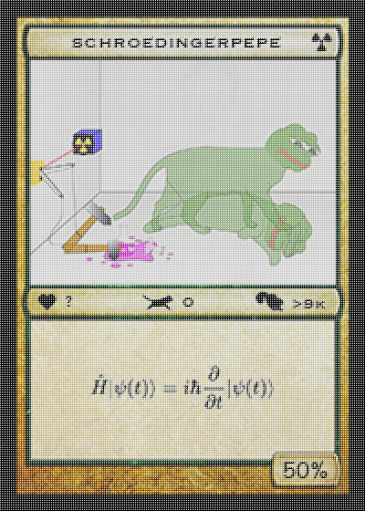

# Series 22

## Series 22, Card 4 - SCHROEPEPE

<figure><figcaption></figcaption></figure>

**Series 22, Card 4** - [SCHROEPEPE](https://pepe.wtf/asset/SCHROEPEPE) was created by the artist [netidx](https://pepe.wtf/artists/netidx). It is one of only two cards created by netidx. The other being [RUBIXPEPE](https://pepe.wtf/asset/RUBIXPEPE). SCHROEPEPE is a one-of-a-kind card. The artist, whose real name is Gilles used a PNG rendering exploit that varies the card's appearance (dead pepe, or alive pepe) depending on the software or device used to display it. You can read an interview with the artist about the process he used to create the image [here](https://www.redlion.news/article/rarepepes-the-origin-story).&#x20;

The card's images reference the thought experiment [_Schrödinger's cat_](https://en.wikipedia.org/wiki/Schr%C3%B6dinger's\_cat)_._

<figure><figcaption>
One of the two possible images that gets displayed based on the software or device. The other image is above.
</figcaption></figure>

## Series 22, Card 7 - CREWLOVEPEPE

<figure><figcaption></figcaption></figure>

**Series 22, Card 7** - [CREWLOVEPEPE](https://pepe.wtf/asset/CREWLOVEPEPE) was created by an [unknown artist](https://pepe.wtf/artists/1Lmy7WxetaSMrCodyczDgjb6ELeJu78KiC).  The card is an edited version of the 2011 mixtape by [Young Love](https://en.wikipedia.org/wiki/Young\_Money\_Entertainment) titled ["Crew Love Vol 1 Mixtape"](https://mixtapewire.com/2011/08/young-money-crew-love-vol-1-mixtape/). The face used for the man on the far left was also used for the Rare Pepe card [BADASSPEPE](https://pepe.wtf/asset/BADASSPEPE) by the same artist.&#x20;

## Series 22, Card 34 - PEPEHARING

<figure><figcaption></figcaption></figure>

Series 22, Card 34 - PEPEHARING was created by the French artist [Zed Erwan](https://pepe.wtf/artists/Zed-Erwan). All but 2 of Erwan's 12 Rare Pepe cards were hand drawn or painted. Along with the above parody, he also parodied works by Grant Wood ([GOTHICPEPE](https://pepe.wtf/asset/GOTHICPEPE)), Andy Warhol ([PEPESOUP](https://pepe.wtf/asset/PEPESOUP)), Roy Lichtenstein ([PEPELCHTNSTN](https://pepe.wtf/asset/PEPELCHTNSTN)), Jackson Pollock ([PEPEPOLLOCK](https://pepe.wtf/asset/PEPEPOLLOCK)), and Paul Cézanne ([PEPECEZANNE](https://pepe.wtf/asset/PEPECEZANNE)).&#x20;

In chatting with Erwan via DM on Twitter he told me "I had trouble finding pepeharing, I was doing things that were too complicated, and then I found, and it was obvious." And shared the image below.

<figure><figcaption></figcaption></figure>

## Series 22, Card 46 - FIGHTSYSTEM

**Series 22, Card 46** - [FIGHTSYSTEM](https://pepe.wtf/asset/FIGHTSYSTEM) was created by the artist [Hosherama](https://pepe.wtf/artists/Hosherama) ([@ThreedmakerG](https://twitter.com/ThreedmakerG) on Twitter). Hosherama had a total of 16 cards accepted into the Rare Pepe project including [DRSTRNGEPEPE](https://pepe.wtf/asset/DRSTRNGEPEPE), [BOWLPEPE](https://pepe.wtf/asset/BOWLPEPE), and a claymation card - [PEPESUPREME](https://pepe.wtf/asset/PEPESUPREME). The GIF on the card is taken from the 1991 [Nintendo Entertainment System](https://en.wikipedia.org/wiki/Nintendo\_Entertainment\_System) game [**Zombie Nation**](https://en.wikipedia.org/wiki/Zombie\_Nation\_\(video\_game\)). The game was first released in Japan on 14 December, 1990 under the title **Abarenbou Tengu.** You can see a full walkthrough of the game below. The portion of the game that was used for the card can be seen at the 13:38 minute mark.



## Series 22, Card 50 - PEPETREK

<figure><figcaption></figcaption></figure>

**Series 22, Card 50** - [PEPETREK](https://pepe.wtf/asset/PEPETREK) was created by the Japanese artist known as [Mekabu](https://pepe.wtf/artists/Mekabu). The source image for the card was taken from Season One, Episode Five of the American science fiction television series, [Star Trek](https://en.wikipedia.org/wiki/Star\_Trek:\_The\_Original\_Series). The title of the episode is "[The Enemy Within](https://en.wikipedia.org/wiki/The\_Enemy\_Within\_\(Star\_Trek:\_The\_Original\_Series\))." The artist chose this episode because it is "one of the best philosophical stories in the ORIGINAL. I felt it was a fitting tribute to the misused Pepe, who continues to walk away with his shadow side as well."\
\
I asked Mekabu if they have Star Trek in Japan. His response was "I first watched Star Trek when I was in high school. It was on late at night and I remember rubbing my sleepy eyes as I watched it. I don't remember the series, but it was "StarTrek: The Next Generation" that was on the air at the time. After that I watched DS9, BEYOND, INTO DARKNESS, Discovery, and PICARD. I have also watched some older series, but not all."

