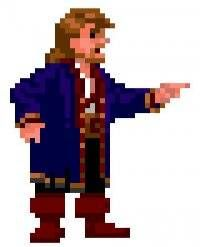

# Series 23

## Series 23, Card 1 - GUYBRUSH

For the start of Series 23, [MrHansel](https://twitter.com/bettidlomas) created "[GUYBRUSH ](https://pepe.wtf/asset/GUYBRUSH)THREEPEPE", a takeoff on the name of the lead character Guybrush Threepwood from the 1991 LucasArts Personal Computer game "[Monkey Island 2, LeChuck's Revenge](https://en.wikipedia.org/wiki/Monkey\_Island\_2:\_LeChuck's\_Revenge)". I have no idea how someone could 1 - play or remember playing a 21 year old game that only sold 25,000 copies, 2 - grab a stock image of the character, 3 - overlay that onto a background that only appears once in the entire game, and 4 - decide that would make a great Pepe! They say there is a fine line between genius and madness and I would say MrHansel is 100% the former.  &#x20;

## Series 23, Card 2 - RICKYPEPE

<figure><figcaption></figcaption></figure>

**Series 23, Card 3** - [RICKYPEPE](https://pepe.wtf/asset/RICKYPEPE) was created by the artist known as [OE](https://pepe.wtf/artists/OE) although he goes by Everyday Earth on Twitter and Telegram. He created a total of 18 cards for the Rare Pepe project.

This card is a parody of the movie poster for 2006 American sports comedy film "[Talladega Nights: The Ballad of Ricky Bobby](https://en.wikipedia.org/wiki/Talladega\_Nights:\_The\_Ballad\_of\_Ricky\_Bobby)" who was played by [Will Ferrell](https://en.wikipedia.org/wiki/Will\_Ferrell). &#x20;



## Series 23, Card 4 - BAYLOP

**Series 23, Card 4** - [BAYLOP](https://pepe.wtf/asset/BAYLOP) was created by an [unknown artist](https://pepe.wtf/artists/1ye1EaLcArtidUSqATkkgzCS4Fj2D4Gpe) who also made both of the [Bogdanoff Twins](https://en.wikipedia.org/wiki/Igor\_and\_Grichka\_Bogdanoff) cards BOGDAPEPE and PEPENOFF as well as one of the Bitconnect cards [CARLOSPEPE](https://pepe.wtf/asset/CARLOSPEPE). The BAYLOP card depicts the execution of [Viet Cong](https://en.wikipedia.org/wiki/Viet\_Cong) member Nguyễn Văn Lém, often referred to as Bảy Lốp. The execution took place in Saigon during the [Tet Offensive](https://en.wikipedia.org/wiki/Tet\_Offensive) in the [Vietnam War](https://en.wikipedia.org/wiki/Vietnam\_War). Văn Lém crime was the alleged murder of Lt. Col. Nguyen Tuan as well as Tuan's wife, six children, and his 80 year old mother. The photograph was taken by [Eddie Adams](https://en.wikipedia.org/wiki/Eddie\_Adams\_\(photographer\)), an Associated Press photographer. You can learn more about the event [here](https://en.wikipedia.org/wiki/Execution\_of\_Nguy%E1%BB%85n\_V%C4%83n\_L%C3%A9m).&#x20;

## Series 23, Card 12 - PEPEAMANDA

<figure><figcaption></figcaption></figure>

**Series 23, Card 12** - [PEPEAMANDA](https://pepe.wtf/asset/PEPEAMANDA) was created by an [unknown artist](https://pepe.wtf/artists/1LHPw5hFTr8NYkE86b3F11y7vnBhmpJrts). They contributed a total of 14 cards to the Rare Pepe series including the 5-card ["Pepe the Forbidden One"](https://pepe.wtf/asset/FORBIDENPEPE) set and a series of portraits including [PEPEFRED](https://pepe.wtf/asset/PEPEFRED), [PEPEANDY](https://pepe.wtf/asset/PEPEANDY), [PEPEVINNY](https://pepe.wtf/asset/PEPEVINNY), [PEPEBOBBY](https://pepe.wtf/asset/PEPEBOBBY), and [PEPESAMSON](https://pepe.wtf/asset/PEPESAMSON).

The woman pictured on the card is [DASH](https://www.dash.org/) report and presenter [Amanda B. Johnson](https://www.instagram.com/amandab\_johnson/?hl=en).  The photograph was taken from the [Bitcoinist article](https://bitcoinist.com/dash-bitcoin-interview-amanda-b-johnson/) _"How Dash Stole Bitcoin’s Mojo – Interview with Amanda B. Johnson"._

## Series 23, Card 16 - PEROCHI

<figure><figcaption></figcaption></figure>

**Series 23, Card 16** - [PEROCHI](https://pepe.wtf/asset/PEROCHI) was created by the Japanese artist known as [Oni Giri](https://pepe.wtf/artists/Oni-Giri). She created a total of 9 cards for the Rare Pepe project; 8 of which are original artworks! The pepe on the card is modeled after the character [Doppo Orochi](https://baki.fandom.com/wiki/Doppo\_Orochi) from the Japanese manga series [Grappler Baki](https://en.wikipedia.org/wiki/Baki\_the\_Grappler). He has a brave "no step down" characteristic about him when it comes to fighting going as far as to fight a Siberian tiger in his younger days and even admits that was a bit foolish of him, but earning him one of his many nicknames the "Tiger Killer". In regard to that Oni said, "It was fun to change the tiger to a stuffed animal."

## Series 23, Card 22 - PHNTOMOFPEPE

<figure><figcaption></figcaption></figure>

Series 23, Card 22 - [PHNTOMOFPEPE](https://pepe.wtf/asset/PHNTOMOFPEPE) was created by an [unknown artist](https://pepe.wtf/artists/Deleted-account). They also created the Melancholia Triptych ([MELANCHOLIA](https://pepe.wtf/asset/MELANCHOLIA), [MELANCOLIE](https://pepe.wtf/asset/MELANCOLIE), [PEPEINTRO](https://pepe.wtf/asset/PEPEINTRO)), the philosophers set ([SOCRATESPEPE](https://pepe.wtf/asset/SOCRATESPEPE), [PEPEKARLMARX](https://pepe.wtf/asset/PEPEKARLMARX), [PEPENIETZSCH](https://pepe.wtf/asset/PEPENIETZSCH)) as well as 5 other cards, for a total of 12 Rare Pepe cards.&#x20;

This card is the artist's interpretation of [one](https://www.penguinrandomhouse.com/books/100150/the-phantom-of-the-opera-by-gaston-leroux/9780553213768?ref=PRHB7BD76FBDB\&aid=14813\&linkid=PRHB7BD76FBDB) of the many cover illustrations for the 1910 Novel [_The Phantom of the Opera_](https://en.wikipedia.org/wiki/The\_Phantom\_of\_the\_Opera) which was written by the French author [Gaston Leroux](https://en.wikipedia.org/wiki/Gaston\_Leroux). &#x20;

## Series 23, Card 48 - PEPEEVO

<figure><figcaption></figcaption></figure>

**Series 23, Card 48** - [PEPEEVO](https://pepe.wtf/asset/PEPEEVO) was created by the Japanese artist known as [Oni Giri](https://pepe.wtf/artists/Oni-Giri). She created a total of 9 cards for the Rare Pepe project and all 9 are original artworks! Oni said of PEPEEVO, "I drew PEPE changing his appearance. His appearance changes depending on the environment around him. His appearance may also change depending on the owner of this card. I wonder how he will evolve?"
