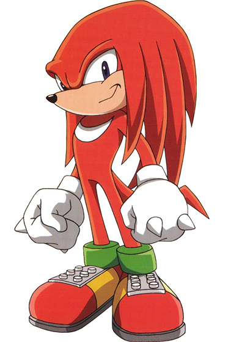

# Series 31

## Series 31, Card 5 - SPACEMOUTH

<figure><figcaption></figcaption></figure>

**Series 31, Card 5** - [SPACEMOUTH](https://pepe.wtf/asset/SPACEMOUTH) was created by the artist known as [Cam](https://pepe.wtf/artists/Cam).&#x20;

On August 25, 2022 the artist informed me via Telegram that the dog pictured on the card is a female [lab](https://en.wikipedia.org/wiki/Labrador\_Retriever) named Rusty. In her mouth is a dry fish carcass that she found at the Southern California fish farm where she lived.&#x20;

## Series 31, Card 17 - UGANDANPEPE

<figure><figcaption></figcaption></figure>

**Series 31, Card 17** - [UGANDANPEPE](https://pepe.wtf/asset/UGANDANPEPE) was created by an [unknown artist](https://pepe.wtf/artists/1NVvsfD2rgv2J2JewXZ9KgLvkYBW4FYyxW). They created a total of 9 cards for the Rare Pepe project.  The card is a parody of [Ugandan Knuckles](https://knowyourmeme.com/memes/ugandan-knuckles), who is in turn a parody of the character [Knuckles](https://en.wikipedia.org/wiki/Knuckles\_the\_Echidna) from the [Sonic the Hedgehog](https://en.wikipedia.org/wiki/Sonic\_the\_Hedgehog) franchise. Ugandan Knuckles was created by YouTuber [Gregzilla](https://www.youtube.com/user/GregzillaGT) in 2017.&#x20;

<figure><figcaption>
Knuckles the Echidna from Sonic the Hedgehog
</figcaption></figure>

## Series 31, Card 39 - PEPESTRY

<figure><figcaption></figcaption></figure>

**Series 31, Card 39** - [PEPESTRY](https://pepe.wtf/asset/PEPESTRY) was created by [nathan sonic](https://pepe.wtf/artists/nathan-sonic) (@nathansonic on Twitter). Nathan created a total of 14 cards for the Rare Pepe series including the iconic [YELLPEPE](https://pepe.wtf/asset/YELLPEPE), the unique [ISOPEPE](https://pepe.wtf/asset/ISOPEPE), and the Solitaire game parody RARECHERRY.\
\
The original is known as the Bayeux Tapestry which is thought to date back to the 11th century. The cloth is 50 cm tall and nearly 70 meters (230 feet) long. The scene that Nathan chose for his Rare Pepe card is that of  [King Harold](https://en.wikipedia.org/wiki/Harold\_Godwinson), the last Anglo-Saxon King of England. At the top left corner, you can see a depiction of [Halley's Comet](https://en.wikipedia.org/wiki/Halley's\_Comet) which is visible from Earth every 75-79 years.&#x20;
