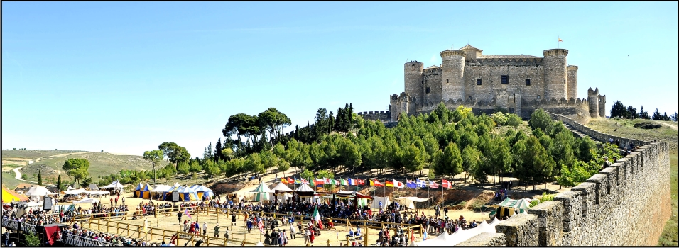

# Series 32

## Series 32, Card 19 - LAUGHINGMAN

<figure><figcaption></figcaption></figure>

**Series 32, Card 19** - [LAUGHINGMAN](https://pepe.wtf/asset/LAUGHINGMAN) was created by an [unknown artist](https://pepe.wtf/artists/1CQ8iuxrkf4DWsFttDtwyRbrJT8U4R212E). They created a total of 13 cards for the Rare Pepe project.  The source for this card is the logo for hacker and cyberterrorist "[The Laughing Man](https://ghostintheshell.fandom.com/wiki/Laughing\_Man)" from the Japanese anime television series _Ghost in the Shell: Stand Alone Complex_. In the show, the character is only ever shown with his logo covering his face. The text on the logo is an excerpt from the book "[The Catcher in the Rye](https://en.wikipedia.org/wiki/The\_Catcher\_in\_the\_Rye)" by [J. D. Salinger](https://en.wikipedia.org/wiki/J.\_D.\_Salinger). [Here](https://www.otakunews.com/Article/201/the-laughing-man-ghost-in-the-shell-standalone-complexs-hacker-logo) is an interview with the man that created the logo, Paul Nicholson.&#x20;

<figure><figcaption></figcaption></figure>

## Series 32, Card 32 - SISTNCHAPEPE

<figure><figcaption></figcaption></figure>

**Series 32, Card 32** - [SISTNCHAPEPE](https://pepe.wtf/asset/SISTNCHAPEPE) was created by an [unknown artist](https://pepe.wtf/artists/13rp875jnvyQYf1An6JpzfyA7TbLfkeHQ5). They created two cards for the Rare Pepe series with the other one being [PEPEROCKWELL](https://pepe.wtf/asset/PEPEROCKWELL).&#x20;

This card is a parody of the [Sistine Chapel](https://en.wikipedia.org/wiki/Sistine\_Chapel) and focuses on [Michelangelo's frescoes](https://en.wikipedia.org/wiki/Sistine\_Chapel#Michelangelo's\_frescoes). The level of detail that was put into this card is impressive - they replaced every single viewable painting in the scene with images of frogs and [Wojaks](https://en.wikipedia.org/wiki/Wojak).&#x20;

<figure><figcaption>
A comparison of The <a href="https://en.wikipedia.org/wiki/The_Creation_of_Adam">Creation of Adam</a>
</figcaption></figure>

## Series 32, Card 36 - BARBARIANPEP

<figure><figcaption></figcaption></figure>

**Series 32, Card 36** - [BARBARIANPEP](https://pepe.wtf/asset/BARBARIANPEP) was created by an [unknown artist](https://pepe.wtf/artists/1JjdKsnzR5g8qRr6WKyENjPip2mUtNEcrb). They only created two cards for the Rare Pepe project with the other being [RARELEE](https://pepe.wtf/asset/RARELEE).

The source used for this card is the promotional poster for the [2016 Medieval Combat Tournament](http://castillodebelmonte.com/i-torneo-nacional-de-combate-medieval/) that was held at the [Castillo D Belmonte](http://castillodebelmonte.com/) in Spain. This tournament was the first national tournament of its kind and included 10 clubs from all over Spain.

<figure><figcaption>
Panoramic view of the tournament
</figcaption></figure>
