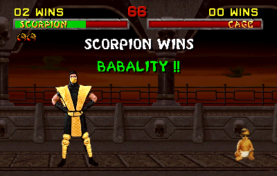

# Series 9

## Series 9, Card 1 - SNOWDENPEPE

Series 9, Card 1 - [SNOWDENPEPE](https://pepe.wtf/asset/SNOWDENPEPE) was created by RarePepeTrader, who is an OG in the Rare Pepe Telegram group and runs the WTH Auction House.

<figure><figcaption></figcaption></figure>

The person pictured on the card is [Edward Snowden](https://en.wikipedia.org/wiki/Edward\_Snowden), the computer intelligence consultant who leaked highly classified information from the [National Security Agency](https://en.wikipedia.org/wiki/National\_Security\_Agency) (NSA)  in 2013. Also pictured is a [Rubik's Cube](https://en.wikipedia.org/wiki/Rubik's\_Cube). One interesting fact about this card is it's supply number - 40,320. RPT recently wrote in the official Telegram chat room that he chose that number because the total number of ways the positions of the 8 corner pieces of a Rubik's Cube can be arranged is 40,320.

## Series 9, Card 3 - STEALPEPE

<figure><figcaption></figcaption></figure>

**Series 9, Card 3 -** [**STEALPEPE**](https://pepe.wtf/asset/STEALPEPE) was created by [Raf Vantongerloo](https://x.com/RafVantongerloo). The card is a parody of the 1971 book titled, "[Steal This Book](https://en.wikipedia.org/wiki/Steal\_This\_Book)" which was written by [Abbie Hoffman](https://en.wikipedia.org/wiki/Abbie\_Hoffman) (born Abbot Howard Hoffman), an American political and social activist. The book which focused on the [counterculture of the 1960's](https://en.wikipedia.org/wiki/Counterculture\_of\_the\_1960s) in America sold more than a quarter of a million copies in the first 7 months of release.&#x20;

## Series 9, Card 4 - THEPEPE

<figure><figcaption></figcaption></figure>

**Series 9, Card 4** - [THEPEPE](https://pepe.wtf/asset/THEPEPE) was created by the prolific artist [Davinci9](https://pepe.wtf/artists/Davinci9) who has 21 cards in the Rare Pepe series along with several commissioned pieces. The bulk of Davinci9's Rare Pepe cards were consigned to RarePepeTrader in 2021 for ongoing sales, mainly through his WTH Auction House Telegram room.&#x20;

The image on the card is a parody of the American film studio Metro-Goldwyn-Mayer production logo that ran before all their movies and television cartoons. The lion in the film is named [Leo](https://en.wikipedia.org/wiki/Leo\_the\_Lion\_\(MGM\)). Between 1917 and 1924, there were eleven different lions used for the logo. In 2021, MGM introduced a new CGI Logo which features a lion partially based on Leo.

## Series 9, Card 5 - PEPETUNADE

<figure><figcaption></figcaption></figure>

**Series 9, Card 5** - [PEPETUNADE](https://pepe.wtf/asset/PEPETUNADE) was created by an [unknown artist](https://pepe.wtf/artists/1AKEuLtnq73BNQjHxU2BVoV4NQSEDDUATj). They created a total of 6 cards for the Rare Pepe series including [PEPEOROCHI](https://pepe.wtf/asset/PEPEOROCHI), [PEPEMAONE](https://pepe.wtf/asset/PEPEMAONE), and [FLYINGACEPEP](https://pepe.wtf/asset/FLYINGACEPEP).

The [original image](https://ukiyo-e.org/image/waseda/006-5705) is by the artist [Utagawa Kunisada](https://en.wikipedia.org/wiki/Kunisada) and is titled "Toyokuni Calligraphy Magic Contest" "Brave Tsunade" which was completed in 1862 as part of his ["A contest of magic scenes by Toyokuni"](http://www.kunisada.de/Kunisada-series60ths/series105/series105-1.htm).

## Series 9, Card 6 - RUBBERPEPE

**Series 9, Card 6 -** [**RUBBERPEPE**](https://pepe.wtf/asset/RUBBERPEPE) was created by [Raf Vantongerloo](https://x.com/RafVantongerloo). Also created by Raf are  [THEANCAPEPE](https://pepe.wtf/asset/THEANCAPEPE), [STEALPEPE](https://pepe.wtf/asset/STEALPEPE), [PPKING](https://pepe.wtf/asset/PPKING), [PREPEDATOR](https://pepe.wtf/asset/PREPEDATOR), and [SCORPEPE](https://pepe.wtf/asset/SCORPEPE). The card appears to be a hand drawn interpretation of the character Johnny played by [Chris Cunningham](https://en.wikipedia.org/wiki/Chris\_Cunningham) in the 2005 British experimental short film/music video [Rubber Johnny](https://youtu.be/eRvfxWRi6qQ) which was written, directed, and produced by Cunningham as well. In the opening scene, an off screen voice can be heard saying "do you want mama to come in?" which causes Johnny to throw a fit for which he is given a sedative to calm down. The rest of the video is just Johnny maneuvering his wheel chair while the [Aphex Twin](https://en.wikipedia.org/wiki/Aphex\_Twin) track "Afx237 v. 7" from the album [_Drukqs_](https://en.wikipedia.org/wiki/Drukqs) plays in the background. That is the band's logo in the top right corner of the card. Also included on the card is a hand drawn Chihuahua Dog to match the real Chihuahua in the  film.&#x20;

## Series 9, Card 10 - PPKING

<figure><figcaption></figcaption></figure>

**Series 9, Card 10 -** [**PPKING**](https://pepe.wtf/asset/PPKING) was created by [Raf Vantongerloo](https://x.com/RafVantongerloo). The guitarist on the card is none other than blues great [B.B. King](https://en.wikipedia.org/wiki/B.\_B.\_King) (pepefied of course). The original photo was taken at a jazz festival in Prague in 1990 and is attributed to [Reuters](https://pictures.reuters.com/).&#x20;

## Series 9, Card 13 - PREPEDATOR

<figure><figcaption></figcaption></figure>

**Series 9, Card 13 -** [**PREPEDATOR**](https://pepe.wtf/asset/PREPEDATOR) was created by [Raf Vantongerloo](https://x.com/RafVantongerloo). The image is a reverse-colored version of a promotional image used for the 2004 American science fiction action horror film [Alien vs. Predator](https://en.wikipedia.org/wiki/Alien\_vs.\_Predator\_\(film\)).  That is where the similarities end however. The card's text refers to [Chris Hansen](https://en.wikipedia.org/wiki/Chris\_Hansen) the host of an American [reality television](https://en.wikipedia.org/wiki/Reality\_television) series in the television [news magazine](https://en.wikipedia.org/wiki/News\_magazine) program [Dateline NBC](https://en.wikipedia.org/wiki/Dateline\_NBC) titled [To Catch a Predato](https://en.wikipedia.org/wiki/To\_Catch\_a\_Predator)r.  In the show, Hansen was allowed to film inside [sting houses](https://en.wikipedia.org/wiki/Sting\_operation) across the United States and interview adult men after they were arrested for attempting to have sex with a minor. Almost every interview began with Hansen telling the person, "[take a seat](https://www.urbandictionary.com/define.php?term=Take%20a%20seat)."

## Series 9, Card 16 - PEPEOROCHI

<figure><figcaption></figcaption></figure>

**Series 9, Card 16** - [PEPEOROCHI](https://pepe.wtf/asset/PEPEOROCHI) was created by an [unknown artist](https://pepe.wtf/artists/1AKEuLtnq73BNQjHxU2BVoV4NQSEDDUATj). The [original image](https://www.fujiarts.com/cgi-bin/item.pl?item=680950) is by the artist [Utagawa Kunisada](https://en.wikipedia.org/wiki/Kunisada) and is titled Battling the Wicked Magician Orochimaru which was completed in 1855. The full print is a three panel piece which depicts two magicians battling each other. It depicts the wicked Orochimaru, who is the son of the Giant Snake, conjuring up an enormous serpent to help him.

<figure><figcaption>
Battling the Wicked Magician Orochimaru, 1855
</figcaption></figure>

## Series 9, Card 22 - SCORPEPE

<figure><figcaption></figcaption></figure>

**Series 9, Card 22 -** [**SCORPEPE**](https://pepe.wtf/asset/SCORPEPE) was created by [Raf Vantongerloo](https://x.com/RafVantongerloo). The image is a pepefied [Scorpion](https://en.wikipedia.org/wiki/Scorpion\_\(Mortal\_Kombat\)) (from the video game series Mortal Kombat). Specifically, it appears to taken from the 2011 series reboot titled [Mortal Kombat](https://en.wikipedia.org/wiki/Mortal\_Kombat\_\(2011\_video\_game\)) (also known as Mortal Kombat 9 (MK9)). The interesting thing about this image though is that Raf ran it through a mobile photo-editing application that uses [neural networks](https://en.wikipedia.org/wiki/Neural\_network) and [artificial intelligence](https://en.wikipedia.org/wiki/Artificial\_intelligence) to apply artistic effects. The fact that this was done in 2016 makes it one of the earliest examples of AI-enhanced art on any blockchain. There are now sites and Discord groups dedicated specifically to locating and documenting these early uses of AI in digital art. The application used for this card is called [Prisma](https://en.wikipedia.org/wiki/Prisma\_\(app\)) which was launched on iOS in June 2016 in Russia. In the first week of release the app was downloaded over 7.5 million times. It was later released on Android. &#x20;

To view all Rare Pepe cards that have been identified as having some sort of AI manipulation done to them, visit the collection page on [pepe.wtf](https://pepe.wtf/sets/AI).

If you've ever played a version of Mortal Kombat you will get the included text "Get Over Here!" - A classic line that Scorpion says to his opponent while throwing his spear on the end of a chain at them. And the bit about "Babality" is hilarious because that is the name of one of the [hidden fatalities](https://mortalkombat.fandom.com/wiki/Babality) in the game. Instead of finishing your opponent by tearing their head off, you instead would turn them into a cute little baby.&#x20;

<figure><figcaption></figcaption></figure>

## Series 9, Card 41 - UKIPEPE

**Series 9, Card 41 -** [**UKIPEPE**](https://pepe.wtf/asset/UKIPEPE) was created by the prolific artist known as "[ICQPEPE](https://pepe.wtf/artists/ICQPEPE)", creator of 28 Rare Pepe cards including the infamous Series 1, Card 49 - [NOFAPPEPE](https://pepe.wtf/asset/NOFAPPEPE). The women in the image is Rozanne Duncan, who was at the time was a UKIP member of the Thanet District Council in Kent, England. She was summarily dismissed after making derogatory statements about African Americans in a 2015 documentary entitled "Meet the Ukippers". Here is a story that mentions Duncan as well as a clip from the documentary which was posted on YouTube. [https://www.kentlive.news/news/kent-news/7-times-kent-councillors-were-2663976](https://www.kentlive.news/news/kent-news/7-times-kent-councillors-were-2663976)&#x20;


