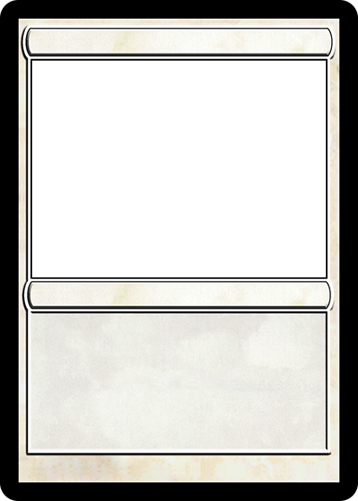

# The Rare Pepe Directory

A directory of all expert approved Rare Pepes can be found on the [Rare Pepe Directory](http://rarepepedirectory.com/).

There are fraudulent Rare Pepes, imitations and tokens which are named to mimic actual Rares.

**If a Pepe isn’t listed on the directory, it isn’t Certified Rare.**

Rare Pepe Scientists worked for years to certify exactly **1774 Rares** from dozens of artists around the world. After the certification was complete, it was time to close submissions and let the rareness bake into these amazing pieces of artwork.

There were rules which had to be strictly adhered to when creating and submitting a new Rare Pepe for approval. The rules can still be found on the directory, but we're listing them below as well.

All Rare Pepes had to be issued on the Counterparty Protocol, include an “Asset Name” such as “RAREPEPE”, be 100% made up, rare and dank. Some of the cards had bonus content and in-game utility as well. Ultimately the rarity depends on artist, issuance, supply, collectability, cultural significance, and originality.

> _“Submissions must be ORIGINAL. Our rareness quality team examines each Pepe for rareness. (no stealing!) Our experts understand that lots of Pepe’s borrow from each other to an extent, but try to add as much Original content as possible. Also make sure your Pepe is dank. Check latest submissions on the directory to compare.”_


Submissions to the Rare Pepe Directory are closed for the foreseeable future.


### Rare Pepes submission rules:

1. Pepe’s must be 400 x 560.   They can look like trading cards but it is not required.
2. Cards can be animated gifs but try to keep them to 1mb or less in size. Use Compression.
3. Issuance must be locked  so your Pepe cannot be inflated.
4. Your Pepe must not be divisible.
5. Make sure your artwork at least has something to do with Pepe.
6. No NSFW content please.
7. When making your token it must have at least 100 shares and max 100k shares.
8. No websites or QR codes.
9. Only 1 submission per day per artist.&#x20;

There was also a submission fee of 200 PEPECASH. If someone had been caught stealing someone else's submissions, their submission fee would have been sent to a burn address.

