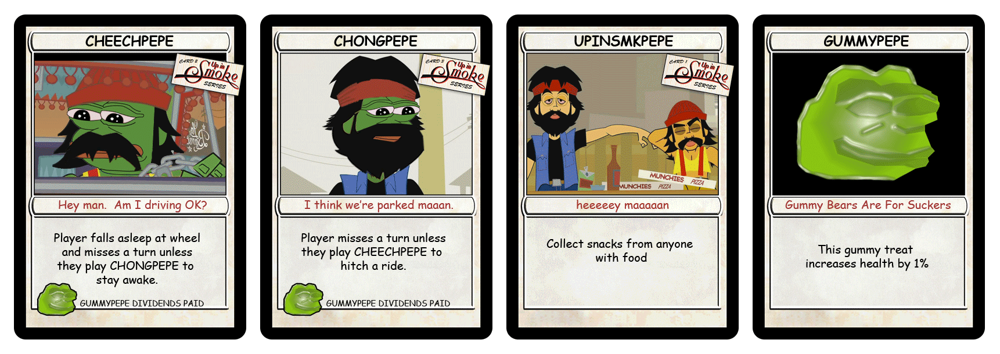

# Unique Rare Pepe Sets

A few Rare Pepe artists saw the project as an ongoing tale and often developed a set or a series of cards. It is sometimes hard to pick them out when viewing all 1,774 cards but when brought together you see their brilliance and foresight. Below are some examples of this.

<figure><figcaption></figcaption></figure>

**"History of Art" Series by DanDarkPill**

The Rare Pepe History of Art Series is a collection of Rare Pepe, all in series 8, by the anonymous twitter personality Dan Dark Pill, designed in the style of famous artists such as Pablo Picasso, Vincent Van Gogh, and Salvador Dali. The collection was intended to be 24 cards, but only seven were completed (#1-6 and #8). Although 100 supply of each pepe were minted, 86 or more of each card is believed to be in a counterparty wallet for whom the private keys are permanently lost, making these cards extraordinarily rare and valuable. Less than 5 complete sets are known to exist, and one is available at auction house Scarce City for prospective buyers.

<figure><figcaption>
The Hip-Hop Elements Series
</figcaption></figure>

**“Hip-Hop Elements Series" by Rare Scrilla**

This series 4 collection was created by long-time Rare Pepe and Fake Rare contributor Rare Scrilla to celebrate the elements of hip-hop music: DJs, MCs, graffiti, and break dancing. DJPEPE is an iconic Rare Pepe, as it is one of the few that offers bonus content (a link to soundcloud playlist of Rare Scrilla), and the first known music NFT ever.

<figure><figcaption>
Series of 5 Putins
</figcaption></figure>

**"Series of 5 Putins" by DanDarkPill**

This series 3 collection features 6 depictions of Russian President Vladmir Putin. The first six cards are only 9 issuance each, and the last one is a unique 1/1.

<figure><figcaption>
Mr. Hansel Triptych
</figcaption></figure>

**"Hansel Triptych"**

Mr. Hansel, one of the most prolific artists in the Rare Pepe Directory, made this 3-part series of pepe the frog set in the year 1917. It tells the story of how Pepe became a PEPECASH Millionaire by selling images of his Pepe marionette.&#x20;

<figure><figcaption>
Jazz Trio Set
</figcaption></figure>

**"Jazz Trio"**

Rare Pepe artist [Kappepe](https://x.com/kartanbitcoin) created a jazz trio over Series 28 and 29. [PEPESAX](https://pepe.wtf/asset/PEPESAX), [PEPEPET](https://pepe.wtf/asset/PEPEPET), and [PEPEBASS](https://pepe.wtf/asset/PEPEBASS) are all 1/150 cards and make for a perfect display. In October 2024 one such display was auctioned off on the site [scarce.city](https://scarce.city/) which included a framed physical piece as well as an [Opendime](https://opendime.com/) device with the three Counterparty tokens loaded onto it.&#x20;

<figure><figcaption>
Pepe Seasons Set
</figcaption></figure>

**"Pepe Seasons"**

Kappepe also created a 5 piece set depicting Taro (eldest son in Japanese) enjoying Japan's four seasons. The Rare Pepe cards included are [PEPEHARU](https://pepe.wtf/asset/PEPEHARU) (Spring in Japanese), [PEPESUMMER](https://pepe.wtf/asset/PEPESUMMER) (Natsu),  [PEPEAKI](https://pepe.wtf/asset/PEPEAKI) (Autumn), [PEPEFUYU](https://pepe.wtf/asset/PEPEFUYU) (Winter), and [PEPETARO](https://pepe.wtf/asset/PEPETARO). The framed physical piece pictured above [sold](https://scarce.city/auctions/rare-pepe-seasons) on scarce.city in April of 2023 for 0.185 Bitcoin (currently valued at $12,295).&#x20;

<figure><figcaption>
Cheech &#x26; Chong Set
</figcaption></figure>

**"Cheech & Chong"**

The Rare Pepe Artist known as 0jack who created a total of 40 cards for the Rare Pepe Project dropped this 4 part set in Series 4 and 5. Included are [CHEECHPEPE](https://pepe.wtf/asset/CHEECHPEPE) (1/100), [CHONGPEPE](https://pepe.wtf/asset/CHONGPEPE) (1/100), [UPINSMKPEPE](https://pepe.wtf/asset/UPINSMKPEPE) (1/800), and [GUMMYPEPE](https://pepe.wtf/asset/GUMMYPEPE) (1/1M). [Cheech & Chong](https://en.wikipedia.org/wiki/Cheech\_%26\_Chong) are a comedy duo that found success in the 1970's and 80's primarily for their love for [cannabis](https://en.wikipedia.org/wiki/Cannabis\_\(drug\)) which they formed their movies and stand-up comedy acts around.&#x20;
