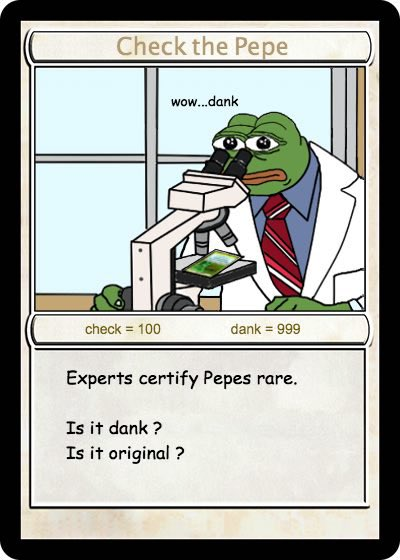

# Notable Pepes


_To learn more about Notable Pepes you can join our_ [_Telegram_](https://t.me/notablepepes) _and follow our_ [_Twitter_](https://twitter.com/notablepepes)_. A dedicated group of Pepe experts are standing by to answer any questions you may have._



_For Notable Submission Rules & Drop Parameters visit our "_[_How It Works_](https://wiki.pepe.wtf/chapter-4-latest-developments/notable-pepes/how-it-works)_" page._

_For more information visit our Notable_ [_FAQ_](https://wiki.pepe.wtf/chapter-4-latest-developments/notable-pepes/faq) _page._


<figure><figcaption>
Pepe Checks - S1 C1
</figcaption></figure>

## A Brief History of Notable Pepes

On February 4th, 2023, notable collector and artist [VincentVanDough](https://twitter.com/Vince\_Van\_Dough) released his first open edition: [Pepe Checks](https://app.manifold.xyz/c/pepechecks).

Pepe Checks was an $6.9 open edition in the style of [Jack Butcher](https://twitter.com/jackbutcher)'s Checks. 237869 were minted with 12k holders, making it one of the most minted editions of its time.

<figure><figcaption>
<a href="https://twitter.com/Vince_Van_Dough/status/1621982296973758466">Pepe Check Open Edition</a>
</figcaption></figure>

 

<figure><figcaption></figcaption></figure>

The artwork immediately inspired a large amount of derivatives, flooding Twitter and setting the perfect playground for speculation as to its future "utility"...

<figure><figcaption>
<a href="https://twitter.com/beeple/status/1622459994376388610">Beeple's DAWN OF CHECKS</a>
</figcaption></figure>

 

<figure><figcaption>
<a href="https://twitter.com/tommy_wilson_/status/1622048466674548737">Tommy Wilson's NOTABLE PEPE</a>
</figcaption></figure>

### On February 12th, 2023, [#vincentvandough-announces-notable-pepes](../../pepe-news-outlet/#vincentvandough-announces-notable-pepes "mention"):&#x20;


**TL;DR**: Notable Pepes is a series of NFT drops of digital cards that are bringing the [Pepe meme](../../chapter-1-historical-lore/the-creation-pepe-the-frog/birth-of-the-meme/) to the Ethereum blockchain.

The concept behind the project stems from the [Rare Pepe](broken-reference) series that has been trading on [Counterparty](../../chapter-3-blockchain-counterparty-how-to/counterparty-what-is-it/)/Bitcoin since 2016.


<figure><figcaption>
Frogs Storm the Beaches of Ethereum
</figcaption></figure>

 

<figure><figcaption>
<a href="https://twitter.com/Vince_Van_Dough/status/1624889005593485312">VVD announces Notable Pepes</a>
</figcaption></figure>

_"You think memes are your ally?_

_You merely adopted the memes. We were born in them, molded by them. We didn’t see the light until we were already rare, by then it was nothing but dankness._

_After 6 years of being molded in the depths of Counterparty, Pepes are coming to Ethereum._

_A contingent of Rare Pepe artists & scientists, Fake Rare creators, and representatives of the frogs have been assembled to give rise to a new movement, spreading dank Pepes far and wide._

_Each series will contain a total of 50 cards, with Pepe Checks representing card 1 of series 1._

_We will be experimenting with a variety of mechanisms with the goal of achieving fair distributions of cards while simultaneously rewarding the most dedicated collectors._

_The long standing rules of Rare Pepes will be in place. Submissions will be checked by a dedicated team of Pepe scientists to ensure dankness._

_Pepe Cheques, S1 C2, will be made available next Sunday via a claim for any artist who has ever minted a Rare Pepe or Fake Rare, or by way of burning a FAKEASF. A Pepe Cheque will be required to be burnt to have your art entered into the Notable Pepe directory._

_Each Sunday at 4:20 PM EST, 5 new cards will be released. Series 1 cards will be priced at 0.069 ETH per card and have a supply ranging from 100-1000._

_Prepare yourselves." - Vincent Van Dough_

<figure><figcaption>
 <a href="https://pepe.wtf/asset/CHECKPEPE">CHECKPEPE</a>  
</figcaption></figure>

_**To be continued...**_
