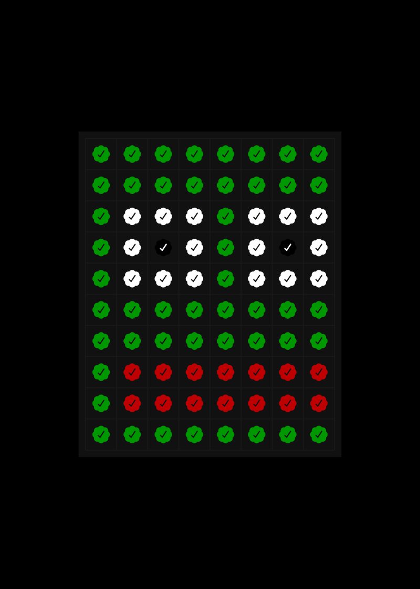

# The Collector's Journey

The Notables collection will drop 5 cards every week in a two-phased process where only whitelisted addresses will be able to collect cards. The [Pepe Inc.](../../pepe-inc..md) will conduct a lottery to assign allowlist spots for each of the 5 cards, based on the ownership of any [Notable Pepes](https://pepe.wtf/collection/notable-pepes) (as opposed to [Pepe Checks](https://pepe.wtf/asset/Pepe-Checks) exclusively).

<figure><figcaption>
<a href="https://pepe.wtf/asset/CHECKS">PEPE CHECKS</a>
</figcaption></figure>

### PHASE 1 - TIER 1 ACCESS

* 80% of the card's supply will be open for sale in this phase.
* There will be an allowlist consisting of a number of spots equal to 1.3 times the card units for sale.
* The spots will be assigned through a lottery between the 237,869 Pepe Checks, as well as all [Notable Pepe](https://pepe.wtf/collection/notable-pepes) holdings (snapshot is taken every Saturday).
* One single address / owner can win more than one spot in the allowlist, depending on how many winning Pepe Checks and/or [Notable Pepes](https://pepe.wtf/collection/notable-pepes) they own.&#x20;
* For Series 2, we are planning to allocate 10% of the available supply from each drop to a second AL1 raffle for full set Series 1 holders. For example, on a 100 issuance card, 80 supply is available via the drop, which means 8 AL1 spots get raffled amongst the 25-30 full set holders.&#x20;

### PHASE 2 - TIER 2 ACCESS

* If there is no sellout in Phase1, then Phase2 will become available, and any unsold units from Phase1 are put up for sale in Phase2.
* There will be an allowlist consisting of a number of spots equal to 4 times the card units for sale.
* The spots will be assigned through a lottery between the 237,869 Pepe Checks as well as all [Notable Pepe](https://pepe.wtf/collection/notable-pepes) holdings (snapshot is taken every Saturday). Phase 1 winners are excluded from this lottery.
* Each winning Pepe Checks and/or [Notable Pepe](https://pepe.wtf/collection/notable-pepes) gives its owner the right to purchase one unit of a card.
* Once Phase2 is open, collectors will be able to purchase on a first-come first-serve basis.


_To learn more about Notable Pepes, join our Telegram and follow our Twitter. A dedicated group of Pepe experts are standing by to answer any questions you may have._ [_https://t.me/notablepepes_](https://t.co/MhbKwi7ZDH) _//_ [_https://twitter.com/notablepepes_](https://twitter.com/notablepepes)

