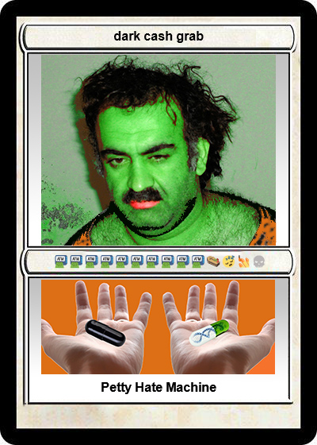
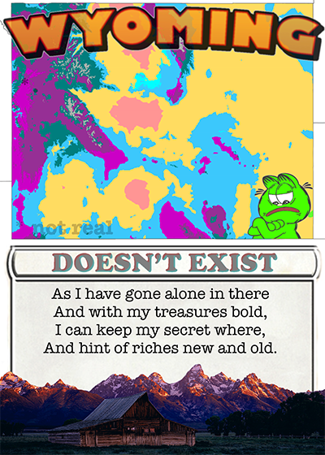

# CARSONATED

For those uninitiated, [Carsonated](https://twitter.com/Carsonated) is one half smooth-skinned Ken Doll, the other half is the only resident in the fake state of Wyoming. Keeper of the [Barnyard](https://twitter.com/BarnyardClub), father of [Fake Memes](https://twitter.com/FAKEMEMES\_ETH), [Fake Rare S1 OG](https://pepe.wtf/asset/DARKCASHGRAB), and patron of all things fake.

<figure><figcaption>
<a href="https://pepe.wtf/asset/DARKCASHGRAB">DARKCASHGRAB</a>
</figcaption></figure>

1. [_**Carsonated**_](https://pepe.wtf/artists/Carsonated)_**, welcome to The Notable Ones, please give us a peak into your world as the artist, memeologist, and where it began.**_

It's been a wild ride but when I look back both the world of frogs and the entry into crypto were pretty close together. I started learning in late 2016 and finally made the jump in the first quarter of 2017. I learned of Pepe on the blockchain via CT and truly felt I was 'late'. People were still creating Rare Pepes but the social barrier to entry scared me. I started collecting and participating on Counterparty with other collections and always felt I missed out.\
\
When Fake Rares started to come together, I knew I would not let a second chance pass me by and dove in with all my focus.

2. _**You’ve got a knack for developing experiential works - from having people go to a the fake state of**_ [_**Wyoming**_](https://pepe.wtf/asset/FAKEWYOMING)_**, to making people go to**_ [_**Costco**_](https://pepe.wtf/asset/FAKEPICOSTCO) _**with Pepe cards. It’s amazing, but many wonder, where did this all come from?**_

It's always felt we are at the start of something where the rules aren't set and the systems aren't decided. For my Fakes I wanted to cause a transaction of experience as opposed to financially. Asking people to prove a place they might never otherwise visit felt like a great way to force an experience and open the horizons of a potential collector. I've been blessed to make new friends and have them learn firsthand about The Cowboy State. We should all be playing fun games together.

<figure><figcaption>
<a href="https://pepe.wtf/asset/FAKEWYOMING">FAKEWYOMING</a>
</figcaption></figure>

 

<figure><figcaption>
<a href="https://pepe.wtf/asset/FAKEPICOSTCO">FAKEPICOSTCO</a>
</figcaption></figure>

3. _**Tell us the story of**_ [_**Poppy Keen**_](https://opensea.io/assets/ethereum/0xe70659b717112ac4e14284d0db2f5d5703df8e43/19)_**, your Notable Pepe.**_

I haven't spoken of Poppy Keen much yet, but I can say I 100% created her and those big eyes and in no way did I steal the art from my wife. I am not Walter Keane and she is not Margret Keane. In no way do I think she will file a DMCA against me once she finds out.

<figure><figcaption>
<a href="https://pepe.wtf/asset/Poppy-Keen">Poppy Keen</a>
</figcaption></figure>

4. _**You’ve been here since 2016 which is essentially a crypto century or two and have experimented with just about everything. What's been your biggest miss and win?**_

My biggest win was buying bitcoin around the $1000 mark. My biggest miss was not buying more bitcoin around the $1000 mark.

5. _**Any final words of wisdom?**_

I try to keep things simple, and my words of advice have always and will continue to be this:\
\
Make friends, Have fun, Don't panic & DONT BE FULL OF YOURSELF AND WE CAN HAVE FUN TOGETHER.\
\
I'd love to extend thanks to both yourself as well as [Vincent Van Dough](https://twitter.com/Vince\_Van\_Dough) for the opportunity to participate in S1 of [Notable Pepes](https://pepe.wtf/collection/notable-pepes) as well as the entire [pepe.wtf](https://pepe.wtf/) team. From his initial entry into Fake Rares and onto the continued work for the Notable Pepes collection its been great to see the growth and interest in frogs.\
\
Let your dreams become memes.\
