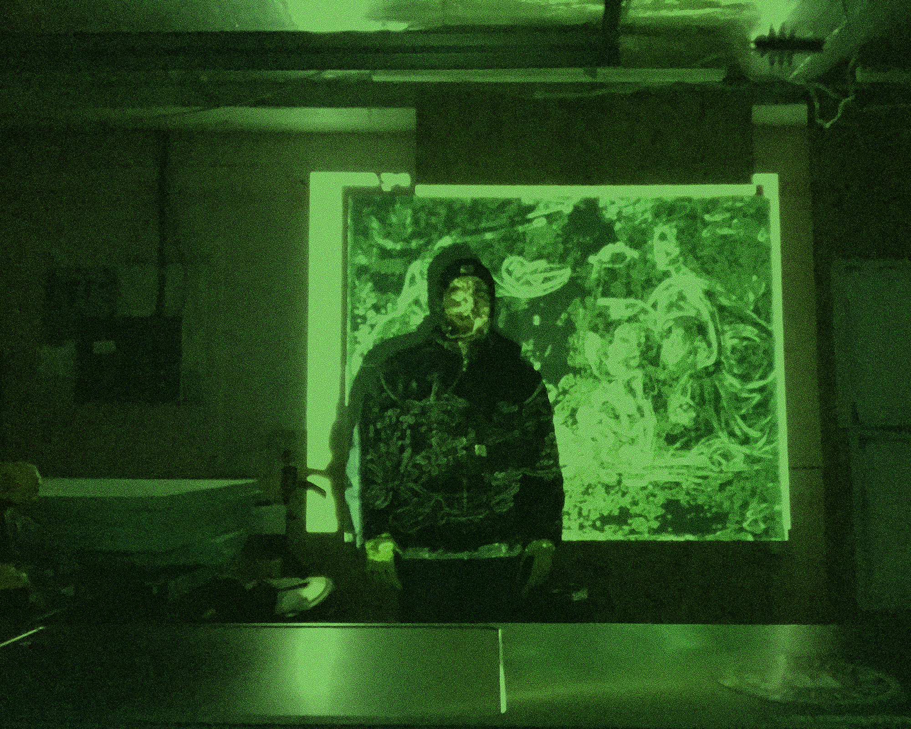
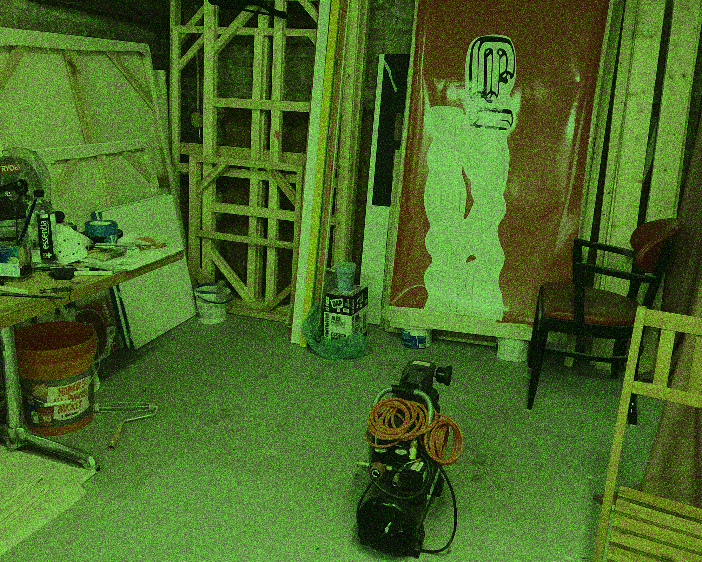
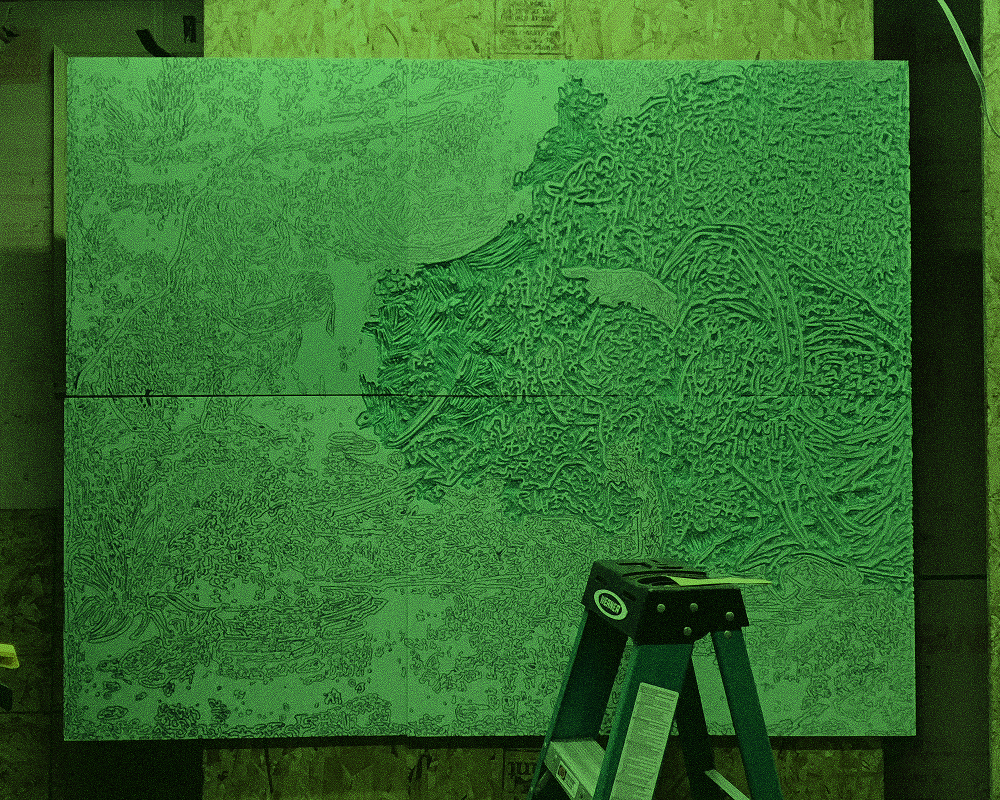
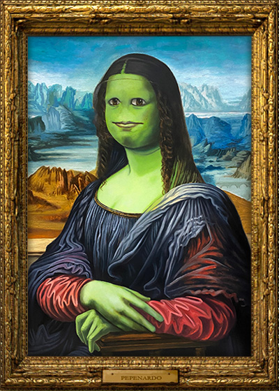
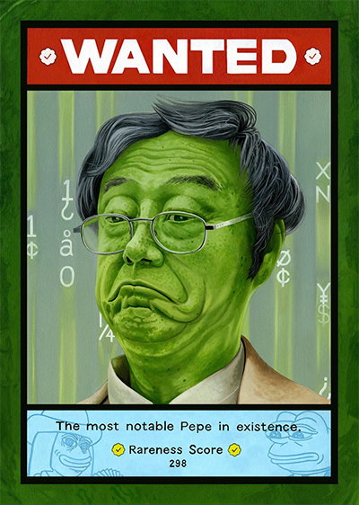
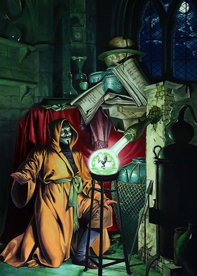
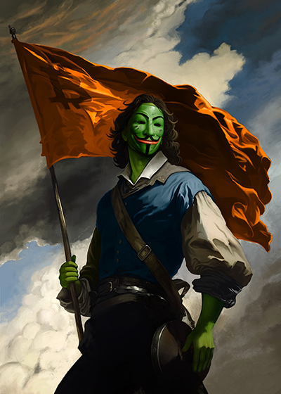

# PEPENARDO

[_Pepenardo_](https://pepe.wtf/artists/Pepenardo) _or_ [_X-NARDO_](https://twitter.com/PepenardoStudio)_, no matter what you call him, the moniker is true - he is the Grail Maker. A S1 Fake Rare OG with card 41 titled ‘_[_FAKEPEPELISA_](https://pepe.wtf/asset/FAKEPEPELISA)_’, followed up by a masterpiece in just about every series - his work is immediately identifiable and timeless. Nardo has a very interesting background from his education, artistic training, to his prior side hustle._

<figure><figcaption>
Nardo in his studio
</figcaption></figure>

1. _**Nardo, welcome to The Notable Ones. Please tell us a little about your background.**_&#x20;

Thank you for the kind introduction. Reflecting on these past two years, it is hard to believe we are at this point. Looking back further, however, I have considered myself an artist for as long as I remember. I completed college and lived/worked in Chicago for 10 years, often traveling back and forth to New York. It was not easy by any means, but I look back on those memories fondly.

My greatest development was founded through the various artist apprenticeships I did in my late teens and early 20s. I worked for some of the greatest contemporary artists in Chicago and New York (specifically in TriBeCa and Brooklyn). I would produce much of their work and eventually manage some of their studios, even training other assistants.  It was a surreal experience to replicate other artists’ works and witness them turn around and sell them for 30, 50, to $100k.  But this is not a new concept – this model has been practiced throughout all of art history.  I utilized these experiences to steal their processes, understand their business models, and build my foundation.

Later, me and a friend started a cash-only stretcher bar business out of a garage. Within a year, we cornered the market and were making stretchers for the best artists and galleries around Chicago.  It ended up being a great networking opportunity, as the garage was also my painting studio. Artists would come to pick up their bars and I would get spontaneous studio visit out of it.

<figure><figcaption>
Nardo's Studio I
</figcaption></figure>

 

<figure><figcaption>
Nardo's Studio II
</figcaption></figure>

2. _**When we met in NYC, you shared an amazing story about how you got into**_ [_**Fake Rares**_](../../../chapter-2-the-rare-pepe-project/fake-rares-and-dank-rares/) _**- it was a sort of break in the matrix as you put it. I also had the pleasure of speaking with**_ [_**Jsteezy**_](https://twitter.com/Jman\_\_12) _**about you and your work. There’s an amazing story here too. Please take us on a trip down Memetica lane.**_

With [how things started](../../../chapter-2-the-rare-pepe-project/pepes-blockchain-beginnings.md) in Cryptoart, I definitely considered it a glitch in the matrix. I still do. I had been pursuing education as a Registered Nurse after taking a brief leave of absence from the traditional art world. Burying myself in textbooks and training in the operating room left me starving to create again. At the same time, I was watching the reignited craze for [Rare Pepes](../../../chapter-2-the-rare-pepe-project/the-rare-pepe-blockchain-project/) in 2021. This inspired me to oil paint a pepe just for fun. I mashed the Mona Lisa with the face of [HAIRPEPE](https://pepe.wtf/asset/HAIRPEPE), created the Pepenardo [twitter account](https://twitter.com/PepenardoStudio), and threw work-in-progress images online.  Sure enough, someone linked me to the [Fake Rares telegram](https://t.me/OFFICIALFAKERARES), thus changing the course of my life.

To this day I don’t know who linked me to the telegram. The anonymous person ended up deleting their post on my twitter. I now just refer to them as ‘Morpheus’.

Huge shout out to [Jsteezy](https://twitter.com/Jman\_\_12) as well – initially he didn’t know anything about me besides the work I had posted and took a chance by sponsoring my first 3 [FAKEASF](https://pepe.wtf/asset/FAKEASF)s.

<figure><figcaption>
<a href="https://pepe.wtf/asset/FAKEPEPELISA">FAKEPEPELISA</a>
</figcaption></figure>

3. _**Speaking of Memetica, tell us about ‘MEMETICA NOW.’ I’m sure not many know what it means, but it’s definitely provocative.**_&#x20;

I created ‘MEMETICA NOW!’ in response to the phrase, “Seize the memes of production”.  I wanted to advocate for a phrase that felt more current, fresh, and metaphysical. Memetica now, refers to time in the present moment, it is a call to arms to meme NOW.  We become what we meme about.

4. _**You were anointed with the responsibility of making the**_ [_**Nakamoto card**_](https://pepe.wtf/asset/RAREPEPE) _**equivalent for S1 of Notable Pepes. You’ve titled this piece ‘**_[_**NOTAMOTO**_](https://pepe.wtf/asset/NOTAMOTO)_**’ and there is a lot to unpack with it, including a physical oil painting which was auctioned at Frogs > Fiat in NYC. Please tell us about the work and your process.**_

I was very honored that [VVD](https://twitter.com/Vince\_Van\_Dough) reached out ahead of the project’s start asking me to create the first card. As a large collector of my work, it was a unique experience as we collaborated to form the idea of what the card should represent for the collection. Ultimately NOTAMOTO’s intent was to pay homage and respect to where this all comes from, that being Rare Pepe and Counterparty. As with all my work, easter eggs are hidden throughout – the ‘xcp’ inscribed on the glasses, the Scrillian and [PEPENOPOULOS](https://pepe.wtf/asset/PEPENOPOULOS) pepes at the bottom, and the colorway referencing the original [RAREPEPE](https://pepe.wtf/asset/RAREPEPE) card, just to name a few.

<figure><figcaption>
<a href="https://pepe.wtf/asset/NOTAMOTO">NOTAMOTO</a>
</figcaption></figure>

5. _**While in NYC, a few very notable things happened with two of your physical pieces. Can you give us a play by play of wtf happened and what you were feeling?**_

NYC was a whirlwind of incredible euphoric emotions. Obviously, when a bunch of your online friends get together in real life situations, it’s the greatest feeling witnessing what we are able to build collectively. But you are also asking about the elephant in the room – the auctions. &#x20;

I still don’t have words for the results other than immense gratitude for the collectors that continue to uplift and support my work. It was a magical experience watching the room roar as the bidding wars were heating up between the infamous General and [Shawn](https://pepe.wtf/artists/Shawn-Leary). I was in shock, my wife was clutching my arm, people were clapping and smiling. It was awesome. [FAKESCIENCE](https://pepe.wtf/asset/FAKESCIENCE) set my new all-time high of 4.025 BTC – absolutely grateful to Shawn, a friend and one of the foundational scientists to the Rare Pepe project. Just as well, very thankful to VVD for securing the original NOTAMOTO. These works went into perfect collections.

<figure><figcaption>
<a href="https://pepe.wtf/asset/FAKESCIENCE">FAKESCIENCE</a>
</figcaption></figure>

6. _**Right before NFT NYC you released Fake Rare S13 C49 titled ‘**_[_**FREEDOMWAR**_](https://pepe.wtf/asset/FREEDOMWAR)_**.’ The process behind this piece is amazing, the story the piece tells is powerful beyond measure, but it also stirred up some controversy.**_

FREEDOMWAR kicks memetic ass. I see it as a pairing to [FAKEGENESIS](https://pepe.wtf/asset/FAKEGENESIS) or [FIGHT4HOPE](https://www.niftygateway.com/itemdetail/primary/0x6f5fd7d600664b239877ebf5e2e7fa9aa0246b36/2).  I am really drawn to creating these symbols that advocate for the progressive nature of Bitcoin, Web3, and decentralization in art. The final result of this work was a digital painting I completed in Procreate. How I got there was different than my usual process – I shoved my previous fakes into an ai prompt and added some extra text-spice in order to make the reference image for the final painting. Sure, the use of ai stirred some disagreement with a few people but a little controversy never hurts. Artists are meant to test new mediums and maybe break a few things along the way.

<figure><figcaption>
<a href="https://pepe.wtf/asset/FREEDOMWAR">FREEDOMWAR</a>
</figcaption></figure>

7. _**You’ve had tons of wins during your time here. As they say, Nardo doesn’t miss. But nobody swings 100%. Tell us about about an L you’ve taken on your journey.**_

I thought I was doing right by diamond handing my huge bag of [KEKO](https://opensea.io/assets/ethereum/0xa2037693b58c46201887ccd84a962273d282653f/1), unknowingly leaving it on xcp… Let’s skip this question hahaha. \*insert quivering-Arthur-diamond-hand-meme here\*

Kind of kidding.  In all seriousness, I wouldn’t necessarily say I’ve had an L here. Every experience, obstacle and win has been a huge blessing and I am so stoked to grow along the way. As Hafftka has made even more famous, **LFG!!!**

8. _**Any final notable remarks?**_

I mainly just want to thank everyone that has been part of the Nardo story. We have some very exciting things to come.

And remember, **MEMETICA NOW!**
