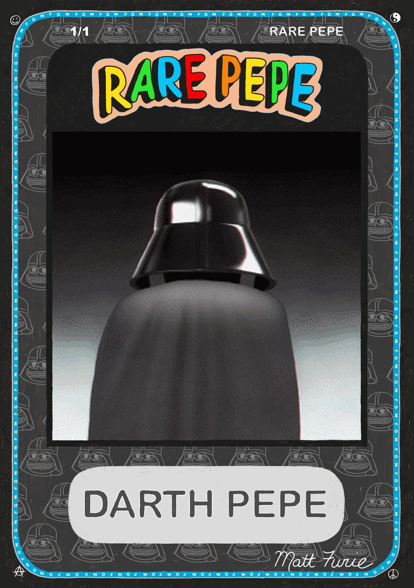
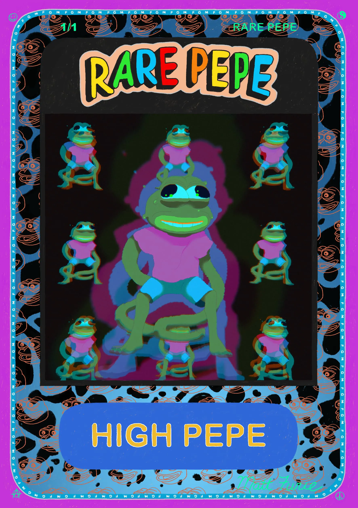
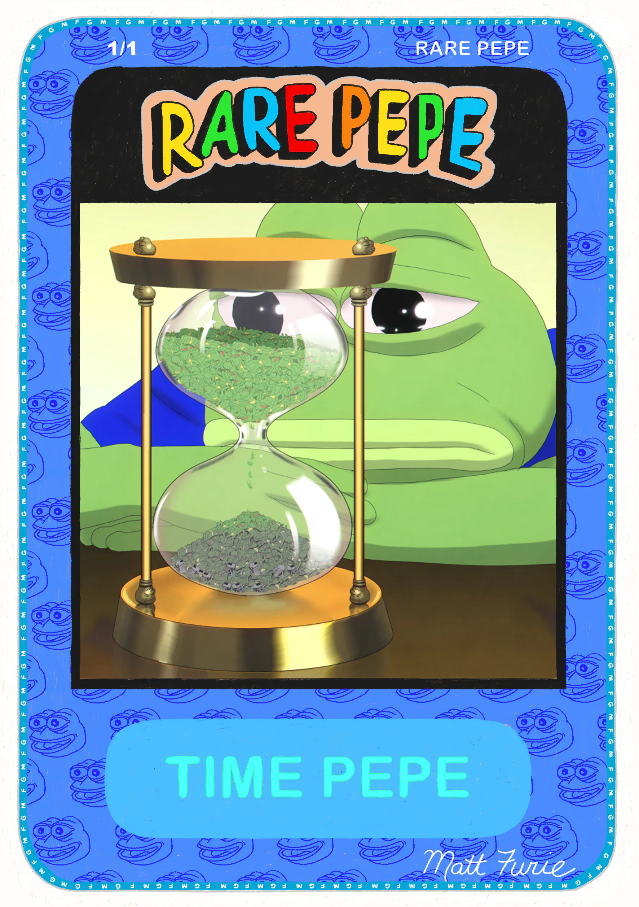

# PegzDAO, Chain/Saw & RarePepe.fun

## **PegzDAO**

[PEGZ](https://www.pegz.fun/) ([@PegzDAO](https://twitter.com/PegzDAO)) is a series of 100 unique collectables, each one of a kind and drawn digitally by [Matt Furie](https://mattfurie.com/). Every Peg character is a member of a family, one of 10 types, including "Pepe" who is present here in the rarest of forms.

Matt's vast world of characters come to life in the form of collectable/tradable files, each with a 2D avatar .PNG file, a 3D .GLB coin file, and an animated .GIF file.

Every 10 PEGZ is a [PEPE](https://www.pegz.fun/family/peper), and after every 30 PEGZ plops a [DAZZLER](https://www.pegz.fun/family/dazzler). The last of the Dazzler family ([Peg 103](https://www.pegz.fun/asset/peg-103)) sold for 269.42 ETH to collector [VincentVanDough](https://twitter.com/Vince_Van_Dough) in 2021.

The PEGZ project came about as Matt focused on digitally created work, and provided a unique opportunity for collectors to get into his vast universe of bizarre mutants and characters, the same universe that single-handedly spawned the most iconic internet creature of all time, Pepe the Frog.

PEGZ is operated by [Chain/Saw](https://www.chainsaw.fun/), a space for artists and collectors to both create and experiment with new digital art.

> _“Welcome to pegz.fun! I've been mining my brains out to bring you these seeds of the metaverse. May the faces of these new mutants bring you joy, good luck, and good fortune from the digital dreamscape."_\
> &#xNAN;_&#x50;eace, Love Unity, Respect,_\
> _Matt Furie_

## **Chain/Saw**

[Chain/Saw](https://www.chainsaw.fun/) ([@ChainSawNFT](https://twitter.com/ChainSawNFT)) is a space for artists and collectors to both create and experiment with a new digital art paradigm, and ultimately shape it. Chain/Saw also operates [PEGZ](http://pegz) in a joint venture with Matt Furie.

As an NFT marketplace, Chain/Saw presents a curated selection of visionary projects that call into question what blockchain art can be.

Chain/Saw was founded by [Frank Musarra](http://heartsofdarknesses.es/), an artist, musician, and creative technologist deeply embedded at the intersection of art and technology.

The project arose through conversations with peers who shared a common curiosity with this emergent space, though with this curiosity comes trepidation — what does the future of NFT art look like? What are the implications of this movement for “legacy” art worlds?

Chain/Saw was founded to further the challenging conversation surrounding the future of digital art, engaging a community of artists, inspired collectors, and curious audiences alike.

## **RarePepe.fun**

[The Rare Pepe Collection](https://www.rarepepes.fun/) is the latest lovechild of Matt Furie’s creative genius and Chain/Saw.

Launched on November 16th, 2021 with [this tweet](https://twitter.com/ChainSawNFT/status/1460728045111808009), the project featured 103 1/1 collectible Pepe NFTs exploring visions of the Pepeverse through beautifully crafted animations.

A glimpse of Matt's Rare Pepe creations:

  

RarePepe.fun is Matt Furie’s take on Rare Pepes today:

> _“You are about to experience the slap and mystery which reaches from the deepest inner mind to the outer limits._
>
> _Behind the curtain is the key to imagination, a dimension of mind entangled in the plight of a frog._
>
> _Pepe the Frog._
>
> _You are traveling to a land of darkness and light._
>
> _Sadness and delight._
>
> _Welcome to Rare Pepe.”_

Some of the collectibles can also be found on the projects OpenSea page [here](https://opensea.io/collection/rarepepe-by-matt-furie).
