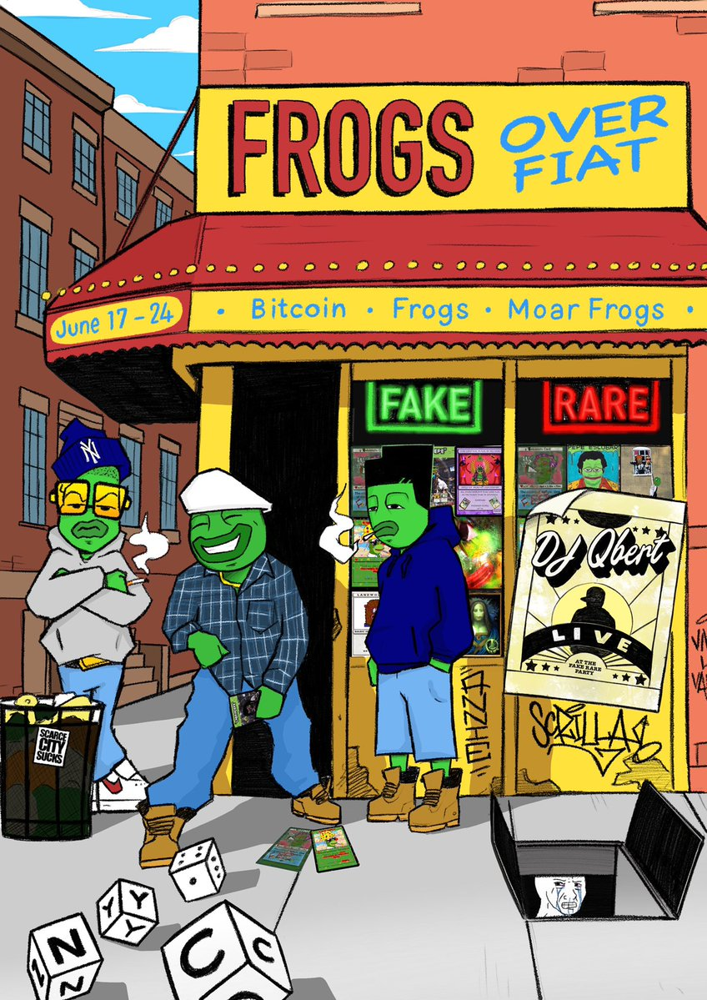
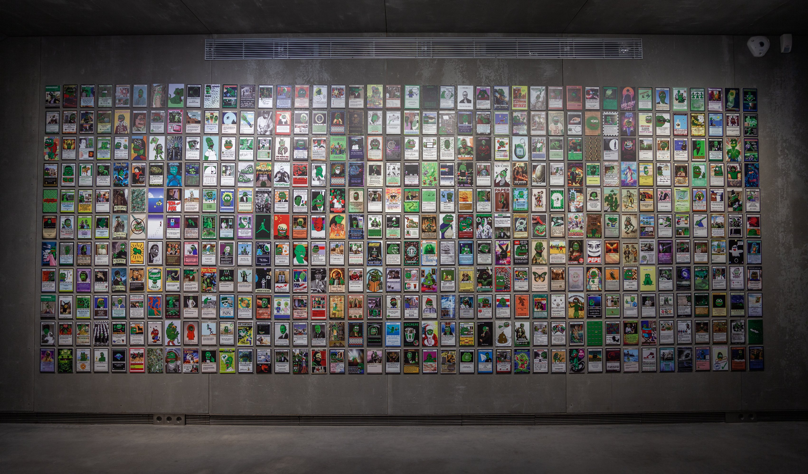
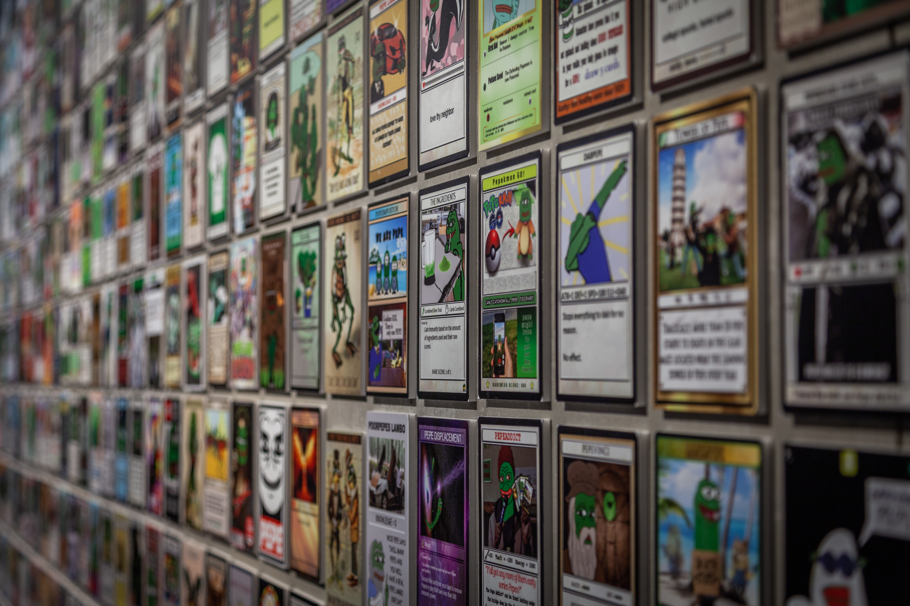

# PEPE NEWS OUTLET

## Joe Looney joins the Pepe Inc.

June 13th, 2022 ; [source](https://twitter.com/Vince\_Van\_Dough/status/1536425389245054976?s=20\&t=K2hyFywQsHoWcpRxbNraVQ)

Submitted by: [@PabloRicasso](https://twitter.com/PabloRicasso)

OG Rare Pepe RPW creator Joe Looney joins Pepe.Inc full-time. He will be developing the Bitcoin/Counterparty ecosystem.&#x20;

_Great_ [_interview w Joe Looney and Shawn Leary_](https://www.youtube.com/watch?v=A1y4CDOtvos\&ab\_channel=NFTCulture) _from August 31, 2021 check it out!_&#x20;


The Beginning of a New Era


## Danks are now being dropped at Pepe.wtf

June 13th, 2022 ; [source](https://twitter.com/DankDirectory/status/1536814235291996166?s=20\&t=aKfKhQq925gmK8uh\_-tbqg)

Submitted by: [@PabloRicasso](https://twitter.com/PabloRicasso)

[Dank Rares](https://www.dankdirectory.io/) have been added to the [drops on Pepe.wtf](https://pepe.wtf/drops) starting with cards by [SteveWeave](https://pepe.wtf/artists/SteveWeave), [Regan](https://pepe.wtf/artists/Regan) and [Zoku](https://pepe.wtf/artists/Zoku). Let the dankness begin!



## FROGS > FIAT, [NFT.NYC](https://www.nft.nyc/) Edition

June 12th, 2022 ; [source](https://twitter.com/ScrillaVentura/status/1536010933797003270?s=20\&t=Vdx1MxUGJEyQR3pv1OGQSQ)

Submitted by: [@FeelsRareMan](https://twitter.com/FeelsRareMan)

Starting on June 19th to 23rd, taking place in TriBeCa, 80 W Broadway, "FROGS > FIAT" is taking over New York City.

Visitors can come mint a free random BTC NFT from an NFT ATM provided by [@BabyPicassoo](https://twitter.com/BabyPicassoo). Check out how the NFT ATM looks [here](https://twitter.com/IrlMint/status/1536029289828818944?s=20\&t=PKjaZg5EiktvibjYJ\_IZLw). There's only 414 mints, randomized between 6 different fake artists. These fakes will only be distributed this week, in this way. Participants must have Proof-of-Bid in the Fake Rare Gallery auction to claim the free NFT.

Visitors can also scoop a VIP ticket to DJ Qbert for Wednesday evening. Get the tickets [here](https://scarce.city/sales/FOVRFNYC).

The event ends with an auction party on Thursday featuring live bidding. Beer and food are included for frens.

## FAKEBASEL Auction in Basel, Switzerland

June 12th, 2022 ; [source](https://twitter.com/fabooowy/status/1535409554271391745?s=20\&t=FTy-b7BqfbfCxILHSAivMg)

Submitted by: [@FeelsRareMan](https://twitter.com/FeelsRareMan)

The FAKEBASEL frog gallery is happening from Wednesday 15th to Saturday 18th, June 2022, in [Parzelle403](https://www.parzelle403.ch/FAKE-BASEL), Basel. The exhibition features both physical and digital FAKE RARE goods, ready for auction.

The auction is hosted by [Scarce.city](https://scarce.city/).

You can check out the auctioned goodies [here](https://scarce.city/collections/fake-basel-22).


FAKEBASEL


  

## La Faka Has Been Defeated

May 26th, 2022 ; [source](https://fakeraredirectory.com/la-faka-has-been-defeated/)

Submitted by: [@PabloRicasso](https://twitter.com/PabloRicasso)

.jpeg>)

### How it all Began

On September 21 2021, [Rare Scrilla](https://pepe.wtf/artists/Rare-Scrilla) was banned from the [Rare Pepe Trading Telegram](https://t.me/joinchat/QJdrG2ehHAfk5lKw) group for violating the number one rule: you can only share Official Rare Pepes in the Rare Pepe Trading Group. Rare Scrilla shared a Fake Rare that was rejected from the directory in 2018. You see, Scrilla had just rediscovered the fake in his wallet, so he figured he’d share it in the chat and give a few away to people who shared their addresses. He was quickly banned from the chat, so he decided to spin up a new chat and subsequent directory called Fake Rares. The [new chat](https://t.me/OFFICIALFAKERARES) quickly filled up, and Scrilla offered the FREEDOMKEK card – the fake that got him fake banned in the first place – to anyone who shared the card in the Rare Pepe chat.&#x20;

It was a “Proof of Ban” card and thus became the first card in the Fake Rare directory. Series 0, Card 1. The Rare Pepe administrators eventually unbanned Scrilla and even participated in the new Fake Rares community, and the rest has been written on the blockchain.

### The Faka Nostra Holdup&#x20;

Scrilla was having difficulties managing the website, so he recruited the Austrian Connect and his wife take over that shit. He was sorting through hundreds of submissions using a proton mail account, which is garbage even if you know how to use email. Scrilla is first and foremost, an artist and musician… the technical stuff… not his forte. He needed a Queen of Cards to help curate the collection and a Meme Lord Tech Guru to elevate the website and keep the chat fakeasf. Enter [Fake Annie](https://pepe.wtf/artists/Fake-Annie) and [Indelible](https://pepe.wtf/artists/Indelible). Shit ran smooth for maybe a week, but ultimately, they were hacked by a team of Eastern European gangstas – the squad called themselves [La Faka Nostra](https://twitter.com/LaFakaNostra) – around Series 2. They threatened the team, stole their memes and overtook the chat… they had DJPEPE at gun point and made him give up password access to Fakes.

La Faka used Scrilla, Fake Annie and Indelible as their slaves until [Ghostface Killa](https://twitter.com/GhostfaceKillah) from Wu Tang Clan showed up. GFK defeated La Faka and rescued Fake Rares, dropping hot hot fire in Series 4 with original audio tracks. But when Ghostface went on tour, La Faka stole back the directory in a late-night escapade, even demanding tribute from the community in the form of subassets.

### Reconquering the Fakes

The next 100+ cards were dictated by this elite group of balaclava wearing hood rats, but something happened towards the end of [Series 7](https://pepe.wtf/new/collections/Fake-Rares)… one late night in America, Fake Annie caught La Faka slipping. She discovered they were working with a South African cartel and – don’t ask how – she forced the South Africans to give up sensitive info on La Faka. When Scrilla presented this info to La Faka, they reluctantly gave back the directory, not wanting to be exposed. In a last-ditch effort to wreak havoc, they nuked the site… but thankfully, the assets were untouchable. Left with a mess, Scrilla and Fake Annie were forced to moonlight as website devs… they would normally have relied on Indelible to work his magic, but he was seemingly kidnapped by La Faka and has since disappeared. (We hope to see Indelible back one day and will pay La Faka a good fake dollar to retrieve his whereabouts.) They were able to get the site back up, though it’s still jankyasf and missing half the data…

Now, after a long and brutal war, we are charging forward, counting our blessings and focusing on our exceptional community. In celebratory fashion, Fake Annie and Scrilla have decided to let the most Pepe of all Pepe collectooooors, [Vincent Van Dough](https://pepe.wtf/artists/VVD), bring peace to the Fake Rare universe by curating Series 8. This gives them time to recalibrate, so we can all get back to doing hood rat shit with our frens.

## The Pepe Museum Exhibition

April 5th, 2022 ; [source](https://twitter.com/raulmarcosl/status/1511461112293769237?s=20\&t=DvTSKR6GTIVNkzhULOwCDA)

Submitted by: [@PabloRicasso](https://twitter.com/PabloRicasso)

[Espacio SOLO](https://coleccionsolo.com/), the famous Madrid museum approached [@raulmarcosi](https://twitter.com/raulmarcosl) after seeing his and his team's work on [https://pepe.wtf](https://pepe.wtf)

  

## Frogs over Fiat

April 6th, 2022 ; [source](https://thechambersproject.com/frogs-over-fiat/)

Submitted by: [@PabloRicasso](https://twitter.com/PabloRicasso)

During the [Bitcoin Miami Conference](https://b.tc/conference/), [The Chambers Project](https://thechambersproject.com/) along side [Scarce.city](https://scarce.city/) hosted the ["Frogs over Fiat" event](https://www.eventbrite.com/e/frogs-over-fiat-tickets-308377715047). The event lasted 6-9th of April.

While there, attendees were able to enjoy free beverage, the closing hours of Scarce.city's Fake Rare auction (more on that below) and a Rare & Fake Rare gallery.

Many iconic creations were featured, including the likes of [Pepenardo](https://pepe.wtf/artists/Pepenardo), [Rare Scrilla](https://pepe.wtf/artists/Rare-Scrilla), CES, MEAR, [Indelible](https://pepe.wtf/artists/Indelible), [Zetra](https://pepe.wtf/artists/ZETRA), [RYR](https://pepe.wtf/artists/RYR), [Kane Mayfield](https://pepe.wtf/artists/Kane-Mayfield), Sketch, [Mr Hansel](https://pepe.wtf/artists/Mr-Hansel), [Easy B](https://pepe.wtf/artists/Easy-B), [Optimist](https://pepe.wtf/artists/Optimist), [Viva La Vandal](https://pepe.wtf/artists/Viva-La-Vandal), Itchy Larry as well as the entire Fake Rare Directory.

As the Scarce.city Pepe tradition dictates, an auction was held on their native marketplace.

> _"We figured we might as well throw a party so we are doing just that on Thursday the 7th with DJ Qbert and The Gaslamp Killer in Wynwood._ J\_oin us for a killer time with the Scarce.city and Fake Rare’s crew for what is certain to be a fun and inspiring night in the sunny state of Florida!"\_

##
