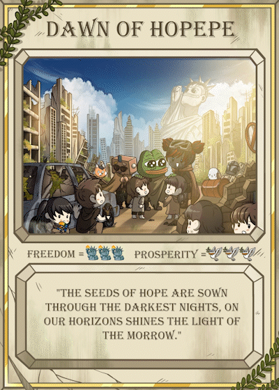
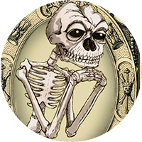
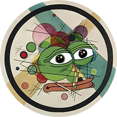

# Pepe.wtf

## What is [Pepe.wtf](https://pepe.wtf/)?

[Pepe.wtf](https://pepe.wtf/) is an all-in-one platform for Rare Pepes, Fare Rares and Dank Rares. It aims to be the center social hub of the Pepe community, providing easy-to-use tools for and frictionless Pepe exploring, buying or selling.

## Features

The platform wants to make the initial stages of the Pepe experience much easier. You can [browse the site](https://pepe.wtf/catalogue) to find the best plays by series, but also by [Artists](https://pepe.wtf/artists) and [Sets](https://pepe.wtf/sets), a long-desired feature by the community.

The site also features a [Leaderboard](https://pepe.wtf/leaderboard) of all wallets carrying Pepe Cards, sorted by highest number of cards collected, with the current leader owning an impressive collection of 1680/1774 unique cards.

Its built-in marketplace aggregator makes the world of Pepe much more digestible to even the greenest of Pepe enthusiasts.

Pepe.wtf also boasts an impressive amount of on-chain data, analytics tools and historical price tracking graphs - a much needed and much welcomed UX upgrade for the Pepe crowd.&#x20;

Users can have a view of all the necessary data about Rares, Fakes or Danks from [XChain](https://xchain.io/), [OpenSea](https://opensea.io/) and [Scarce.city](https://scarce.city/), right there in one window. They can find all the relevant information on any card in one single place, before proceeding to buy one for their collection. Pepe.wtf hopes to serve OGs and attract new souls to this green rabbit hole as well.

**Activity tabs** on [pepe.wtf](https://pepe.wtf) allow users to have a broader market overview. They show monthly total sales, volume and asset count, as well as a chronological list of sales that are happening on the market starting from the latest. Activity tabs are supported for [Rares](https://pepe.wtf/activity), [Fakes](https://pepe.wtf/new/activity/Fake-Rares) and [Danks](https://pepe.wtf/new/activity/Dank-Rares).


As of April 2022, Pepe.wtf added support for Fake Rares and Dank Rare Pepes, becoming the first platform to support the full repertoire of Pepes.


### Introducing: [**Drops**](https://pepe.wtf/drops)

Drops is a newly added feature that automated the purchasing of new released and by doing so, massively enriches the user experience on the platform. Now, Pepe gatherers can buy a newly released drops straight from the Pepe.wtf website. You can stay tuned for future drop announcements via the [PepePawnShop Telegram Chat](https://t.me/PepePawnShop).

To kick things off, the first card on Drops was [DAWNOFHOPE](https://pepe.wtf/asset/DAWNOFHOPEPE) by [FourLeafClover](https://pepe.wtf/artists/FourLeafClover).

New to purchasing on pepe.wtf? Watch this "[How To Purchase](https://youtu.be/pjPzmjCc480)" tutorial to get you started:




[#pepe.wtf-introduces-new-improved-ui-for-collectors-and-artists](../pepe-news-outlet/#pepe.wtf-introduces-new-improved-ui-for-collectors-and-artists "mention")


## Pepe.wtf team

Pepe.wtf is the brainchild of [@pepe](https://twitter.com/pepe) himself and [Carbono](https://carbono.com/).

   

[@pepe](https://twitter.com/pepe) is the NFT-collecting, Pepe-hoarding alter ego of a true crypto believer.

[Carbono](https://twitter.com/carbono\_com) is a crypto company that does some serious [consulting](https://carbono.com/), some serious [investing](https://abacus.carbono.com/), some serious [NFTing](https://botto.com/) and then some other things for the lulz.

> "We joined forces to shed some light and share some alpha on the intricate world of Rare Pepes."

* [Pepe](https://twitter.com/pepe) brought all the wisdom acquired from a troubled history of collecting frogs
* [Al](https://twitter.com/al\_fernandz), Carbono's shadowy super coder, took to the keyboard and untangled Matrix.
* [Raúl](https://twitter.com/raulmarcosl) and [Miguel](https://twitter.com/miguelatcarbono) sang cheerful songs, sent stickers and ate cashews on the sidelines.

Pepe.wtf is their humble contribution to the exciting universe of Pepes.

> _“This is a self funded, non-for-profit project born from passion and fun. We might scoop a few Pepes here and there ourselves, but there is no business model behind it. We have done our best to make everything work flawlessly, but Rare Pepes are a complicated collection. Al has only two hands and 24 hours in his day (he refuses to sleep or eat), but there might be bugs or mistakes here and there. We are eager to listen to the community and try to accommodate, so let us know if you find something that's off, something that doesn't work... Also let us know what you like. We have feelings.”_


You can support Pepe.wtf by dropping an actual Pepe, XCP or Bitcoin at:

1Ft8YRa691UZAdSLbwHkXuU3L1c2Xm8m3P

or ETH and NFTs at:

0xce7564749E49D8f41241b4A1156fDDD4F272D52B

