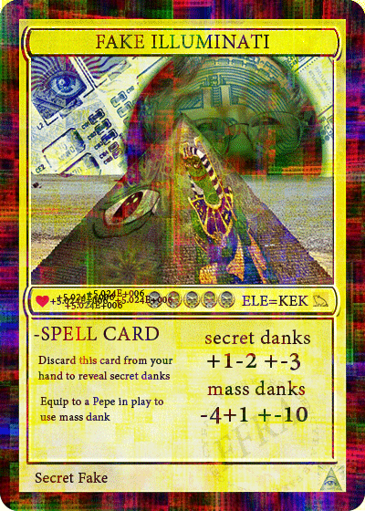

# Dank Rares


_**Work in progress**_ - if you would like to contribute some lore or your card-specific story, please follow the steps in [how-to-contribute-to-the-book-of-kek.md](../how-to-contribute-to-the-book-of-kek.md "mention") or send us an email titled **"BoK Edit Request"** to [wiki@pepe.wtf.](mailto:wiki@pepe.wtf?subject=BoK%20Edit%20Request)&#x20;


All Dank Rares are listed in the[ Dank Directory](https://www.dankdirectory.io/) - a curated collection inspired and developed by an original Rare Pepe artist: [Dankboost](https://pepe.wtf/artists/Boost).

