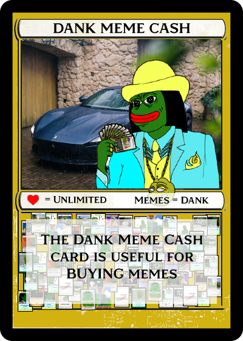

# Dank Rares Submission Rules

You can find the official Dank Directory Submission Rules [here](http://www.dankdirectory.io/submissions/).

### Danks Submission Rules:

1. Submission to the directory site must be a 400×560 image. Asset image size can be 400×560, 800×800, or 800×1200. Regardless of the image size you choose for your asset, a display image size of 400×560 is required for the directory.
2. Image size should not be over 10Mb, if so please message @boost on Telegram before submitting. If you are making a large file for your asset you can make a different display image for the directory.
3. Issuance must be LOCKED using the lock token function on Counterparty.
4. No divisible assets.
5. If you are concerned about the content in your image ask before submitting.
6. No NSFW content.
7. Minimum token supply is 21.
8. No websites, no QR codes on the card unless permission granted by dank admin @boost.
9. Do not distribute your meme before being added to the directory.

**100,000 DANKMEMECASH or 1420 PEPECASH&#x20;**_**AFTER APPROVAL**_**&#x20;needs to be destroyed or sent to either one of the below addresses;**&#x20;

1BurnDaNK476q5h7vtf3BTdqKpKu65SKbe

1BurnPepexxxxxxxxxxxxxxxxxxxAK33R

**Directory DANKMEMECASH dispenser** **link:**

[https://xchain.io/tx/ce8f0c82c960109f25ec6de786dde46203c1438b4ede6a273c424ac101d813bb](https://xchain.io/tx/ce8f0c82c960109f25ec6de786dde46203c1438b4ede6a273c424ac101d813bb)
