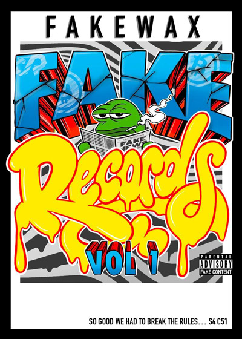

# Pepe News Outlet 📰

## Fake Rares Submissions are open again!

September 1st, 2022 ; [source](https://twitter.com/FAKERARES\_XCP/status/1565353860482285569)

Submitted by [@PabloRicasso](https://twitter.com/PabloRicasso)

Fake Rares announced that the process to [submit new Fakes](../chapter-2-the-rare-pepe-project/fake-rares-and-dank-rares/fake-rares-submission-rules.md) is officially open again as of September 1st! To submit your Fake Rare follow [our guide ](../chapter-2-the-rare-pepe-project/fake-rares-and-dank-rares/fake-rares-submission-rules.md)or visit the [Fake Submission Portal](https://fakeraredirectory.com/fake-submissions/).


_While this is great news for creators, as lots of artists have been waiting to submit their latest creations for a while, please expect a rather long waitlist and backlog in the submission process._



Praise Lord Kek!


## Pepe.wtf introduces new Pepe Exchange Market

September 1st, 2022 ; [source](https://twitter.com/al\_fernandz/status/1564264655773728768)

Submitted by [@PabloRicasso](https://twitter.com/PabloRicasso)

[Pepe.wtf](../chapter-4-latest-developments/pepe.wtf.md) creator [@al\_fernandz](https://twitter.com/al\_fernandz) announced a new feature on his site: [pepe.wtf/market](https://pepe.wtf/market), a page to easily explore all different listings across each collection: [Rare Pepes](https://pepe.wtf/market) - [Fake Rares](https://pepe.wtf/market/fake-rares) - [Fake Commons](https://pepe.wtf/market/fake-commons) - [Dank Rares](https://pepe.wtf/market/dank-rares)

The new Market page shows [OpenSea listings](../chapter-3-blockchain-counterparty-how-to/emblem-vault/), [Counterparty BTC dispensers](../chapter-3-blockchain-counterparty-how-to/dispensers-what-are-they-how-to-use-them.md), Counterparty trades and of course the latest [PepePawnShop ](../chapter-4-latest-developments/pepepawnshop/)drops!

<figure><figcaption></figcaption></figure>

## New 'CryptoArt - Begins' book will feature Rare Pepe

September 1st, 2022 ; [source](https://twitter.com/TheNFTMag/status/1564655938472030209)

Submitted by [@PabloRicasso](https://twitter.com/PabloRicasso)

[The NFT Magazine](https://twitter.com/TheNFTMag) will release its first "phygital" book '[CryptoArt - Begins](https://www.thenftmag.io/cryptoartbegins/)', co-written by [Andrea Concas](https://twitter.com/acvault) _(aka @ACVAULT)_ and [Eleonora Brizi](https://twitter.com/eleonorabrizi) _(author of_ [_The Rarest Book_](../chapter-2-the-rare-pepe-project/the-rare-pepe-blockchain-project/the-rarest-book-by-eleonora-brizi.md)_)_, on September 19th via the marketplace [Nifty Gateway](https://www.niftygateway.com/marketplace).  Featured on the digital cover of the book is the Rare Pepe card [MODERNPEPE](https://pepe.wtf/asset/MODERNPEPE) issued in March 2017 by artist [Meme Conscious](https://pepe.wtf/artists/Meme-Conscious).&#x20;

<figure><figcaption></figcaption></figure>

Inside the book, Rare Pepes will be featured among some of the 50 best crypto artists of our time, including works and words by OG Pepe artists such as [@ScrillaVentura](https://twitter.com/ScrillaVentura), [@theog\_\_](https://twitter.com/theog\_\_), [@pepe\_designer](https://twitter.com/pepe\_designer), [@Rare\_Luca](https://twitter.com/Rare\_Luca), [@NFTcloud69](https://twitter.com/NFTcloud69), [@ROBNESSOFFICIAL](https://twitter.com/ROBNESSOFFICIAL) & [@MemeConscious](https://twitter.com/MemeConscious).

As the author Eleonora Brizi would put it: "[Crypto Art explained from its core](https://twitter.com/eleonorabrizi/status/1564660555369029633)."

## FAKEWAX drops retroactively including a vinyl compilation of all tracks on Fake Rares S4

August 18th, 2022 ; [source](https://fakeraredirectory.com/fakewax/)

Submitted by [@PabloRicasso](https://twitter.com/PabloRicasso)

"FAKEWAX was emancipated and given Fake Statehood in Series 4 thanks to a frog and 50+ creators. The Fake scientists decided we needed to add the Special Edition [FAKEWAX](https://pepe.wtf/asset/FAKEWAX) card Viva La Vandal created retroactively, and make it the 51st state of the ground-breaking [Series 4](https://fakeraredirectory.com/series-4/) collection of the Fake Rares. The card is not just a card. It’s a summation of the hard work the creators and developers of Series 4, which features entirely music NFTs.

One FAKEWAX equals one FAKE WAX Volume 1 record. Thirty original tracks made for the Fake Rare series are spliced together thanks to Pimpernel Jones, who mastered all the tracks, and 80s Kurt Russell who A\&R’ed the project."&#x20;

Read more about FAKEWAX and its full tracklist [here](https://fakeraredirectory.com/fakewax/).


If you own a [FAKEWAX.REDEEM](https://xchain.io/asset/FAKEWAX.REDEEM) fill out this [CLAIM FORM](https://xcpsub.io/fakewax) to receive your record!



[CLAIM FORM](https://xcpsub.io/fakewax)



As a tribute to FAKEWAX, Fake master [Pepenardo](https://twitter.com/PepenardoStudio) released [FAKEFAKEWAX](https://pepe.wtf/asset/FAKEFAKEWAX), a 35 numbered limited edition vinyl available only via 48h silent auction at the [pepepawnshop](../chapter-4-latest-developments/pepepawnshop/ "mention").



FAKEFAKEWAX Silent Auction


## Fake Rares S8 concludes with VVD & ACK drop

July 30th, 2022 ; [source](https://twitter.com/FAKERARES\_XCP/status/1553006852971151360)

Submitted by [@PabloRicasso](https://twitter.com/PabloRicasso)

On July 29th, high priest of Kek and curator [Vincent Van Dough](https://twitter.com/Vince\_Van\_Dough) closed the [legendary lineup](https://twitter.com/Vince\_Van\_Dough/status/1542982900454264832) of artists alongside the acclaimed [Alpha Centauri Kid](https://twitter.com/lphaCentauriKid) with their respective cards [LILYPAD](https://pepe.wtf/asset/LILYPAD) & [GRANTYUM](https://pepe.wtf/asset/GRANTYUM), a diptych in homage to [Grant Riven Yun](https://twitter.com/GrantYun2)'s "[Cow](https://superrare.com/artwork-v2/cow-33524)".

 .jpeg>)

This concludes a historic month of [Fake Rares Series 8](./#vvd-announces-curated-fake-rares-series-8), praised as the "Pepe Summer" of 2022 by all frog-aficionados of the Fakeverse. The curated series was a huge success, with over 40 leading artists in the NFT space onboarded to Fake Rares & XCP, as well as 21k new active users on [pepe.wtf](https://pepe.wtf/) and 2.5k new members in the [PepePawnShop Telegram](https://t.me/PepePawnShop), setting the directory up for steady growth in the months to come!



## SuperTrip64 releases a multiplayer game alongside his S8 Fake WAGMIWORLD

July 28th, 2022 ; [source](https://twitter.com/SuperTrip64/status/1552720983961862145?s=20\&t=YN-fFeszZoZ9Z06J44bpsw)

Submitted by [@PabloRicasso](https://twitter.com/PabloRicasso)

3D artist [SuperTrip64](https://twitter.com/SuperTrip64) released a multiplayer game alongside his Fake Rare S8C43, [WAGMIWORLD](https://pepe.wtf/asset/WAGMIWORLD). The game went live on SuperTrip64's website [SuperTrip.Land](https://t.co/UPJ7Nvqoew), where players were able to test the gameplay experience in a 24h alpha launch event. [770 unique players](https://twitter.com/SuperTrip64/status/1553153594752466947) participated in the event, marking the release of what's probably the first ever 64bit multiplayer Pepe game!


SuperTrip64


## Welcome to the FAKEVERSE

July 28th, 2022 ; [source](https://twitter.com/al\_fernandz/status/1549352175054327814?s=20\&t=-NcXHkfQWe6d1sLdw1i08A)

Submitted by [@masonmarcobello](https://twitter.com/masonmarcobello)

On the 19th of July, [AL Fernandz](https://twitter.com/al\_fernandz?s=20\&t=EFVnMu0qbGu-\_lraY9cEYw) released [FAKEVERSE](https://pepe.wtf/asset/FAKEVERSE) - a new addition to the Series 8 Fake Rare collection curated by [VincentVanDough](https://twitter.com/Vince\_Van\_Dough).

Created as a homage to collectors, FAKEVERSE (capped at 100 cards) goes beyond static visuals and rarity metrics by reflecting the activity of its holders in real time. In the Fakeverse, holders with the same amount of cards live together on different planets and can view the assets on the interactive page here: [http://pepe.wtf/fakeverse](http://pepe.wtf/fakeverse)

Every planet represents a group of holders with the same number of cards, the closer they are to the star the danker they live in the universe.

Search for different cards and explore the cosmos!

> _“I wanted to do something unique for artists and pepe.wtf users. So now every artist can navigate the universe of their cards, and every collector can navigate the planets they live on.”_ - Al



## Rares, Fakes & the Pepe OGs on Rug Radio

July 20th, 2022 ; [source](https://twitter.com/PabloRicasso/status/1549879030790356992)

Submitted by [@PabloRicasso](https://twitter.com/PabloRicasso)

On July 20th_,_ [Farokh](https://twitter.com/farokh) invited the OGs of Rares & Fakes to his daily podcast show GM NFTs on [Rug Radio](https://twitter.com/RugRadio): [Joe Looney](https://twitter.com/wasthatawolf), [Robness](https://twitter.com/ROBNESSOFFICIAL), [Rare Scrilla](https://twitter.com/ScrillaVentura) & [Fake Annie](https://twitter.com/fakefakeannie) joined him to talk about the beginnings of the [Rare Pepe Project](../chapter-2-the-rare-pepe-project/the-rare-pepe-blockchain-project/), the current success of [Fake Rares](../chapter-2-the-rare-pepe-project/fake-rares-and-dank-rares/) and the hype around [VVD's curated Series 8](./#vvd-announces-curated-fake-rares-series-8), as well as the Book Of Kek.

_"Today after diving into some of the positive macros we jumped into the Rare Pepe rabbit hole. Learning about everything from the creation, the inspiration to the eventual deviation due to strict moderation that became the Fake Rares. Listen in for a history lesson on all things Rare Pepe."_

**Listen to the full episode here:**



**Spotify:** [https://open.spotify.com/episode/75bw25EAHXmdotc78fVTos](https://open.spotify.com/episode/75bw25EAHXmdotc78fVTos?si=e3a99dc8a0a94893)

**Apple Music:** [https://podcasts.apple.com/us/podcast/gm-nfts-on-rug-radio-rare-pepes-fake-rares-and-the-ogs/id1623389858?i=1000570609718](https://podcasts.apple.com/us/podcast/gm-nfts-on-rug-radio-rare-pepes-fake-rares-and-the-ogs/id1623389858?i=1000570609718)

## A new and improved look for pepe.wtf

July 7th, 2022 ; [source](https://twitter.com/al\_fernandz/status/1542861523764248579?s=20\&t=yUZ5WGFd0\_JS5-WPbF7gsQ)

Submitted by [@masonmarcobello](https://twitter.com/masonmarcobello)

On the 1st of July, pepe.wtf world was upgraded to better organise the ever-expansive and engrossing collections of Fake Rares, Dank Rares and Fake Commons.



Although OG RarePepes will always be a focal point on the site, the team behind pepe.wtf believe that this new central location (for all collections) will only help streamline the learning experience for anyone starting their journey into the Pepeverse (especially through aspects like curated news, history, and the Book of Kek).

Special thanks goes to [@0xWillRock](https://twitter.com/0xWillRock) and [@Luna\_Lu\_Arts](https://twitter.com/Luna\_Lu\_Arts) for their collective time and effort to build this elegant new home.

## Matt Kane's NOTKAMOTO card launches S8 of Fake Rares

July 1st, 2022 ; [source](https://twitter.com/Vince\_Van\_Dough/status/1542964638450479104?s=20\&t=U2PT7wtbkflif8EHXwelZQ)

Submitted by [@masonmarcobello](https://twitter.com/masonmarcobello)

As the first NFT by artist [Matt Kane](https://twitter.com/MattKaneArtist) on the Bitcoin blockchain, NOTKAMOTO was minted at the [end of day June 10th](https://xchain.io/asset/NOTKAMOTO) as a master copy tribute to the original [RAREPEPE Nakamoto Card](https://pepe.wtf/asset/RAREPEPE), created by anonymous artist Mike in September 2016.

Released as an edition of 300 (mirroring the supply of the original RAREPEPE), The Notkamoto Card is the first and only time Matt Kane has deviated from his long-standing tradition of minting unique 1/1s. It’s also included as the first in [Series 8 of FakeRares](https://fakeraredirectory.com/series-8/) curated by a long-standing collector and purveyor of fine art, [VincentVanDough.](https://twitter.com/Vince\_Van\_Dough)

**About the artist:**

As referenced on the [official Notkamoto site](https://notkamotos.club/), Kane is known for using custom generative software to digitally paint master copies of original masterpieces.

However, with NOTKAMOTO he challenges the standard practice of the master copy genre by applying his unique designs - a stylistic practice that started in 2006, three years before the advent of Bitcoin and when he just began programming.

> _“The most compelling brushstrokes to consider emulating in this new paradigm has less to do with image, more to do with honoring the culture, memes, exhibition history, provenance, market, technology, and general context that surround a masterpiece NFT.”_ - Kane

**Community Initiative:**

[As mentioned on Twitter](https://twitter.com/MattKaneArtist/status/1542952953400549376?s=20\&t=NrD6EAPHU7POOtTr6MvDNQ), 69 patronage editions will shortly become available on a dispenser for 1 BTC each. To become eligible for a NOTKAMOTO, Kanes has detailed the process and conditions [here](https://twitter.com/MattKaneArtist/status/1542952953400549376?s=20\&t=NrD6EAPHU7POOtTr6MvDNQ):



Alongside exhibiting work in [Sotheby’s 2021 Natively Digital auction](https://www.sothebys.com/en/buy/auction/2021/natively-digital-a-curated-nft-sale-2/meules-after-claude-monet?locale=en), Kanes also has a [“Gazers” discord](../chapter-4-latest-developments/pepe-news-outlet/discord.gg/gazers/) named after his [Art Blocks collection](https://www.artblocks.io/project/215) where people can talk about NOTKAMOTO.

Ultimately, while the original RAREPEPE Nakamoto card served as the progenitor of the [CryptoArt movement](https://www.artnome.com/news/2018/1/14/what-is-cryptoart), Notkamoto by Kanes is a shining example of a work that reflects the current state of digital craftsmanship and dank culture.

**Official Links:**

[Matt Kane Website](https://mattkane.com/)

[Twitter](https://twitter.com/mattkaneartist)

[Instagram](https://instagram.com/mattkaneartist)

[NOTKAMOTO Official Website](https://notkamotos.club/)

[XCHAIN](https://xchain.io/asset/NOTKAMOTO)

[About Video](https://www.youtube.com/watch?v=ZJHf-5yN3XA)

## VVD announces curated Fake Rares Series 8

June 29th, 2022 ; [source](https://twitter.com/Vince\_Van\_Dough/status/1541599342590537729?s=20\&t=7HfJZNSzMPqx7GJxIL\_EvQ)

Submitted by [@PabloRicasso](https://twitter.com/PabloRicasso)

On June 27th, 2022, the famed NFT collector VincentVanDough announced the release date and lineup of the highly-anticipated Fake Rares Series 8, curated by VVD himself and featuring an incredible lineup of some of the most acclaimed NFT artists of our time.

According to VVD, Series 8 will launch on July 1st and will last most of the month. Dropping 2 cards per day on [https://pepe.wtf/drops](https://pepe.wtf/drops), Monday to Saturday, taking Sundays off.



The announcement was quickly followed by two promo videos, made by Fake Rare artists [@LOVEBEINGWORLD](https://twitter.com/LOVEBEINGWORLD) & [@viva\_la\_vandal](https://twitter.com/viva\_la\_vandal), including a more detailed schedule and only adding to the anticipation felt by the whole of the Pepe community.


Promo video by [@LOVEBEINGWORLD](https://twitter.com/LOVEBEINGWORLD)



Promo video by [@viva\_la\_vandal](https://twitter.com/viva\_la\_vandal)


## Pepe.wtf added the 'Nakamoto 300 Club'

June 16th, 2022 ; [source](https://twitter.com/al\_fernandz/status/1537397646415040514?s=20\&t=c15c4QCZmsw3pyxSUBc6-Q)

Submitted by [@FeelsRareMan](https://twitter.com/FeelsRareMan)

**Nakamoto Cards get ID #s and companion PFPs**

RAREPEPE (also known as the Nakamoto card) is the first NFT of the Rare Pepe collection, created in September 2016, with a supply of 300 cards. RAREPEPE is a museum piece, and it can now be collected as a pure NFT, numbered from 1 to 300 thanks to the parsing of the Bitcoin blockchain. For each ID, a unique "Nakamoto" PFP is associated.

Also, [Pepe.wtf](https://t.co/7H2dOxwXNK) is showing them as PFPs in the leaderboard. Now the members of the 300 club have the place they deserve: [http://pepe.wtf/leaderboard](https://t.co/3ErD6pYeaH)

Pepe.wtf will continue working and adding cool things to the 300 club. Hats off to the incredible work developed by [@TheNakasClub](https://twitter.com/TheNakasClub)!

 

## Joe Looney joins the Pepe Inc.

June 13th, 2022 ; [source](https://twitter.com/Vince\_Van\_Dough/status/1536425389245054976?s=20\&t=K2hyFywQsHoWcpRxbNraVQ)

Submitted by: [@PabloRicasso](https://twitter.com/PabloRicasso)

OG Rare Pepe RPW creator Joe Looney joins Pepe.Inc full-time. He will be focusing on developing the Bitcoin/Counterparty ecosystem!

_Great_ [_interview w Joe Looney and Shawn Leary_](https://www.youtube.com/watch?v=A1y4CDOtvos\&ab\_channel=NFTCulture) _from August 31, 2021 check it out!_


The Beginning of a New Era


## Danks are now being dropped at Pepe.wtf

June 13th, 2022 ; [source](https://twitter.com/DankDirectory/status/1536814235291996166?s=20\&t=aKfKhQq925gmK8uh\_-tbqg)

Submitted by: [@PabloRicasso](https://twitter.com/PabloRicasso)

[Dank Rares](https://www.dankdirectory.io/) have been added to the [drops on Pepe.wtf](https://pepe.wtf/drops) starting with cards by [SteveWeave](https://pepe.wtf/artists/SteveWeave), [Regan](https://pepe.wtf/artists/Regan) and [Zoku](https://pepe.wtf/artists/Zoku). Let the dankness begin!



## FROGS > FIAT, [NFT.NYC](https://www.nft.nyc/) Edition

June 12th, 2022 ; [source](https://twitter.com/ScrillaVentura/status/1536010933797003270?s=20\&t=Vdx1MxUGJEyQR3pv1OGQSQ)

Submitted by: [@FeelsRareMan](https://twitter.com/FeelsRareMan)

Starting on June 19th to 23rd, taking place in TriBeCa, 80 W Broadway, "FROGS > FIAT" is taking over New York City.

Visitors can come mint a free random BTC NFT from an NFT ATM provided by [@BabyPicassoo](https://twitter.com/BabyPicassoo). Check out how the NFT ATM looks [here](https://twitter.com/IrlMint/status/1536029289828818944?s=20\&t=PKjaZg5EiktvibjYJ\_IZLw). There's only 414 mints, randomized between 6 different fake artists. These fakes will only be distributed this week, in this way. Participants must have Proof-of-Bid in the Fake Rare Gallery auction to claim the free NFT.

Visitors can also scoop a VIP ticket to DJ Qbert for Wednesday evening. Get the tickets [here](https://scarce.city/sales/FOVRFNYC).

The event ends with an auction party on Thursday featuring live bidding. Beer and food are included for frens.

## FAKEBASEL Auction in Basel, Switzerland

June 12th, 2022 ; [source](https://twitter.com/fabooowy/status/1535409554271391745?s=20\&t=FTy-b7BqfbfCxILHSAivMg)

Submitted by: [@FeelsRareMan](https://twitter.com/FeelsRareMan)

The FAKEBASEL frog gallery is happening from Wednesday 15th to Saturday 18th, June 2022, in [Parzelle403](https://www.parzelle403.ch/FAKE-BASEL), Basel. The exhibition features both physical and digital FAKE RARE goods, ready for auction.

The auction is hosted by [Scarce.city](https://scarce.city/).

You can check out the auctioned goodies [here](https://scarce.city/collections/fake-basel-22).


FAKEBASEL


  

## [Deca.art](https://deca.art/) now supports all assets on Pepe.wtf

June 6th, 2022 ; [source](https://twitter.com/0xDecaArt/status/1533932680517013504?s=20\&t=c15c4QCZmsw3pyxSUBc6-Q)

Submitted by: [@PabloRicasso](https://twitter.com/PabloRicasso)

PEPE IS UTILITY. The art curation platform [Deca.art](https://deca.art/) added support for Rare Pepes, Fake Rares, Fake Commons and Dank Rares on June 6th, 2022. Users can now create and curate their galleries to exhibit their frogs in all their glory!



## La Faka Has Been Defeated

May 26th, 2022 ; [source](https://fakeraredirectory.com/la-faka-has-been-defeated/)

Submitted by: [@PabloRicasso](https://twitter.com/PabloRicasso)

### How it all Began

On September 21 2021, [Rare Scrilla](https://pepe.wtf/artists/Rare-Scrilla) was banned from the [Rare Pepe Trading Telegram](https://t.me/joinchat/QJdrG2ehHAfk5lKw) group for violating the number one rule: you can only share Official Rare Pepes in the Rare Pepe Trading Group. Rare Scrilla shared a Fake Rare that was rejected from the directory in 2018. You see, Scrilla had just rediscovered the fake in his wallet, so he figured he’d share it in the chat and give a few away to people who shared their addresses. He was quickly banned from the chat, so he decided to spin up a new chat and subsequent directory called Fake Rares. The [new chat](https://t.me/OFFICIALFAKERARES) quickly filled up, and Scrilla offered the FREEDOMKEK card – the fake that got him fake banned in the first place – to anyone who shared the card in the Rare Pepe chat.

It was a “Proof of Ban” card and thus became the first card in the Fake Rare directory. Series 0, Card 1. The Rare Pepe administrators eventually unbanned Scrilla and even participated in the new Fake Rares community, and the rest has been written on the blockchain.

### The Faka Nostra Holdup

Scrilla was having difficulties managing the website, so he recruited the Austrian Connect and his wife take over that shit. He was sorting through hundreds of submissions using a proton mail account, which is garbage even if you know how to use email. Scrilla is first and foremost, an artist and musician… the technical stuff… not his forte. He needed a Queen of Cards to help curate the collection and a Meme Lord Tech Guru to elevate the website and keep the chat fakeasf. Enter [Fake Annie](https://pepe.wtf/artists/Fake-Annie) and [Indelible](https://pepe.wtf/artists/Indelible). Shit ran smooth for maybe a week, but ultimately, they were hacked by a team of Eastern European gangstas – the squad called themselves [La Faka Nostra](https://twitter.com/LaFakaNostra) – around Series 2. They threatened the team, stole their memes and overtook the chat… they had DJPEPE at gun point and made him give up password access to Fakes.

La Faka used Scrilla, Fake Annie and Indelible as their slaves until [Ghostface Killa](https://twitter.com/GhostfaceKillah) from Wu Tang Clan showed up. GFK defeated La Faka and rescued Fake Rares, dropping hot hot fire in Series 4 with original audio tracks. But when Ghostface went on tour, La Faka stole back the directory in a late-night escapade, even demanding tribute from the community in the form of subassets.

### Reconquering the Fakes

The next 100+ cards were dictated by this elite group of balaclava wearing hood rats, but something happened towards the end of [Series 7](https://pepe.wtf/new/collections/Fake-Rares)… one late night in America, Fake Annie caught La Faka slipping. She discovered they were working with a South African cartel and – don’t ask how – she forced the South Africans to give up sensitive info on La Faka. When Scrilla presented this info to La Faka, they reluctantly gave back the directory, not wanting to be exposed. In a last-ditch effort to wreak havoc, they nuked the site… but thankfully, the assets were untouchable. Left with a mess, Scrilla and Fake Annie were forced to moonlight as website devs… they would normally have relied on Indelible to work his magic, but he was seemingly kidnapped by La Faka and has since disappeared. (We hope to see Indelible back one day and will pay La Faka a good fake dollar to retrieve his whereabouts.) They were able to get the site back up, though it’s still jankyasf and missing half the data…

Now, after a long and brutal war, we are charging forward, counting our blessings and focusing on our exceptional community. In celebratory fashion, Fake Annie and Scrilla have decided to let the most Pepe of all Pepe collectooooors, [Vincent Van Dough](https://pepe.wtf/artists/VVD), bring peace to the Fake Rare universe by curating Series 8. This gives them time to recalibrate, so we can all get back to doing hood rat shit with our frens.

## The Pepe Museum Exhibition

April 5th, 2022 ; [source](https://twitter.com/raulmarcosl/status/1511461112293769237?s=20\&t=DvTSKR6GTIVNkzhULOwCDA)

Submitted by: [@PabloRicasso](https://twitter.com/PabloRicasso)

[Espacio SOLO](https://coleccionsolo.com/), the famous Madrid museum approached [@raulmarcosi](https://twitter.com/raulmarcosl) after seeing his and his team's work on [https://pepe.wtf](https://pepe.wtf)

  

## Frogs over Fiat

April 6th, 2022 ; [source](https://thechambersproject.com/frogs-over-fiat/)

Submitted by: [@PabloRicasso](https://twitter.com/PabloRicasso)

During the [Bitcoin Miami Conference](https://b.tc/conference/), [The Chambers Project](https://thechambersproject.com/) along side [Scarce.city](https://scarce.city/) hosted the ["Frogs over Fiat" event](https://www.eventbrite.com/e/frogs-over-fiat-tickets-308377715047). The event lasted 6-9th of April.

While there, attendees were able to enjoy free beverage, the closing hours of Scarce.city's Fake Rare auction (more on that below) and a Rare & Fake Rare gallery.

Many iconic creations were featured, including the likes of [Pepenardo](https://pepe.wtf/artists/Pepenardo), [Rare Scrilla](https://pepe.wtf/artists/Rare-Scrilla), CES, MEAR, [Indelible](https://pepe.wtf/artists/Indelible), [Zetra](https://pepe.wtf/artists/ZETRA), [RYR](https://pepe.wtf/artists/RYR), [Kane Mayfield](https://pepe.wtf/artists/Kane-Mayfield), Sketch, [Mr Hansel](https://pepe.wtf/artists/Mr-Hansel), [Easy B](https://pepe.wtf/artists/Easy-B), [Optimist](https://pepe.wtf/artists/Optimist), [Viva La Vandal](https://pepe.wtf/artists/Viva-La-Vandal), Itchy Larry as well as the entire Fake Rare Directory.

As the Scarce.city Pepe tradition dictates, an auction was held on their native marketplace.

> _"We figured we might as well throw a party so we are doing just that on Thursday the 7th with DJ Qbert and The Gaslamp Killer in Wynwood._ J\_oin us for a killer time with the Scarce.city and Fake Rare’s crew for what is certain to be a fun and inspiring night in the sunny state of Florida!"\_

##
